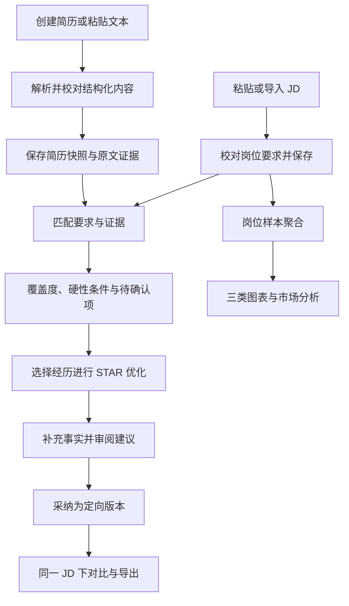
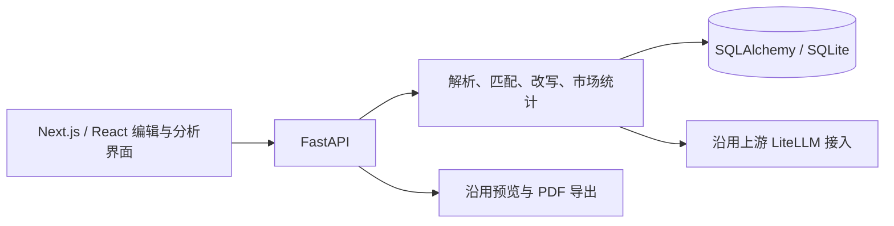

# CareerLens：AI 简历诊断与岗位匹配系统构建思路

> 初版决策日期：2026年9月7日；现状核对：2026年9月9日。本文保留初版的产品取舍与建设顺序。当前接口、运行模式及完成状态以[系统设计方案](docs/系统设计方案.md)、[构建计划](CareerLens_构建计划.md)和[测试报告](docs/测试报告.md)为准；课程逐日文档见[总览](docs/README.md)。

## 0. 当前实现与初版计划的接续

当前工程已完成多岗位比较、本地语义候选、AI目标诊断与方向建议、实时岗位来源、照片和独立版式、Word导出，以及网站邮箱登录与账号数据隔离。后文“首版”“后续”用于说明9月7日的建设顺序，不表示这些功能仍未实现。DeepSeek历史真实调用已有记录；目标服务器容器、HTTPS与真实邮件仍待验收。

表0-1 现状与详细依据

| 范围 | 当前实现 | 文档 |
| --- | --- | --- |
| 使用模式 | 本地无需账号；网站邮箱验证码进入账号独立工作区 | [网站设计与部署](docs/网站部署指南.md) |
| 诊断与优化 | 规则覆盖、AI适合度、语义候选、多岗比较、逐句核验和独立采纳 | [后端与数据库设计](docs/后端与数据库设计文档.md)、[AI诊断](docs/AI诊断与岗位推荐.md) |
| 岗位与统计 | 接入NCSS、Jobicy、腾讯；主界面主要统计实时页，后端保留已存JD聚合 | [实时岗位](docs/实时岗位与JD记忆.md)、[API](docs/API接口文档.md) |
| 编辑与导出 | 照片、独立版式、PDF与可编辑Word | [照片与导出](docs/简历照片与排版导出.md) |
| 课程材料 | 逐日任务、详细设计、测试、演示脚本和报告MD已整理 | [实训文档总览](docs/README.md) |

真实APP体验、5份真实JD与3份学生简历、个人工作确认和视频/报告最终格式继续按[交付清单](docs/交付清单与评分对照.md)完成。

## 1. 总体判断

原方案的核心方向成立：通过“岗位要求—简历证据”的对应关系解释匹配结果，再根据事实优化经历表达。这两点能够同时支撑课程中的匹配模型设计、AI 定向优化和答辩前后对比，应作为第一版的中心。

需要调整的是实现范围、评分依据和开源复用方式。六天实训应完成一个能够稳定运行的求职辅助系统，优先交付 Level 1、Level 2，并安排最小 Level 3；多岗位比较作为后续增强。首版采用 **Resume Matcher 固定版本二次开发**，复用编辑、解析、预览、导出与模型接入，自行完成中文要求抽取、证据匹配、事实约束改写和岗位样本分析。

产品定位为：**面向学生求职，将简历中的经历与目标岗位要求逐项对照，解释当前材料的匹配情况，并帮助用户形成有事实依据的定向简历。**

### 原方案需要修正的内容

| 原方案问题 | 修订决定 |
| --- | --- |
| 从简历诊断扩展到投递、面试、通用 Agent，六天范围过大 | 收敛到编辑、匹配、优化、市场洞察四个业务入口 |
| 可解释匹配放在第二优先级，原版与优化版对比放得较后 | 两者直接进入核心交付，分别对应设计评估和答辩要求 |
| 没有发现某技能证据就判为“能力缺口” | 首先标记“尚无证据／待用户确认”，确认未掌握后再列入能力提升建议 |
| 给出能力画像 88、94 等数字，缺乏计算依据 | 展示技能、经历和证据位置，不生成独立的“真实能力分数” |
| 技能、关键词、项目、经历重复加权，权重缺乏验证 | 按去重后的岗位要求计算一次证据覆盖度，硬性条件单独展示 |
| “可信优化”的示例仍在未确认时加入 Python、清洗等新事实 | 工具、行动、规模和结果都须来自原文或用户补充事实 |
| 多个 GitHub 项目只有名称，没有版本和改造边界 | 固定一个基础仓库，明确现成功能、必须重写的模块和参考项目 |
| 市场洞察排在面试、追踪之后，缺乏统计口径 | 先实现课程列出的三类图表与基于统计结果的分析工作流 |
| 最后一天才准备视频、报告、测试数据 | 从第一天保留过程证据，9 月 11 日冻结功能并完成材料初稿 |

## 2. 课程要求与交付范围

这里的“核心”与“增强”是团队开发优先级，Level 1—3 保留课程原本的分级含义。

| 课程要求 | CareerLens 的实现 | 优先级与验收证据 |
| --- | --- | --- |
| 至少 2 款招聘 APP 竞品分析 | 比较录入、诊断、匹配解释和定向修改流程 | 核心；体验记录和《求职市场痛点分析报告》 |
| 5 份真实 JD、3 份学生简历及 Gap 分析 | 经学生同意后脱敏，人工标注要求与证据 | 核心；来源记录、15 组简历—JD 对照 |
| Level 1：结构化编辑与文本自动解析 | 空白表单创建、粘贴文本、解析后校对与保存 | 核心；手动录入和自动解析都能完成 |
| Level 1：JD 输入、匹配分数、差距清单 | JD 校对、要求覆盖度、证据卡片和待确认项 | 核心；每项判断能够定位原文并复算 |
| Level 2：STAR 与 JD 定向优化 | 针对一段经历给出草稿、补充问题、事实引用 | 核心；建议与目标 JD、原始经历关联 |
| 答辩：原版与优化版对比 | 保存原始快照，用户采纳后生成定向版本 | 核心；同一 JD 下比较内容与匹配变化 |
| Level 3：市场分析智能体及三类图表 | 热门技能词云、薪资分布、岗位技能分布和受限分析工作流 | 优先增强；核心通过后集成，数据准备提前进行 |
| AI 辅助开发全流程 | 需求、设计、代码、测试的使用与人工修订记录 | 核心；每名成员保留本人实例 |
| 源码、运行说明、视频、个人报告 | 固定依赖、初始化数据、复现流程和个人材料 | 核心；按提交要求逐项检查 |

多 JD 比较和向量检索排在最小 Level 3 之后。自动抓取、求职追踪、模拟面试、通用职业 Agent、技能图谱和复杂模板管理进入后续路线，不占用本轮开发工期。上游已有的非核心功能可暂时隐藏入口，无须为删掉它们进行大规模重构。

个人报告占总成绩 50 分，其中设计、实施与 AI 应用均需具体证据。需求判断、设计图、测试记录和问题解决过程应随开发同步整理，不能将主要精力全部用于增加页面。

## 3. GitHub 项目怎样复用

### 3.1 唯一基础项目：Resume Matcher

截至本次核查，其前后端采用 FastAPI 与 Next.js，已有简历编辑、定向修改和 PDF 导出。技术上与原构想接近，适合作为二次开发起点。[上游项目](https://github.com/srbhr/Resume-Matcher)

本次审查的固定提交为：

```text
srbhr/Resume-Matcher
0932418cf694de227fd5ca030ddbc0d1f40b1bef
```

该固定基线已导入并在本机运行，依赖锁文件已纳入工程。首版实现与验证结果见[验证记录](docs/验证记录.md)；后续真实模型调用已有[AI诊断记录](docs/AI诊断与岗位推荐.md)，容器及目标服务器验收见[测试报告](docs/测试报告.md)。

源码核查发现三处直接影响方案的事实：

1. **数据库应以代码为准。** README 仍列 TinyDB，但该提交的数据层已经采用 SQLAlchemy 与 SQLite，存在 SQLite 专用事务和索引。首版沿用这一实现，避免为实训迁移整套数据层。[数据层](https://github.com/srbhr/Resume-Matcher/blob/0932418cf694de227fd5ca030ddbc0d1f40b1bef/apps/backend/app/database.py)、[数据模型](https://github.com/srbhr/Resume-Matcher/blob/0932418cf694de227fd5ca030ddbc0d1f40b1bef/apps/backend/app/models.py)
2. **原关键词高亮不能直接承担中文匹配。** 前端分词采用英文字母、数字与连字符规则，最短长度为 3；中文技能、C++、C#、R 等需要另行处理。应改为展示后端返回的标准技能与原文位置。[关键词工具](https://github.com/srbhr/Resume-Matcher/blob/0932418cf694de227fd5ca030ddbc0d1f40b1bef/apps/frontend/lib/utils/keyword-matcher.ts)
3. **已有 ATS 分数不是本项目的证据匹配模型。** 上游综合关键词、技能重合和章节完整度；CareerLens 另行计算要求覆盖度，并将格式检查分开呈现。[ATS 计算](https://github.com/srbhr/Resume-Matcher/blob/0932418cf694de227fd5ca030ddbc0d1f40b1bef/apps/backend/app/services/ats.py)

### 3.2 其他项目的用途

| 项目 | 核查结果 | 本项目决定 |
| --- | --- | --- |
| [Reactive Resume](https://github.com/amruthpillai/reactive-resume) | MIT；当前为 TanStack Start、React、PostgreSQL 等组成的应用，具备编辑和导出能力 | 参考编辑与预览交互，不整体并入 Resume Matcher |
| [OpenResume](https://github.com/xitanggg/open-resume) | AGPL-3.0；采用浏览器端 PDF.js 解析，产品面向美式简历 | 参考“解析后校对”的流程，不在首版复制其解析器；中文适配不能由产品介绍推定 |
| [JobSpy](https://github.com/speedyapply/JobSpy) | MIT；支持列表包含 LinkedIn、Indeed 等，未列出 Boss 直聘和拉勾 | 首版手工录入或导入课程数据，不把它当作国内 JD 的现成接口 |
| [AIHawk](https://github.com/feder-cr/AIHawk) | 当前主线定位已变为通用浏览器 Agent；当前为 MIT，README 说明旧分发版本仍保留 AGPL-3.0 | 从本轮基础依赖中移除，不能继续按旧求职自动化介绍规划集成 |

这些判断基于 2026 年 9 月 7 日读取的官方仓库。实际复制文件时记录仓库、提交、文件路径和许可信息，随交付保留相应上游许可与署名。

### 3.3 复用与自主开发边界

| 直接复用并验证 | 必须改造或新增 |
| --- | --- |
| 前后端目录、现有 UI 组件、模型调用封装 | 中文 JD 要求抽取、别名词典和人工校对 |
| 结构化简历编辑、预览及 PDF 导出 | 空白创建与文本粘贴入口的课程验收链路 |
| 文档抽取、JSON 校验、错误处理基础 | 岗位要求到简历原文的证据映射与评分 |
| 简历记录、定向版本与预览确认机制 | 保存可复算的输入快照、判断与评分版本 |
| 既有模型连接和部署配置 | STAR 单段优化、事实补充、差异对比 |
| SQLAlchemy 与 SQLite | 岗位样本聚合、三类图表和市场分析工作流 |

项目报告应明确这些边界。自主贡献集中在匹配方法、中文处理、证据管理、可信优化和市场统计，不将上游编辑器与导出功能计为原创。

## 4. 业务流程



用户应在解析后看到可编辑的结构化表单；模型提取不完整时，仍可人工补齐后继续匹配。系统先分析原始材料，再允许定向修改，保留明确的“优化前”基线。

“个人画像”简化为简历页面内的技能证据列表，例如“SQL：技能栏提及，项目证据待补充”。不单独建立能力打分中心或图数据库。

## 5. 可解释匹配方法

### 5.1 评分对象

匹配分数衡量**当前简历对该 JD 的材料覆盖情况**。学历、经验年限、到岗时间等约束单独呈现，不通过其他项目的高分抵消。

先将 JD 中可检查的技能和具体任务拆成要求集合，合并同义项与重复项，再将要求对应到简历段落。每条要求保存原文、标准名称、重要程度、证据位置和判断理由。

### 5.2 证据状态

| 状态 | 判断依据 | 用户看到的处理方式 |
| --- | --- | --- |
| 有具体证据 | 项目、工作、课程或竞赛描述明确支持该要求 | 展示原文与匹配理由 |
| 仅有自述 | 技能栏或概述提及，但缺少应用描述 | 建议补充真实使用场景 |
| 待确认 | 没有找到证据，或语义关系尚不明确 | 询问是否有相关经历 |
| 已确认未掌握 | 用户明确表示尚未掌握 | 给出学习或实践建议，不加入简历 |

“表达缺口”只用于已有事实支持、表达仍可改进的情况。“待确认”与“已确认未掌握”保留不同标签，即使两者当前都没有材料得分。

### 5.3 可复算的第一版评分

令第 \(i\) 条要求的权重为 \(w_i\)，证据值为 \(e_i\)，要求覆盖度为

\[
S=100\frac{\sum_i w_i e_i}{\sum_i w_i}.
\]

首版将 JD 明确要求及未标明优先级的普通要求设为 \(w_i=2\)，明确加分项设为 \(w_i=1\)。有具体支持证据时 \(e_i=1\)，仅有自述时 \(e_i=0.5\)，暂无支持证据时 \(e_i=0\)。每条要求只取一个最终证据值，不因重复堆叠关键词增加得分。

这些参数是可解释的项目规则，需用人工标注样本检查后冻结，不能写成经过招聘效果验证的权重。条件冲突或否定句不能仅凭关键词命中计分；模型提出的间接语义对应须确认后进入评分快照。

演示算例：Python、SQL、数据可视化是普通要求，Tableau 是加分项；对应证据值依次为 1、0.5、1、0，则 \(S=100\times5/7\approx71.4\)。页面同时显示各项贡献、证据原文以及待确认项。没有有效要求时显示“信息不足，暂不计算”，不返回 0 分或 100 分。

### 5.4 规则、向量与 LLM 的分工

规则负责别名归一、去重、计算、边界处理和条件检查。LLM 负责结构抽取、提出可能的证据对应、生成解释与改写草稿；输出必须通过结构校验与原文引用检查。

向量相似度是后续的证据检索增强：将岗位要求与经历段落比较，取少量候选供核验。余弦相似度不直接解释为“能力达到 92%”，也不单独证明某项具体技能。当前样本规模可在内存中比较，无需为单份简历匹配引入 pgvector。

### 5.5 条件检查与结果稳定性

学历、经验、到岗等条件使用“符合／不符／未知／JD 未说明”四种状态。经验年限只根据明确的相关经历计算，排除日期重叠和把课程项目直接计为工作年限的情况；有歧义时交由用户确认。

每次分析保存简历快照、JD 快照、标准化要求、证据判断、规则版本和模型配置标识。重复展示读取同一记录；重新抽取或重新判断生成新记录。确定性是指**同一已确认输入与规则能够复算出相同结果**，不承诺多次调用模型必然返回相同文本。

## 6. 基于事实的 STAR 优化

用户选择一段经历后，系统向模型提供该段原文、相关 JD 要求和已确认的补充事实，返回改写草稿、事实引用、STAR 缺项和需要补充的问题。

例如原文只有“负责用户数据分析”，系统先询问“具体分析任务、实际工具、本人行动、可确认结果”，而不是直接补入 Python、12 万条数据或效率提升百分比。用户确认“用 Python 分析 12 万条数据并完成用户分群”后，才可写为：

> 使用 Python 分析 12 万条用户数据并完成用户分群。

未确认的数据规模、业务收益、团队角色和技术工具均不进入可导出的文本。缺失内容放在单独的问题列表；用户也可保留不含新增事实的简洁改写，无须强行补齐 STAR 四项。

每条建议关联原文片段或用户补充事实。系统检查新增数字、工具、时间和主体是否有来源，再由用户逐条采纳。采纳生成定向版本，原始快照保持不变。比较页固定同一 JD 与规则版本，并区分“表达调整”和“补充了新事实”；修改文字后分数保持不变也属于正常结果。

## 7. 最小就业市场分析

Level 3 使用已经录入的 JD，建立“选择范围—统计数据—生成解读”的有限工作流。模型可将问题转换为经过校验的岗位类别、城市与时间筛选条件，程序调用固定统计函数，再将结果交给模型解读，无需通用 Agent 框架或开放式 SQL 执行。

### 7.1 数据准备

课程最低要求的 5 份真实 JD 用于问题分析。市场模块建议整理 30—50 份去重 JD，覆盖 2—3 类学生目标岗位，这是团队的采样目标，不是课程新增硬性要求。数据不足时仍可展示已有样本，并标明各组数量。

每份 JD 保存来源链接或课程样本编号、采集时间、发布日期、岗位类别、地点和原始薪资。人工采样优先。发布日期缺失时不能以采集日期冒充，页面可改为说明“本次采集样本”。真实岗位与合成测试数据分开，市场统计默认排除合成数据。

### 7.2 图表口径

| 图表 | 统计方式 |
| --- | --- |
| 热门技能词云 | 先统一别名，再按包含该技能的不同 JD 数量计数，同一 JD 中重复提及只算一次 |
| 不同岗位薪资分布 | 按币种、日薪／月薪／年薪分别分组；用招聘区间中点绘制样本分布，保留上下界和原文 |
| 岗位技能要求分布 | 各岗位类别中要求某技能的 JD 数 ÷ 该类别有效 JD 总数 |

薪资未披露的岗位仍参与技能统计，并在薪资图旁显示缺失数量。首版不混算实习日薪与全职月薪，不将招聘区间当作实际录用工资；13 薪等信息保留原字段，不擅自假设换算条件。

市场解读中的数字来自程序统计，每项结论对应筛选范围、样本量和支持的岗位记录。没有跨期样本时描述技能需求分布，不生成“需求快速增长”等趋势结论。

## 8. 技术方案



| 部分 | 首版选择 | 原因 |
| --- | --- | --- |
| 前端 | 沿用 Next.js、TypeScript、Tailwind 与现有组件 | 保留可运行编辑器，集中改造业务流程 |
| 后端 | 沿用 FastAPI、Pydantic | 原文档推荐方向一致，复用输入和输出校验 |
| 数据库 | 沿用 SQLAlchemy 与 SQLite | 适合本地实训演示，提供建表、初始化与备份说明 |
| 文档解析 | 沿用现有抽取流程，优先支持粘贴文本与可提取文字的 PDF | 在真实中文样本上验证，再决定是否补充解析库 |
| 模型接入 | 复用 LiteLLM，主流程固定一个已验证的模型配置 | 减少多提供商差异，记录调用耗时与失败 |
| 图表 | ECharts 5 与 echarts-wordcloud 2 的兼容组合 | 直接覆盖三类图表，安装后锁定具体版本 |
| 导出 | 沿用 Playwright PDF 链路，先验证一种中文模板 | 避免重建打印系统 |
| 部署 | 基于源码构建的 Docker Compose 与本地数据卷 | 教师能够按运行说明复现本项目改造后的镜像 |

图表扩展的版本配对以其[官方说明](https://github.com/ecomfe/echarts-wordcloud)为依据。上游后端及前端依赖以固定提交中的 [pyproject.toml](https://github.com/srbhr/Resume-Matcher/blob/0932418cf694de227fd5ca030ddbc0d1f40b1bef/apps/backend/pyproject.toml) 和 [package.json](https://github.com/srbhr/Resume-Matcher/blob/0932418cf694de227fd5ca030ddbc0d1f40b1bef/apps/frontend/package.json) 为准。

提供的实训整理将 PostgreSQL 与 pgvector 列为推荐技术，因此本计划不将数据库迁移设为前置任务。若后续课程另行指定 PostgreSQL，需单独改造 SQLite 事务、索引与初始化方式，不能只替换连接地址。

首版按本地个人工作区组织，当前已扩展网站账号及独立业务库，各工作区保留主简历与定向版本关系。3份学生简历分别作为隔离的评估案例，不混成同一个人的版本。用户的简历正文、联系方式和API Key不进入普通日志；模型调用按实际操作筛选所需内容，演示使用脱敏或明确标注的合成数据。详细发送与存储边界见[后端与数据库设计](docs/后端与数据库设计文档.md)。

## 9. 页面与可演示结果

首版业务导航为“我的简历、岗位库、匹配与优化、市场洞察”，保留必要设置入口。

| 页面 | 核心内容 | 完成标志 |
| --- | --- | --- |
| 我的简历 | 结构化表单、粘贴解析、原文校对、预览、定向版本 | 手工与自动两条路径均可保存，中文 PDF 正常导出 |
| 岗位库 | JD 输入、要求校对、岗位来源与元数据 | JD 可独立存储和查看，可供匹配与统计复用 |
| 匹配与优化 | 要求覆盖度、条件状态、证据、待确认项、STAR 建议、差异对比 | 不离开业务流程即可从原版生成并导出定向版本 |
| 市场洞察 | 筛选、词云、薪资分布、技能分布、样本解读 | 所有数字能回溯到已录入岗位 |

## 10. 项目亮点与最终叙事

本轮重点呈现三项工作：一是建立岗位要求与简历证据的对应关系，使匹配结果能够逐项解释与复算；二是区分表达可改进、证据待补充与用户确认的能力不足，使建议与事实相符；三是通过用户审阅、版本快照和前后对比，将 AI 优化组织成完整的信息系统流程。

最小市场模块补充岗位样本层面的技能与薪资观察。演示遵循“输入材料—解释差距—依据事实修改—比较结果—查看岗位样本”的顺序。开发任务、时间节点和验收标准见[CareerLens构建计划](CareerLens_构建计划.md)。
