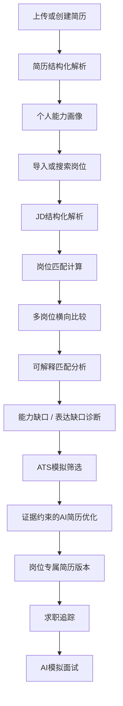

# CareerLens：AI 驱动的可解释简历诊断与岗位决策系统

## 1. 项目定位

### 1.1 项目名称
**CareerLens**

### 1.2 项目副标题
**AI 驱动的可解释简历诊断与岗位决策系统**

### 1.3 核心定位
CareerLens 不只是一个“AI 简历润色工具”，而是一套围绕求职全过程构建的智能决策系统。

系统希望回答五个核心问题：

1. **我现在具备什么能力？**
2. **我适合哪些岗位？**
3. **为什么适合或不适合？**
4. **我的差距到底是能力不足，还是简历没有表达出来？**
5. **我应该优先投递哪些岗位，并如何针对目标岗位优化简历？**

因此，整个系统的核心主线不是“生成内容”，而是：

> **能力画像 → 岗位理解 → 可解释匹配 → 缺口诊断 → 可信优化 → 求职决策**

---

# 2. 整体构建思路

本项目不直接照搬某一个开源项目，而是参考多个成熟 GitHub 项目的长处，并将其重新组织为一个统一的信息系统。

## 2.1 参考项目与借鉴方向

### Resume Matcher
主要参考：
- AI 简历诊断
- JD 解析
- 简历与岗位匹配
- 关键词分析
- AI 简历优化逻辑

### Reactive Resume
主要参考：
- 简历编辑器
- 简历实时预览
- 多模板
- PDF 导出
- 多版本简历管理
- SaaS 风格界面设计

### OpenResume
主要参考：
- PDF 简历解析
- 简历结构化
- Resume Parser 逻辑

### JobSpy
主要参考：
- 岗位数据获取
- JD 数据标准化
- 岗位库构建
- 多岗位搜索与筛选

### AIHawk
主要参考：
- AI 求职工作流
- 求职 Agent
- 岗位 → 简历 → 投递 → 面试的流程编排

最终不直接拼接源码，而是将这些能力整合为 CareerLens 自己的业务体系。

---

# 3. 系统核心业务逻辑

整个系统围绕一条完整求职链路展开。



---

# 4. 六大核心功能中心

## 4.1 简历中心 Resume Hub

### 核心功能
- 上传 PDF / Word 简历
- 自动解析简历
- 结构化展示
- 在线编辑
- 实时预览
- 多模板切换
- PDF 导出
- 多版本管理

### 结构化简历数据示例

```text
Resume
├── Basic Info
├── Education
├── Work Experience
├── Project Experience
├── Awards
├── Skills
├── Certificates
└── Self Introduction
```

对于每一段项目经历，需要进一步结构化：

```json
{
  "project_name": "项目名称",
  "role": "个人角色",
  "description": "项目描述",
  "skills": [
    "Python",
    "SQL",
    "Gurobi"
  ],
  "results": [
    "完成某项成果"
  ]
}
```

结构化的目的，是让后续系统能够识别：

> 某项能力究竟只是出现在技能栏，还是确实有项目、实习或竞赛经历作为证据。

---

# 5. 个人能力画像 Candidate Profile

在简历解析之后，不直接进入岗位匹配，而是先建立个人能力画像。

## 5.1 能力画像内容

例如：

```text
数据分析        88
优化建模        94
机器学习        76
产品分析        65
数据库          81
项目管理        72
```

## 5.2 Skill Graph

```text
Python
├── 数据分析
├── 运筹优化
└── 机器学习

SQL
└── 数据处理

Gurobi
└── 优化建模
```

## 5.3 Evidence 机制

每项能力必须绑定原始证据。

例如：

```text
Skill: Python

Evidence 1:
GEO卫星优化项目

Evidence 2:
数学建模项目

Evidence 3:
数据分析竞赛
```

因此系统后续判断的不只是：

> 简历里有没有出现 Python

而是：

> 用户是否真正具备 Python 能力，以及是否有可追溯的项目证据。

---

# 6. 岗位中心 Job Hub

## 6.1 岗位来源

系统支持两种岗位来源。

### 方式一：手动输入 JD
用户直接粘贴岗位描述。

### 方式二：岗位库
系统保存一批结构化岗位数据。

岗位字段包括：

```text
公司
岗位名称
地点
薪资
学历要求
经验要求
岗位类别
岗位描述
技能要求
发布日期
```

后期可进一步接入 JobSpy 或其他公开岗位数据源。

---

# 7. JD 结构化解析

岗位描述不能只保存成一段文本，而应该被拆解成结构化要求。

例如：

```json
{
  "title": "数据分析实习生",
  "company": "XX科技",
  "required_skills": [
    "Python",
    "SQL"
  ],
  "preferred_skills": [
    "Tableau",
    "A/B Testing"
  ],
  "education": "本科及以上",
  "experience": "不限",
  "responsibilities": [
    "数据分析",
    "用户行为分析",
    "业务指标监控"
  ]
}
```

进一步生成岗位要求画像：

```text
Python          必须
SQL             必须
数据分析         必须
Excel           必须

Tableau         加分
A/B Testing     加分
用户增长         加分
```

---

# 8. 核心匹配引擎

## 8.1 不直接让大模型给分

不采用：

```text
请给这份简历和岗位JD打一个0-100分。
```

这种方式。

而采用：

> **规则 + Embedding + LLM 的 Hybrid Matching**

---

## 8.2 多维评分模型

可以设计为：

\[
Score =
0.35S_{skill}
+0.25S_{experience}
+0.15S_{education}
+0.15S_{project}
+0.10S_{keyword}
\]

其中：

- \(S_{skill}\)：技能匹配
- \(S_{experience}\)：经历匹配
- \(S_{education}\)：教育背景匹配
- \(S_{project}\)：项目相关性
- \(S_{keyword}\)：ATS 关键词覆盖

最后形成：

```text
综合匹配度      84

技能匹配        91
项目经历        88
教育背景        95
行业经历        65
关键词覆盖      78
```

LLM 负责：
- 语义识别
- 要求抽取
- 能力判断
- 解释生成

系统规则负责：
- 最终评分
- 权重控制
- 硬性条件判断
- 结果可复现

---

# 9. 核心创新一：Explainable Match

CareerLens 不只告诉用户：

> 你的岗位匹配度是 84%

而是进一步解释：

```text
JD Requirement
↓
Resume Evidence
↓
Semantic Similarity
↓
Match Judgement
↓
Score Contribution
```

例如：

```text
JD要求：
熟练使用 Python 进行数据分析

简历证据：
使用 Python 对用户行为数据进行清洗与聚类分析

语义相似度：
0.92

判断：
Strong Match

评分贡献：
+9.2
```

这样每个匹配结果都可以追溯。

---

# 10. 核心创新二：能力缺口与表达缺口区分

普通系统通常只提示：

> 缺少 Tableau

但 CareerLens 将缺口分为两种。

## 10.1 表达缺口

用户实际上具备相关能力，但简历中没有明确表达。

例如：

```text
项目经历：
使用 Python 和 Matplotlib 完成数据可视化
```

但技能栏中没有：

```text
Data Visualization
```

系统判断：

> 表达缺口

处理方式：

> 建议优化简历表达。

---

## 10.2 能力缺口

如果简历、项目、实习中完全找不到 Tableau 证据：

系统判断：

> 能力缺口

处理方式：

> 不建议直接将 Tableau 添加到简历，应先补充学习或项目经历。

---

# 11. 核心创新三：Evidence-Grounded Rewrite

CareerLens 的 AI 简历优化遵循：

> **AI 可以优化表达，但不能创造经历。**

例如原文：

```text
负责用户数据分析。
```

普通 AI 可能改成：

```text
分析10万条用户数据，使运营效率提升30%。
```

但这些数字可能并不存在。

CareerLens 则生成：

```text
使用 Python 对【待补充：数据规模】条用户行为数据进行分析，
完成【待补充：具体任务】，
为【待补充：业务结果】提供数据支持。
```

然后询问用户：

```text
数据规模？
120000

具体任务？
用户分群

业务结果？
运营策略优化
```

最终再生成：

```text
使用 Python 对 12 万条用户行为数据进行清洗与分析，
完成用户分群，为后续运营策略优化提供数据支持。
```

每一条优化内容都绑定原始 Evidence。

---

# 12. 核心创新四：多 JD 岗位决策

系统支持一份简历同时匹配多个岗位。

例如：

| 维度 | 数据分析 | 商业分析 | 产品经理 | 算法运营 |
|---|---:|---:|---:|---:|
| 技能 | 92 | 88 | 68 | 81 |
| 项目 | 91 | 94 | 72 | 86 |
| 教育 | 95 | 95 | 95 | 95 |
| 行业 | 75 | 81 | 63 | 72 |
| 综合 | **88** | **90** | **72** | **83** |

系统进一步生成：

```text
推荐投递顺序：

1. 商业分析 90%
2. 数据分析 88%
3. 算法运营 83%
4. 产品经理 72%
```

并给出每个岗位的：

- 最大优势
- 最大缺口
- 优化建议
- 推荐优先级

这样 CareerLens 从“简历优化工具”升级为“求职决策支持系统”。

---

# 13. ATS 模拟筛选器

模拟招聘系统初筛。

示例：

```text
ATS兼容度          92
关键词覆盖率        81%
核心技能覆盖        8 / 10
简历结构识别        PASS
项目经历量化        63%
```

关键词识别：

```text
✅ Python
✅ SQL
✅ Machine Learning

⚠ A/B Testing
⚠ Tableau

❌ Growth Analytics
```

系统重点区分：

- Missing Keyword
- Missing Ability

避免用户为了提高匹配度而机械堆砌关键词。

---

# 14. 多版本简历系统

用户可以维护：

```text
Master Resume

├── 字节-数据分析版
├── 美团-商业分析版
├── 腾讯-产品版
└── 京东-算法运营版
```

每个版本记录：

```text
Target JD
Match Score
修改内容
创建时间
投递状态
```

系统支持：

- 原版与优化版对比
- 修改高亮
- 定向简历导出
- 多版本管理

---

# 15. 求职追踪模块

可以进一步增加：

```text
岗位名称
公司
匹配度
当前状态
申请时间
面试时间
简历版本
备注
```

状态包括：

```text
待投递
已投递
笔试
一面
二面
Offer
拒绝
```

形成个人求职看板。

---

# 16. Career Copilot / AI Agent

在基础系统稳定之后，再加入 AI Agent。

Agent 不只是聊天，而是能够调用系统工具。

例如用户输入：

> 我想找北京的数据分析实习岗位。

Agent 执行：

```text
Step 1
读取个人能力画像

Step 2
查询岗位库

Step 3
筛选前20个岗位

Step 4
计算匹配度

Step 5
推荐Top5岗位

Step 6
分析Top1岗位缺口

Step 7
生成定向简历建议
```

可以封装为：

```text
Resume Tool
Job Search Tool
Match Tool
Rewrite Tool
Interview Tool
```

---

# 17. AI 模拟面试

模拟面试的问题来源于：

> **JD Requirement ∩ Resume Evidence ∩ Capability Gap**

例如：

```text
你的简历中提到使用 Python 进行数据分析，
请具体说明你如何完成用户分群？
```

或者：

```text
JD中要求 A/B Testing，
但你的简历中没有相关经历。
如果进入岗位后需要设计一次实验，你会如何处理？
```

最后生成：

- 回答质量评价
- 表达建议
- 知识缺口
- 改进建议

---

# 18. 前端页面架构

建议采用完整 SaaS 工作台结构。

```text
CareerLens

├── Overview
├── 我的简历
├── 我的画像
├── 岗位发现
├── 岗位匹配
├── 简历优化
├── 求职追踪
├── 模拟面试
├── 市场洞察
└── 设置
```

首页 Dashboard 可以展示：

```text
我的求职竞争力

简历完整度        91
平均岗位匹配度    82
已分析岗位        16
高匹配岗位        7

推荐岗位

美团 商业分析             91%
字节 数据分析             89%
京东 数据策略             87%

当前主要能力缺口

A/B Testing
Tableau
用户增长分析
```

---

# 19. 后端整体架构

推荐使用单体架构，不需要微服务。

```text
React / Next.js
        ↓
      REST API
        ↓
     FastAPI
        ↓
┌────────────────────┐
│ Resume Service     │
│ Job Service        │
│ Match Service      │
│ AI Service         │
│ Agent Service      │
└────────────────────┘
        ↓
 PostgreSQL + pgvector
        ↓
      LLM API
```

---

# 20. 推荐技术栈

| 模块 | 技术 |
|---|---|
| Frontend | Next.js + TypeScript |
| UI | Tailwind CSS |
| Backend | FastAPI |
| ORM | SQLAlchemy |
| Database | PostgreSQL |
| Vector | pgvector |
| PDF Parser | PyMuPDF |
| Embedding | BGE-M3 / OpenAI Embedding |
| LLM | OpenAI / Gemini / DeepSeek |
| Chart | ECharts |
| PDF Export | Playwright |
| Agent | LangGraph / 自定义 Workflow |
| Deployment | Docker Compose |

---

# 21. 核心数据库表

第一版建议：

```text
users

resumes
resume_sections
resume_versions

skills
resume_skills

jobs
job_requirements

match_records
match_details

rewrite_records

applications

interview_sessions
interview_messages
```

其中最关键的是：

```text
match_details
```

建议字段：

```text
requirement_id
evidence_id
similarity
match_type
score
reason
```

用于支撑 Explainable Match。

---

# 22. AI 接口设计

不要只设计一个：

```text
POST /chat
```

而要将 AI 能力嵌入具体业务。

建议接口：

```text
POST /ai/parse-resume
POST /ai/parse-job
POST /ai/extract-skills
POST /match/calculate
POST /ai/analyze-gap
POST /ai/rewrite
POST /ai/interview
POST /agent/career
```

这样才能体现：

> AI 是业务能力的一部分，而不是外挂聊天机器人。

---

# 23. MVP 开发优先级

## 第一层：必须完成

```text
简历上传
↓
简历解析
↓
JD导入
↓
岗位匹配
↓
AI诊断
↓
简历优化
```

---

## 第二层：推荐完成

增加：

- 个人能力画像
- Explainable Match
- 能力缺口 / 表达缺口
- 多 JD 比较
- ATS 模拟器

做到这里，项目已经具备较完整的创新性和产品感。

---

## 第三层：有时间再做

增加：

- 岗位自动获取
- 多版本简历
- 求职追踪
- 模拟面试
- Career Agent
- 市场洞察

---

# 24. 六天实训建议节奏

## Day 1
- 项目定位
- 竞品分析
- 功能确定
- UI 风格确定
- 数据库初步设计

## Day 2
- 需求分析
- 简历数据结构
- JD 数据结构
- API 设计
- UI 原型

## Day 3
- 简历上传与解析
- JD 解析
- 数据库
- 基础前后端打通

## Day 4
- 匹配算法
- 可解释匹配
- AI 缺口分析
- AI 简历优化

## Day 5
- 多 JD
- ATS
- 能力画像
- 系统联调
- 测试

## Day 6
- UI 完善
- 演示数据准备
- 视频
- PPT
- 报告
- 最终演示

---

# 25. 项目核心创新总结

最终建议将创新点凝练为四项。

## 创新一：可解释岗位匹配
构建“岗位要求—简历证据”映射机制，使匹配结果能够追溯至具体能力、项目与经历。

## 创新二：能力缺口与表达缺口区分
不仅识别“缺什么”，还进一步判断用户是真的不会，还是已经具备能力但没有在简历中充分体现。

## 创新三：基于证据的可信简历优化
限制生成式 AI 只能基于原始简历和用户补充事实进行改写，避免虚构项目经历、数字和成果。

## 创新四：多岗位求职决策
由传统“一份简历匹配一个岗位”扩展到“一份简历比较多个岗位”，形成岗位优先级和投递决策建议。

---

# 26. 项目最终叙事逻辑

CareerLens 的完整产品逻辑可以概括为五句话。

## Understand Me
理解我的简历、经历与真实能力。

## Understand Jobs
理解岗位真正需要什么。

## Explain the Match
告诉我为什么适合或不适合。

## Improve Honestly
在不虚构经历的情况下优化简历表达。

## Help Me Decide
帮助我决定优先投哪些岗位，以及如何准备下一步。

---

# 27. 最终一句话定位

> **CareerLens 不是一个单纯的 AI 简历生成器，而是一套以个人能力画像为基础、以岗位要求理解为输入、以可解释匹配和可信优化为核心、以多岗位求职决策为目标的智能求职支持系统。**
