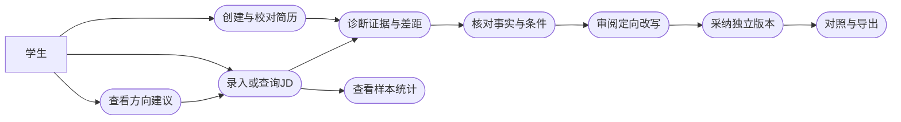
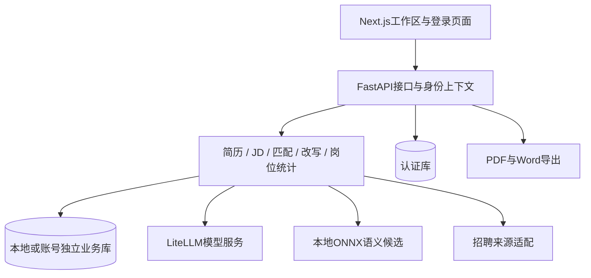
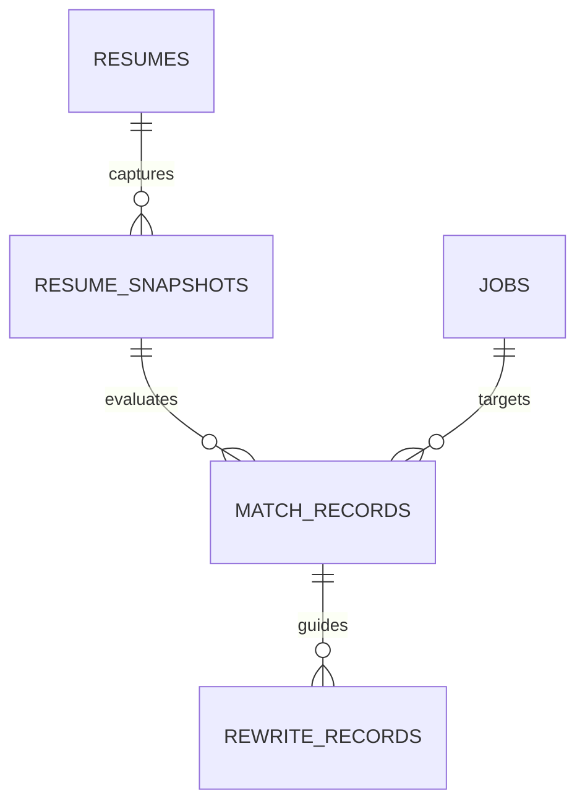

# AI 简历诊断与岗位匹配系统实训报告

> 项目名称：CareerLens。编制日期：2026-09-09。本文按指导书第6.1.3.1节的六章结构形成项目事实底稿；姓名、学号、本人分工及个人经历尚待填写。工程事实依据当前源码与有日期的验证记录。定稿时按本人实际工作修订第三至六章，并套用教师提供的Word模板。

表0-1 报告基本信息

| 项目 | 内容 |
| --- | --- |
| 姓名、学号 | 待填写 |
| 班级、组号、组长 | 待填写 |
| 实训选题 | T5 AI 简历诊断与岗位匹配系统 |
| 实训时间 | 2026年9月7日至12日 |
| 本人主要负责内容 | 待按[个人贡献记录](个人贡献与AI应用总结.md)填写 |
| 项目技术 | Next.js、TypeScript、FastAPI、SQLAlchemy/SQLite、LiteLLM、ONNX、ECharts |

## 1. 项目背景

学生在准备实习和校园招聘时，需要把课程、项目与实践经历转换为招聘者能够理解的材料。实际困难通常出现在两个环节：一是岗位描述中的工具、任务和条件分散在不同段落，学生难以确定准备重点；二是简历只列出技能名称或笼统职责，无法充分展示具体应用。相同经历面对不同岗位也需要调整表达顺序，反复复制修改容易混淆原版与定向版本。

本项目把上述问题归纳为岗位要求理解、经历证据组织和修改过程控制。既有公开资料调研表明，同类产品已提供岗位推荐与简历服务，因此项目的建设重点是把岗位要求、简历原文、判断结果和修改动作连接起来。调研范围与资料来源见[调研报告](调研报告.md)；真实学生任务观察仍需按课程样本要求补充。

CareerLens面向正在准备实习、校招和初次求职的学生，以一份简历和一份目标JD为基本分析单元。用户先保存并校对材料，再检查要求与证据，补充本人能够确认的事实，最后审阅建议并保存定向版本。系统同时提供岗位方向、实时岗位查询和样本统计，帮助尚未确定目标的用户进入具体岗位分析。

项目预期成果是一套能够运行、解释与复核的求职辅助系统，以及覆盖需求、设计、实施、测试和交付的工程文档。应用基于Resume Matcher固定版本开展二次开发，自主工作集中于中文业务流程、要求级评分、事实约束改写、版本记录和市场样本分析。通过这些工作，实训把AI生成能力纳入明确的数据与业务流程，并以可检查的结果评价实现质量。

## 2. 需求分析

主要用户分为已有目标岗位和正在探索方向的学生。前者关注当前简历是否充分表达了岗位要求，后者需要从已有经历出发寻找可以进一步核对的岗位。教师作为经学生同意的评审者，关注判断依据、修改前后差异和项目实现过程；网站运营者负责部署、模型与邮件服务配置。这些使用场景决定系统应围绕材料准备组织功能，并使保存、分析、采纳和导出状态清晰可见。

功能需求分为四组。第一组是材料管理：支持空白创建、文本粘贴和文件导入，解析后允许校对，保留原文与结构化字段；用户可以录入JD、核对要求并再次使用。第二组是诊断：对要求逐项寻找经历证据，区分具体支持、仅提及、待确认和本人确认未掌握，单独检查学历、经验及到岗等条件；AI提供带原文引用的岗位判断和行动建议。第三组是优化：选择一段经历，结合目标JD与本人补充事实生成建议，审阅来源后采纳为独立版本，再比较与导出。第四组是岗位探索：分析方向、检索真实岗位、比较多个已保存JD，并查看明确样本范围的技能与薪资分布。

网站模式增加邮箱验证码登录、会话管理和账号数据隔离。本地模式直接进入个人工作区，网站模式进入独立账号空间。照片与版式属于简历文档设置，应随该份简历保存并在预览、PDF和Word导出中保持一致。完整功能需求使用FR-01至FR-16编号，验收条件见[需求分析](需求分析.md)。

图2-1 核心用例关系图

非功能需求重点约束正确性、可靠性、安全和可用性。相同规则与输入应产生可复算结果，旧诊断保留当时的材料快照；重复采纳不能创建重复版本，旧材料生成的草稿应在冲突时被拒绝。模型不可用时，文件解析可保留原文和规则草稿，显式请求的AI诊断则返回错误并允许用户主动切换。账号间应隔离简历、JD及导出内容，API密钥和私人材料不进入交付包。界面应给出加载、失败、保存与恢复反馈，图表标明来源、分母和缺失数据。

需求验证采用两类证据：工程测试检查系统行为，真实材料分析评价诊断与建议质量。课程要求至少体验两款招聘APP，收集五份真实JD与三份学生简历；本项目据此设计十五组材料对照，记录表达差距和待确认能力。当前已有公开资料调研、合成案例和工程验证，完整真实样本尚待归档。因此，现阶段的结论能够支持系统设计和流程说明，尚不能给出真实求职效果提升比例。

## 3. 设计思路

系统采用前后端分离结构。Next.js与React承载编辑、诊断和图表界面，TypeScript统一客户端数据类型；FastAPI提供HTTP接口，Pydantic检查输入输出；SQLAlchemy与SQLite保存业务记录。LiteLLM承接可配置模型调用，本地ONNX语义模型用于检索相关经历。ECharts绘制岗位样本图表，Playwright/Chromium用于PDF，Word导出由后端生成可编辑文档。

图3-1 系统总体架构

选择该架构的主要依据是当前工程已经具备成熟的编辑、模型配置和打印能力，实训需要把精力放在T5的业务差异上。SQLite适合当前部署和演示规模，现有代码也已包含其事务、索引与初始化逻辑。指导书将PostgreSQL及pgvector列为推荐技术，本项目采用已有SQLite和本地向量推理，以减少迁移成本。后续存储扩展应由实际并发、运维和检索规模决定。

数据库按认证与工作区分别组织。认证库存储用户、验证码挑战、会话和发送事件；本地或各账号的工作区保存业务表。业务设计的中心是简历、岗位、快照、诊断与改写。快照冻结结构化材料和证据，诊断保存岗位快照、规则版本及逐项贡献，改写保存草稿、事实来源和采纳结果。完整字段、索引及物理外键见[后端与数据库设计](后端与数据库设计文档.md)。

图3-2 核心业务关系图

表3-1 核心数据设计

| 对象 | 主要保存内容 | 作用 |
| --- | --- | --- |
| 简历 | 原文、结构化字段、版本关系、版式 | 编辑与输出材料 |
| JD | 原文、来源、薪资、校对后的技能/任务要求 | 固定分析目标 |
| 快照 | 冻结材料、哈希、证据 | 保留分析依据 |
| 诊断 | 规则版本、要求明细、条件、AI分析 | 重现与解释判断 |
| 改写 | 草稿、补充事实、逐句来源、采纳结果 | 支持审阅和独立版本 |

匹配方法以去重后的要求为计算对象。设第$i$项要求权重为$w_i$、证据值为$v_i$，规则材料覆盖度为

$$
S=100\frac{\sum_i w_i v_i}{\sum_i w_i}.
$$

普通要求权重为2，优先项为1；具体经历支持取1，仅在技能等位置提及取0.5，其余取0。最终分数按一位小数舍入。总权重为零时不生成分数。学历、经验和到岗条件单独呈现。AI适合度独立保存并显示引用；语义相似度仅用于提出候选，核对后才按既有规则参与覆盖度计算。

界面围绕“我的简历、目标岗位、诊断与优化、实时岗位”组织。左侧选择工作区与文档，顶部提供保存、预览和导出，正文连续编辑；诊断结果从结论进入原文证据和修改动作。原型用线框与流程图明确页面层级，具体组件状态、响应式和键盘操作见[原型与交互设计](原型与交互设计.md)。这种设计让用户在同一条任务路径中完成材料整理和修改确认，避免只看到分数却无法定位下一步。

网站请求先经过身份检查，再把账号上下文传入存储与导出流程。业务库选择发生在统一边界，旧接口也遵循相同规则。模型和招聘来源等耗时操作放在写事务之外，保存前重新检查材料指纹，再原子写入结果，减少外部等待对数据库锁的影响。编辑保存使用更完整的revision，涵盖原文、结构化正文、名称和版式；诊断与采纳则检查结构化正文和JD。只修改版式不会使业务诊断过期，采纳时继承当前版式。PDF打印仅向允许的内部目标传递身份，Word从当前账号的简历数据生成。上述边界分别由接口、存储和导出测试核对。

## 4. 实施过程

工程首先导入Resume Matcher固定提交，将前后端保存在`app/`，由根仓库统一管理需求、业务改造和交付材料。基线导入提交为`6fd8b18`，后端业务、前端工作区和首版交付分别有后续提交；最新网站与导出改动还包含工作区变更，验收时应以交付快照为准。Python依赖由`pyproject.toml`和`uv.lock`固定，前端通过`package-lock.json`与`npm ci`安装。启动脚本组织数据库初始化、语义模型准备、后端与前端启动，并把日志保存在本地忽略目录。

材料模块先处理来源保存与结构化编辑。文本或文件被解析为编辑器需要的数据，用户核对后保存原文、表单和版本名称。AI文件解析失败时保留原文，返回可编辑的规则草稿；后续保存再同步原文与结构化数据。版本校验用于识别并发或陈旧编辑，防止后提交的旧内容覆盖新材料。照片与版式按简历保存，导出入口检查已保存内容与当前状态。

岗位模块接收用户粘贴JD，也通过来源适配器查询NCSS、Jobicy和腾讯岗位。系统保留来源差异，按完整JD组织本页样本；浏览不自动写入岗位表，只有用户主动记住时才保存。薪资原文与币种、周期等信息共同解释，技能统计按岗位计数，缺失薪资不补为零。这些规则使岗位探索与个人目标库相互衔接，同时保留统计范围。

诊断模块先读取简历与JD并计算输入指纹，在写事务外完成规则和AI分析；保存前再次校验当前材料，将简历快照与诊断记录原子写入。规则服务计算每项状态、权重和贡献，前端据此展示覆盖度与证据卡片。AI诊断在同一材料范围内返回适合度、优点、缺口及行动建议，引用和事实边界通过检查后才能保存。多岗位比较复用同一简历快照；人工核对产生新记录，旧结果仍可读取。

改写模块把输入收敛到一段经历及目标要求。用户补充事实后，AI按已有材料组织STAR表达；系统检查数字、技能、角色、结果和用途的来源，并对逐句支持关系进行独立核验。草稿展示修改类型与前后差异，采纳时在事务内生成独立定向版本。重复采纳返回同一结果，源材料变化则要求重新分析。这一实现把生成、审阅与保存分为明确步骤，使用户能够控制最终内容。

网站扩展增加邮箱验证码、会话与请求来源检查。后端根据账号上下文选择独立业务库，旧接口和导出也使用该上下文；前端在退出、账号切换及会话失效时清空旧工作区。PDF打印需由服务端访问前端打印页，身份只在允许的内部目标之间传递。相关实现与网站验证分别记录，公开域名和真实邮件供应商仍需在目标环境验收。

AI辅助开发贯穿多个阶段。需求阶段用于梳理用户故事与边界，设计阶段用于列出ER、接口和失败场景，实现阶段用于生成路由与组件并修订，测试阶段用于提出反例和分析失败。项目记录了原文保存、事实扩写、语义候选与导出身份等具体问题。人工工作集中在确定语义、核对来源、约束范围和判定测试是否真正支持结论，不能仅凭生成结果看似完整就认定完成。

表4-1 测试证据概况

| 时间与范围 | 结果 | 用途 |
| --- | --- | --- |
| 9月7日首版历史记录 | 本地解析、匹配、采纳、幂等、PDF及生命周期有通过记录 | 说明首版闭环形成 |
| 9月8日AI历史记录 | 合成材料的目标诊断、方向建议、改写真实调用成功 | 说明AI服务确有接入 |
| 9月8日至9日网站历史记录 | 后端1223项、前端570项通过，另有隔离运行演示 | 说明对应版本的认证与隔离验证 |
| 9月9日本轮专项回归 | 后端9文件133项、前端13文件70项通过 | 核对当前相关行为；非全量复验 |

测试采用规则单元、接口集成、前端交互和独立运行等层次。自动化中的AI替身检查错误与边界，历史真实调用检查具体材料响应，两者分别记录。命令和覆盖范围详见[测试报告](测试报告.md)，本人参与的任务、判断和测试应在定稿时补入对应段落。

## 5. 遇到的问题及解决方案

第一个问题是旧文档与当前实现逐渐分离。早期方案按单机工作区组织，后续代码已经增加网站账号、照片、版式与Word导出，仍按旧说明撰写会造成需求、设计和验收冲突。本次修订以路由、数据模型、前端入口和锁文件为依据，新增后端、数据库、API和前端详细设计，并在文档中保留历史验证日期。由此形成的经验是把文档视为接口和数据契约的一部分，在功能变更后同步核对依赖文档。

第二个问题是关键词匹配容易混淆“描述缺失”与“能力不足”。原文没有某词时，用户可能通过其他表述说明过相同任务，也可能确实未实践。项目采用具体证据、仅提及、待确认和本人确认缺口的区分，并引入本地语义候选帮助定位经历。相似度不直接计分，用户核对后才按证据值计算。这样既保留可解释性，也把模型误判的影响限制在可审阅的候选阶段。

第三个问题是AI可能在润色时扩大角色、结果或用途。例如，“参与问卷”被改成“主导上线”，或加入原文没有的业务改善结论，即使文字更流畅也改变事实。项目在结构、引用、数字和技能检查之外增加角色与用途约束，并独立核验逐句支持关系。历史修复记录包含被拒绝的扩写反例和正常改写案例。生成内容仍由本人审阅，无法确认的成果转成补充问题，而不写入经历。

第四个问题是保存与采纳的版本一致性。编辑器使用包含结构化正文、原文、标题和版式的revision，防止旧页面覆盖新编辑；诊断与采纳另以结构化正文和JD指纹核对业务依据。正文或JD变化时，旧草稿采纳返回冲突；仅调整版式不会改变诊断结果，采纳的独立版本继承当前版式。冻结快照保留原判断，事务和采纳幂等防止重复创建。验证需同时检查响应、持久记录和原版内容。

第五个问题出现在部署及导出。网站PDF必须访问内部打印页并携带正确身份，普通本地打印成功并不能说明账号场景也正确。项目通过独立网站测试环境验证账号隔离、身份传递、Word/PDF和退出流程；真实公网HTTPS、邮件与容器启动另列目标环境任务。同时，本次发现静态DDL缺少版式字段、旧依赖列表未覆盖新库，运行说明因此明确以当前ORM初始化及锁文件安装为准，交付前再同步导出文件。

这些问题表明，AI辅助开发的主要质量控制点是输入边界、数据语义、版本一致性与证据可复查。修复记录需要包含触发材料、原因、修改位置和回归结果，避免将“已改代码”直接等同于“已解决问题”。本人具体参与哪项定位、作出何种决定及如何复验，应依据实际记录补充，而不将团队实现全部归为个人贡献。

## 6. 总结与展望

CareerLens已实现围绕JD的简历编辑、规则与AI诊断、事实约束改写、独立版本、岗位比较和样本分析，并支持本地使用与网站账号模式。工程证据能够说明核心流程及指定边界的实现情况；课程所需真实样本、个人署名材料、视频成片及最终环境验收仍按提交清单完成。

实训的主要方法收获是把需求、数据、实现和验证建立明确对应。规则覆盖度能回到要求和证据，AI建议能回到原文和补充事实，版本变化能回到诊断快照和采纳记录，测试结论能回到有日期的命令与输出。这样的组织方式使系统的解释与复核成为实际能力，也为报告和答辩提供连续证据。

AI能够加快代码阅读、方案初稿、重复实现与反例设计，但可能遗漏隐含约束、误读旧文档，或把推测写成事实。开发者仍需决定问题边界、核对生成内容、运行验证并解释结果。个人总结应突出一项真实判断和修订过程，说明AI输出如何被接受、修改或拒绝。

后续工作优先补齐五份真实JD与三份学生简历的评价，在冻结规则后记录抽取误差、证据判断和改写忠实性；随后验证目标服务器的容器、HTTPS、真实邮件与备份恢复。界面方面继续检验键盘操作、窄屏长文本和导出分页。随着实际使用规模增长，再评估数据库、检索及异步处理需求，使扩展建立在可观察的瓶颈上。

---

定稿格式：正文宋体小四、标题黑体三号、1.5倍行距，上下页边距2.54cm、左右3.17cm，页码居中；图表保留编号与标题。原型与实际界面图应从[原型文档](原型与交互设计.md)和当前演示材料选取，插入教师Word模板。六章建议篇幅依次约500、800、1000、1200、800、500字；本人经历补入后再按篇幅调整。最终提交Word与同名纸质版，当前MD保留为可编辑底稿。
