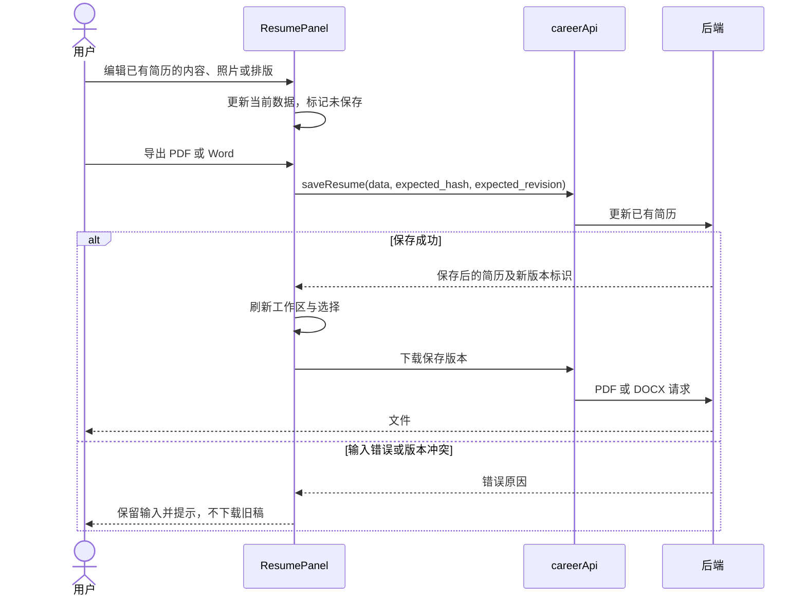

# CareerLens 前端设计文档

> 版本：v1.0｜编制日期：2026-09-09｜课程对应：第三天系统设计、UI/UX 原型和开发启动，第四天接口同步与联调。基于当前工作区源码；本轮编写文档，不修改 UI 实现。
>
> 关联文档：[需求分析](需求分析.md) · [UI/UX 设计文档](UIUX设计文档.md) · [原型与交互设计](原型与交互设计.md) · [系统设计方案](系统设计方案.md)。

## 1. 设计目标与技术基线

前端将“整理简历—保存 JD—核对诊断—审阅改写—导出定向版”组织为连续工作区。服务器保存业务数据与版本，浏览器管理本次编辑、选择和反馈；网站模式在确认会话后加载个人工作区。本地模式直接使用同一业务界面。

表 1 技术基线（来自前端 `package.json`）

| 技术 | 当前声明版本 | 作用 |
| --- | --- | --- |
| Next.js | `^16.2.12` | App Router、路由布局、后端代理和部署构建 |
| React / React DOM | `^19.2.4` | 组件与交互状态 |
| TypeScript | `^5` | 数据结构和 API 类型 |
| Tailwind CSS | `^4` | 全局和通用组件样式 |
| CSS Modules | Next.js 内置 | 工作区、认证及简历排版的局部样式 |
| ECharts / wordcloud | `5.6.0` / `2.1.0` | 技能词云、薪资散点、岗位技能热力图 |
| Tiptap | `^3.20.0` | 简历富文本编辑 |
| dnd-kit | core `^6.3.1`、sortable `^10.0.0` | 章节与列表排序 |
| Vitest / Testing Library | `^4.1.8` / React `^16.3.2` | 组件和接口行为测试 |

声明范围不等于锁定安装版本，复现使用 `package-lock.json` 和 `npm ci`。本设计沿用现有实现；不新增全局状态框架或平行表单模型。

## 2. 路由与组件架构

图 1 前端组件与数据访问结构

```mermaid
flowchart TD
    R[根布局 AuthProvider] --> G[默认布局 AuthGate]
    R --> L[/login LoginPage]
    G --> P[Status / Language / Preview Context]
    P --> W[/ CareerWorkspace]
    W --> A[ResumePanel]
    W --> B[JobsPanel]
    W --> C[MatchPanel]
    W --> D[MarketPanel]
    A --> A1[ResumeForm / ResumeLayout / Resume]
    C --> C1[AnalysisResults / ComparePanel / RewriteComparison]
    D --> D1[MarketCharts 按需加载]
    P --> S[/settings 本地设置或 AccountPage]
    A & B & C & D --> API[careerApi]
    L & R --> AUTH[authApi]
    API & AUTH --> F[apiFetch]
    F --> N[/api/v1 → FastAPI]
```

表 2 路由责任

| 路由 | 组件/用途 | 访问与状态 |
| --- | --- | --- |
| `/` | `CareerWorkspace` 四面板 | 网站匿名显示 `PublicSite`，本地及网站已登录进入工作区 |
| `/login` | `LoginPage` | 邮箱验证；已登录或本地模式回到首页 |
| `/settings` | `LocalSettingsPage` / `AccountPage` | 本地配置模型和数据；网站展示账户、服务与退出 |
| `/builder?id=…` | 简历编辑器 | 扩展排版、预览与附件功能 |
| `/dashboard`、`/resumes/[id]` | 现存简历管理与详情 | 保留扩展路由 |
| `/tailor`、`/tracker`、`/resume-wizard` | 定向流程、投递追踪和创建向导 | 不增加首页顶层面板 |
| `/print/resumes/[id]`、`/print/cover-letter/[id]` | 打印专用页面 | 由导出链路使用，网站请求按打印会话传递身份 |

首页四个面板由 `page` 状态切换，尚未写入 URL。浏览器刷新后重建工作区，不能承诺保留当前面板或比较选择。原型规范将可恢复导航列为后续改进。

表 3 主要源码位置与职责

| 模块 | 相对前端目录的位置 | 责任 |
| --- | --- | --- |
| 根与业务布局 | `app/layout.tsx`、`app/(default)/layout.tsx` | 字体、元数据、认证、上下文与错误边界 |
| 网站认证 | `components/auth/` | 公开入口、邮箱登录、会话同步与账户页 |
| 工作区容器 | `components/career/workspace.tsx` | 数据加载、简历/JD 选择、导航、统一操作反馈 |
| 简历模块 | `resume-panel.tsx`、`resume-layout.tsx` | 内容/原文/排版、保存与导出 |
| 岗位模块 | `jobs-panel.tsx` | JD 输入、来源、要求校对和记忆 |
| 匹配模块 | `match-panel.tsx`、`compare-panel.tsx` | 诊断、条件、历史、改写和多岗比较 |
| 市场模块 | `market-panel.tsx`、`market-charts.tsx` | 查询、完整度、主动记住、本页统计与解读 |
| 类型与网络 | `lib/api/career.ts`、`auth.ts`、`client.ts` | 接口类型、请求、超时、下载与会话取消 |
| 照片处理 | `lib/utils/resume-photo.ts` | 类型与体积校验、裁切压缩及对象 URL 回收 |

## 3. 状态设计与版本一致性

表 4 状态归属

| 状态组 | 保存位置 | 生命周期及更新原则 |
| --- | --- | --- |
| 简历、JD、诊断、改写历史 | 后端；前端 `CareerState` 为读取结果 | 成功写入后 `refresh`，由返回对象更新选择 |
| 当前面板、简历/JD 编号、AI 开关 | `CareerWorkspace` | 当前挂载期间有效；非持久化偏好 |
| `busy`、`notice`、`error`、`dirty` | `CareerWorkspace` | `run` 统一提交反馈；简历和 JD 编辑未保存时拦截离开 |
| 简历内容、原文、名称、排版、视图 | `ResumePanel` | 编辑与预览共享当前数据；保存使用服务端版本标识 |
| 实时查询输入与已提交条件 | `MarketPanel` 的输入状态和 `applied` | 翻页使用已提交条件；失败保留旧结果 |
| 请求代次 | `MarketPanel.requestId` | 仅最新请求可更新数据；卸载后旧响应失效 |
| 当前会话、通知与代次 `epoch` | `AuthProvider` | 身份变化清理旧缓存与请求，重建受保护组件 |
| 预览、状态缓存与语言 | 对应 Context | 受认证门控制，身份变化随组件树重新建立 |

简历 `hash` 与 `revision` 是编辑并发检查标识，其中 `revision` 还包含排版变化，`template_settings` 独立保存。提交时携带 `expected_hash` 与 `expected_revision`，服务端拒绝过期写入。只改排版不应改动经历事实；诊断和采纳另按结构化正文与冻结 JD 校验，单独修改排版不会自动使既有改写过期。采纳生成的定向版继承源简历当前排版，并拥有独立业务版本。

图 2 保存与导出时序

以下对应已有简历的工具栏导出。新建草稿的 PDF/Word 按钮禁用，须先显式保存；诊断结果中的快捷 PDF 导出直接下载已保存结果，使用接口默认的 Swiss 单栏/A4 参数。补充事实、核对选择和比较选择未接入简历/JD 的离开保护，面板卸载时会丢失。



## 4. API 接入与错误处理

浏览器默认请求同源 `/api/v1`；Next.js 将 `/api/*` 代理到 `BACKEND_ORIGIN`。服务器侧相对请求转换为后端内部地址。`NEXT_PUBLIC_API_URL` 仅配置公开 API 地址，密钥与平台服务凭据不进入客户端环境变量。

`apiFetch` 默认携带凭据，使用 `cache: 'no-store'`，通过 `AbortController` 控制超时与取消。默认请求上限为 240 秒，环境配置约束为 30 秒至 30 分钟；该传输上限与后端各业务操作预算分别管理。

表 5 前端功能与接口映射（路径省略 `/api/v1`）

| 用户操作 | 接口 | 关键字段/响应 |
| --- | --- | --- |
| 初始化 | `GET /career/state` | 简历、岗位、诊断、改写、模型状态 |
| 解析文本/文件 | `POST /career/resumes/parse`、`POST /career/resumes/file` | 原文、结构化 `data`、解析 `mode`、可选警告 |
| 保存简历 | `POST /career/resumes`、`PUT /career/resumes/{id}` | 内容、原文、排版、预期 hash/revision |
| 提取/保存 JD | `POST /career/jobs/parse`、`POST /career/jobs`、`PUT /career/jobs/{id}` | 要求引文、重要度及来源字段 |
| 单岗/多岗诊断 | `POST /career/matches`、`POST /career/matches/compare` | 简历/JD 标识、AI 与语义开关、快照和明细 |
| 方向分析 | `POST /career/directions` | 方向、引用、已保存候选岗位 |
| 人工核对 | `POST /career/matches/{id}/review`、`…/conditions` | 证据状态/证据标识或条件确认，返回新诊断 |
| 改写与决策 | `POST /career/rewrites`、`…/{id}/apply`、`…/{id}/reject` | 选中章节、至多 8 条事实、用户确认与定向版 |
| 实时查询/记住 | `GET /career/live/jobs`、`POST /career/live/jobs/{id}/remember` | 来源、关键词、地域、分页、完整 JD |
| 本页解读 | `POST /career/live/analyze` | 至多 10 条完整 JD 与问题 |
| 已存岗位聚合 | `POST /career/market/summary`、`…/analyze` | 筛选与统计；接口存在，首页主要显示实时页统计 |
| 文件导出 | PDF 使用 `lib/api/resume.ts`；`GET /resumes/{id}/docx` | 下载 Blob、触发文件保存并回收对象 URL |
| 会话与邮件 | `GET /auth/session`、`POST /auth/email/start`、`…/verify`、`POST /auth/logout` | 模式、用户、可用状态、挑战编号和有效时间 |

业务 API 读取响应 `detail`，支持字符串和验证错误数组并转为用户可见提示；邮箱接口另读取 `Retry-After`。当前多数错误呈现在操作级通知中，字段错误与字段的程序关联仍为待完善项。

表 6 失败场景与恢复设计

| 场景 | 当前机制 | 用户恢复路径与验收 |
| --- | --- | --- |
| 后端无法连接 | 初始化捕获异常、显示重试 | 恢复连接后重新读状态，不显示虚假空数据 |
| 输入校验失败 | 展示后端错误 | 保留原文，定位需修改字段；字段关联待补齐 |
| 并发保存冲突 | 预期 hash/revision 校验 | 提示冲突，避免静默覆盖；完整草稿保留流程需实测 |
| AI 不可用 | 显示真实失败，部分功能允许规则模式 | 用户主动关闭 AI 重试；不保存冒充 AI 的规则答案 |
| 查询响应乱序 | 请求代次校验 | 旧结果不能替换新的查询 |
| 导出失败 | 保存和下载按序处理 | 已保存内容保留，可再次下载 |
| 业务接口 401 | 派发会话过期事件 | 清除受保护状态，重新验证邮箱 |
| 账号切换 | 请求取消、会话代次和 React `key` | 旧账号的迟到数据不得回填新账号 |

## 5. 网站认证交互

`AuthProvider` 首次读取 `/auth/session`。`AuthGate` 在会话未返回时显示连接状态；网站匿名用户看到公开首页；本地模式或已登录用户进入业务布局。邮箱验证使用 6 位数字，保存挑战编号及服务端返回的重试/有效时间，支持重发、更换邮箱和失效提示。

身份发生变化时，`resetApiSession` 取消业务请求，前端清理 `master_resume_id`、`resume_builder_*` 和 `resume_wizard_*` 已知缓存，并增加 `epoch` 使受保护树重新挂载。页面重新获得焦点时刷新会话；同浏览器标签通过 `BroadcastChannel` 同步身份变化。

公开首页中的 `github_url` 对应“本地部署”仓库链接，并非 GitHub 登录。网站账户页不呈现模型密钥编辑器，退出成功后回到公开首页。界面门控之外的租户访问控制由后端执行，具体见[后端与数据库设计](后端与数据库设计文档.md)。

## 6. 照片、排版与文件输出

照片处理接受 PNG/JPG，检查扩展对应的 MIME 与文件头、非空体积及像素规模，源文件上限 10 MB。浏览器居中裁切为 3:4、360×480 的 JPEG，处理结果上限 1 MB，写入 `personalInfo.photo`。读取失败保留原照片；临时对象 URL 在结束时回收。照片为可选材料，AI 服务构造输入时剔除该字段。

排版面板复用 `TemplateSettings`，编辑纸张、字体、字号、行距、章节/经历间距和四边页边距。自动排版依据实际字体与图片加载后的内容测量选择排版参数，保留全部内容。简历面板的工具栏导出先保存当前设置，PDF 将其映射为查询参数，Word 读取已保存设置并使用原生可编辑文本与嵌入照片。各导出入口的差异见[原型与交互设计](原型与交互设计.md)，实现细节见[简历照片与排版导出](简历照片与排版导出.md)。

## 7. 响应式、可访问性与性能

工作区沿用奶油底、深紫文字、紫色主按钮和黄色选中状态，实际变量与尺寸见[UI/UX 设计文档](UIUX设计文档.md)。桌面为侧栏与主区，760 px 以下转为顶部导航和单列表单，版本列表变为下拉；表格允许局部滚动。核心面板用标题、可见标签、状态文本和焦点环承载信息。

本轮按 ui-ux-pro-max 的“字段错误关联与可聚焦错误汇总”“客户端与服务器组件边界”建议核对设计。图表和复杂编辑器按需动态加载；市场图表在用户展开后渲染。图表已有文字说明和技能频次表，薪资与分类技能的等价明细仍需补齐。44 px 触控目标、键盘闭环、字段错误关联和缩放重排作为待执行验收，不宣称已完成全部可访问性测试。

## 8. 验证入口与设计待办

表 7 按行为组织的现有测试入口

| 验证内容 | 测试文件（前端 tests 目录） | 核心观察 |
| --- | --- | --- |
| 默认选择、离开保护 | `career-workspace.test.tsx` | 未保存输入与导航 |
| 编辑、保存后导出 | `career-resume-panel.test.tsx` | 当前内容与导出顺序 |
| 文档与长内容 | `career-resume-document.test.tsx`、`career-resume-sections.test.tsx` | 章节编辑和呈现 |
| 排版、照片 | `career-layout.test.ts`、`resume-photo.test.tsx` | 独立设置、照片校验与状态 |
| 诊断、多岗与来源 | `career-diagnosis.test.tsx`、`career-enhancements.test.tsx` | 证据、条件、快照和结果模式 |
| 实时查询 | `career-live-jobs.test.tsx` | 查询条件、乱序、失败与样本 |
| 认证、旧请求 | `auth-flow.test.tsx`、`api-client.test.ts` | 会话切换、退出和旧数据隔离 |

本文件的设计说明以源码核对为依据。本轮另执行前端13个文件70项专项测试并全部通过，命令与范围见[测试报告](测试报告.md)；没有重跑完整测试、浏览器、类型检查或生产构建。后续按变更范围选择 `npm run typecheck`、`npm run lint`、`npm test` 和 `npm run build`，执行后再记录结果。

待办优先级依次为：真实用户完整任务与网站会话体验；首次 AI 材料发送告知；字段错误及焦点管理；图表等价数据；可恢复 URL 导航。9 月 10—12 日的测试与集成属于后续计划，按实际执行日期填入记录。
