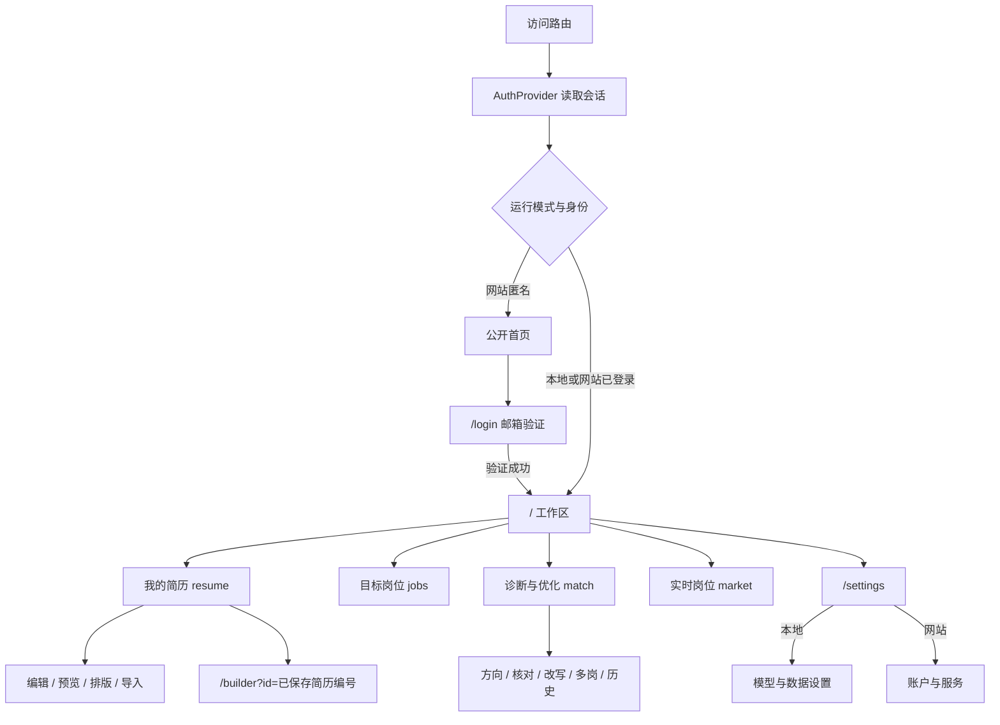
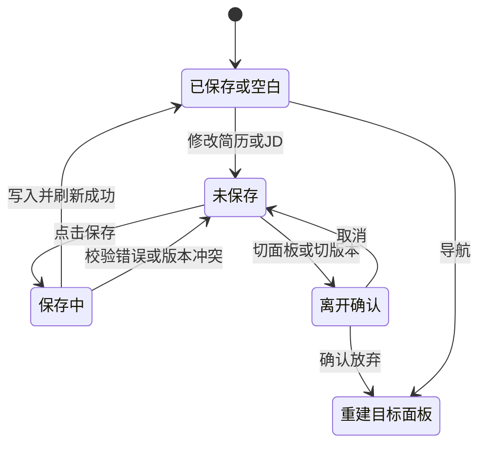
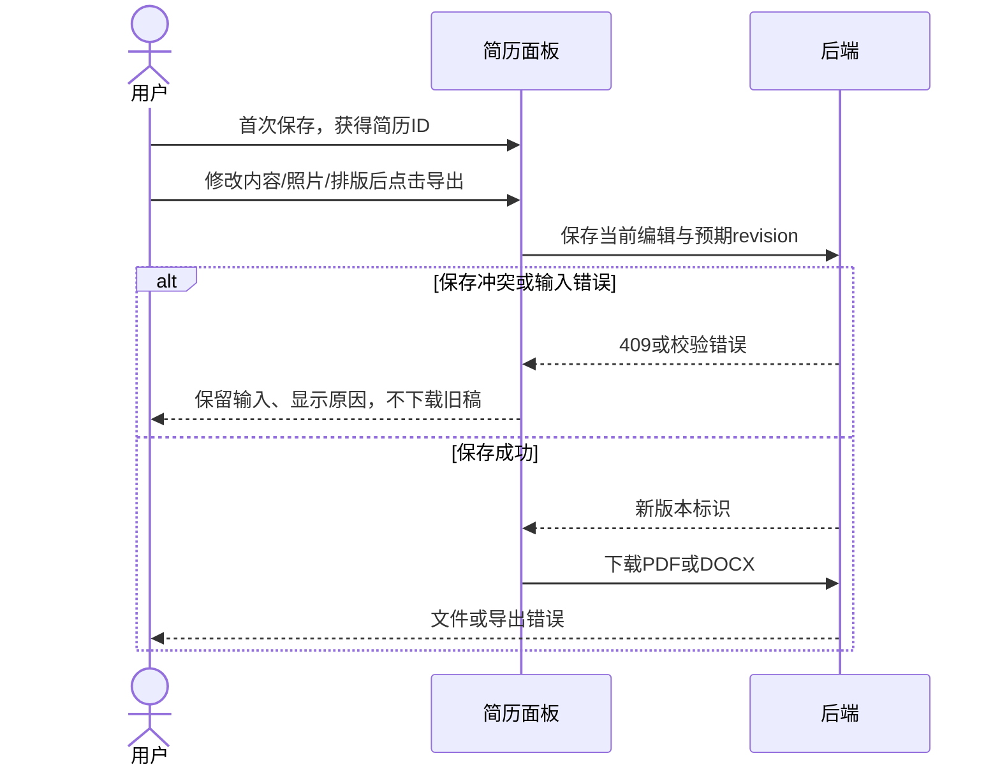
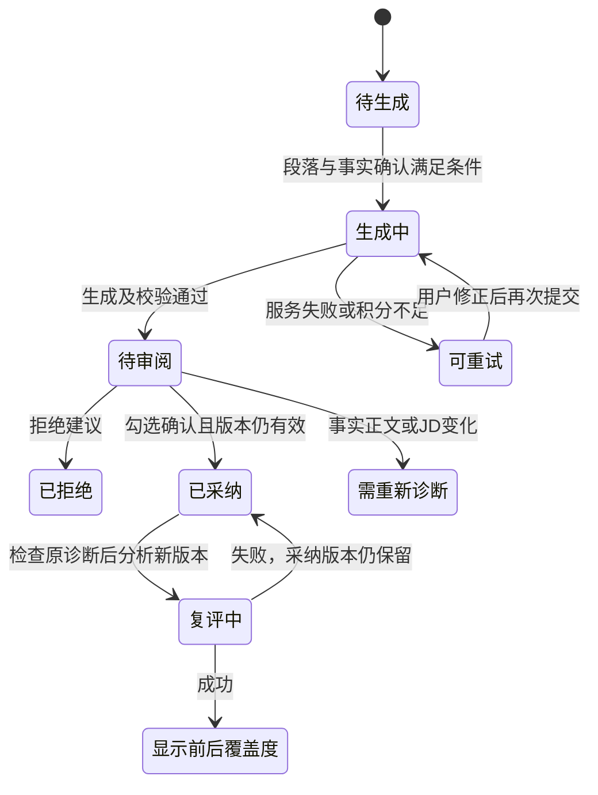

# CareerLens 原型与交互设计

> 版本：v1.1｜修订日期：2026-09-09｜课程对应：第三天 UI/UX 原型与设计评审、第四天接口联调。本文以当前前端及相关接口源码为依据，采用 Markdown 线框、状态图和可执行验收步骤。
>
> 关联文档：[需求分析](需求分析.md) · [前端设计](前端设计文档.md) · [UI/UX 设计](UIUX设计文档.md) · [后端与数据库设计](后端与数据库设计文档.md) · [API 接口](API接口文档.md) · [测试计划](测试计划与测试用例.md)。

## 1. 原型范围与证据

原型覆盖网站入口与验证码、四个工作区面板、照片排版、诊断审阅、市场统计、积分和设置。保留现有奶油色与紫色视觉及信息架构，不另设新风格。线框中的方括号表示控件，省略内容以文字说明；接口字段、错误码和物理数据关系分别见 API 文档及合并设计文档。

本文以“当前行为”说明源码已有能力，以“设计目标”标出尚待改进的交互；第 11 节为本次新增的验收步骤，尚未执行。未制作 Figma/Stitch 项目，也未新增截图或浏览器体验记录。项目已有 Azure 发布与线上验收记录，其中真实模型润色、扣分、隔离及导出结果见[Azure 部署记录](Azure部署记录.md)；本轮只读引用，不重新验证线上状态。

表 1-1 原型与实现依据

| 原型 | 页面任务 | 主要源码（前端目录下） | 需求 |
| --- | --- | --- | --- |
| P-01 | 公开入口、邮箱验证、已有会话入口 | `components/auth/public-site.tsx`、`login-page.tsx`、`auth-gate.tsx` | FR-15 |
| P-02 | 简历、版本、首次导入与未保存保护 | `components/career/workspace.tsx`、`resume-panel.tsx` | FR-01—02、FR-09、FR-14 |
| P-03 | 照片、排版、PDF/Word | `resume-layout.tsx`、`builder/forms/resume-photo-editor.tsx`、`lib/api/resume.ts` | FR-02、FR-16 |
| P-04 | JD 输入、校对、记住与删除 | `components/career/jobs-panel.tsx` | FR-03、FR-14 |
| P-05 | 方向、单岗、核对、改写、比较与历史 | `match-panel.tsx`、`analysis-results.tsx`、`compare-panel.tsx`、`rewrite-comparison.tsx` | FR-04—10 |
| P-06 | 查询、翻页、记住与样本统计 | `market-panel.tsx`、`market-charts.tsx` | FR-11—12 |
| P-07 | 本地设置、网站账户、积分与退出 | `app/(default)/settings/page.tsx`、`components/auth/account-page.tsx`、`auth-provider.tsx`、`lib/api/client.ts` | FR-13、FR-15；积分为当前扩展 |

## 2. 实际入口与跨页面状态

### 2.1 路由、面板与返回

图 2-1 路由与内存面板



表 2-1 实际导航边界

| 入口 | 当前行为 | 刷新与返回 |
| --- | --- | --- |
| `/` 的四个主入口 | React `page` 切换，同一 URL，不是四条路由 | 刷新回到“我的简历”；浏览器返回键不逐个恢复面板 |
| 简历“编辑/预览/排版/导入” | `ResumePanel.view` 切换，保留本次数据 | 刷新、切版本或卸载后重建，默认“编辑” |
| 诊断子功能 | 同面板中的结果区、表单和比较区 | 切出面板后即时结果、选择与未提交表单不保留；已保存历史可重新读取 |
| `/login` | 网站匿名显示验证码；本地或已登录显示“进入工作区”链接 | 后两种状态需点击链接；验证成功才自动替换为 `/` |
| `/settings` | 本地设置页或网站账户页 | 页面提供返回首页/工作台入口，不恢复离开前面板 |
| `/builder?id=…` | “更多版本操作”中的高级编辑器，读取已保存内容 | 属于独立路由，不是首页“排版”视图 |
| 保留扩展路由 | `/dashboard`、`/resumes/[id]`、`/tailor`、`/tracker`、`/resume-wizard` | 存在于工程，不增设为首页四入口 |
| 打印路由 | `/print/resumes/[id]`、`/print/cover-letter/[id]` | 供导出链路使用，不进入主导航 |

网站身份门作用于默认布局；匿名访问其下的受保护页面显示公开首页，不能把前端显示控制作为后端授权的替代。打印身份限制见合并设计文档。

### 2.2 加载、选择和未保存边界

表 2-2 工作区共享状态

| 状态或操作 | 当前行为 | 用户恢复或后续设计 |
| --- | --- | --- |
| 会话未返回 | 显示“正在连接 CareerLens…”；失败显示错误与“重新连接” | 成功后再决定公开首页或业务布局 |
| 业务数据未返回 | 显示“正在读取工作区…”；失败显示“服务尚未连接”与“重试连接” | 重试重新读取 `/career/state` |
| 首次空工作区 | 默认“我的简历”，选择新建态；文件名输入初值为“我的简历” | 可直接填写，也可点击“导入” |
| 默认版本 | 保留仍存在的已选简历；首次优先最近修改的非“虚构示例 ·”版本，否则新建 | 默认 JD 不自动选定；岗位列表过滤 `synthetic` 并按最近使用排序 |
| 全局业务处理中 | `busy` 禁用业务 fieldset、主导航、版本切换与 AI 开关；显示操作文本 | 完成显示“某操作完成”；失败显示原因，结束后可关闭提示 |
| 编辑简历或 JD | 名称、内容、原文、照片、排版及 JD 校对操作设置 `dirty` | 离开主面板、切换文档、打开设置/高级编辑器时确认是否放弃 |
| 取消离开 | 保持原面板、选择与编辑 | 可继续编辑或显式保存 |
| 确认离开 | 丢弃该面板未保存编辑，切到新目标 | 不自动创建草稿备份 |
| 刷新/关闭页面 | `dirty` 为真时注册浏览器 `beforeunload` 提示 | 提示实际呈现由浏览器控制；确认刷新后重读已保存数据 |
| 诊断表单未提交 | 补充事实、证据勾选、条件输入、比较选择不设置全局 `dirty` | 当前切页不会额外确认；若要持久保存，须先完成对应提交 |
| 市场查询中 | 仅该面板的查询、分页、记住与解读按钮锁定 | 主导航仍可切出；请求代次阻止迟到结果回填已卸载面板 |

图 2-2 编辑、保存与离开状态



图中“保存失败回到未保存”针对服务端拒绝写入。若写入已成功而后续列表刷新失败，界面可能显示错误但数据已经保存，应重新读取后确认，不推断写入回滚。刷新后恢复面板、临时表单持久化及冲突合并器均属于设计目标，当前没有这些控件。

## 3. P-01 公开首页与邮箱验证

图 3-1 公开首页与验证表单

```text
CareerLens                                            [邮箱登录]
看清经历，找到更合适的下一步。
[在线使用] [本地部署（有 HTTPS 仓库地址时显示）]
邮箱注册即送 20 免费积分。
把经历写清楚 / 找到适合的方向 / 发现下一份机会

                    ↓ 点击在线使用
用邮箱进入 CareerLens                                [返回首页]
首次验证注册赠送 20 免费积分，已有账户直接登录。
邮箱地址    [you@example.com                    ]
[发送验证码]
发送成功后：验证码已发送至当前邮箱
6 位验证码  [ _ _ _ _ _ _ ]
[验证并进入工作区] [倒计时/重新发送验证码] [更换邮箱]
发送失败、验证码错误或过期原因显示在表单内
```

表 3-1 字段、动作与状态

| 字段/按钮 | 当前输入与禁用条件 | 成功、空态、失败及恢复 |
| --- | --- | --- |
| 邮箱地址 | 必填、邮箱类型、自动填充、最长 254；处理中或已有挑战时禁用 | 服务端返回规范化邮箱；更换邮箱后重新输入 |
| 发送验证码 | 邮箱为空、处理中或等待重试时禁用；浏览器校验邮箱格式 | 成功保存挑战编号和有效时间；失败保留邮箱，遵循 `Retry-After` |
| 6 位验证码 | 数字输入、自动填充、仅保留 6 位数字；处理中或过期禁用 | 未满 6 位不能验证；错误显示 `alert`，可修改后再提交 |
| 验证并进入工作区 | 处理中、过期或位数不足时禁用 | 成功更新会话并 `replace('/')`；失败保留当前邮箱和挑战，不冒充登录成功 |
| 重新发送验证码 | 处理中或重试倒计时大于零时禁用 | 清除当前代码；成功替换挑战与有效时间；失败显示原因 |
| 更换邮箱 | 处理中禁用 | 清空挑战、代码与错误；仍遵守已有重试倒计时 |
| 邮件服务未开放 | 不显示邮箱表单，显示暂未开放说明 | 返回首页；无假发送状态 |
| 本地/已有会话访问 `/login` | 显示“本地工作区已就绪”或“欢迎回来”及“进入工作区” | 点击链接进入，不重复创建账户 |

“本地部署”对应项目仓库外链，不是 GitHub 登录。当前 20 积分为页面固定文案，与服务端默认注册额度一致；改变部署额度时必须同步文案，不能把固定文字视作接口动态值。

## 4. P-02 简历编辑、导入与版本

图 4-1 桌面工作区

```text
┌─────────────────┬─────────────────────────────────────────────┐
│ CareerLens      │ 我的简历            未保存状态 / 网站积分   │
│ 我的简历        │ 网站积分使用说明                            │
│ 目标岗位        ├─────────────────────────────────────────────┤
│ 诊断与优化      │ 版本名 [               ] [保存简历]         │
│ 实时岗位        │ [编辑][预览][排版][导入][PDF][Word][…]      │
│                 │ 操作中 / 完成 / 错误                        │
│ 简历文档    [+] ├─────────────────────────────────────────────┤
│ 基础版          │ 个人信息 简介 教育 工作 项目 技能 自定义     │
│ 定向版          │ 姓名、职位、联系方式、可选照片               │
│                 │ 教育、经历、项目、技能等连续编辑区            │
│ AI 已开启/关闭  │ [选择目标岗位 →（已保存版本显示）]            │
│ 模型/账户设置   │                                             │
└─────────────────┴─────────────────────────────────────────────┘
```

表 4-1 文档字段与动作

| 字段/按钮 | 当前行为与条件 | 成功或失败处理 |
| --- | --- | --- |
| 版本名称 | 最长 120，空白禁用保存；不要求用户先填写全部经历才可保存 | 保存显示新名称；后端长度/内容错误保留输入 |
| 连续章节 | 复用教育、工作、项目、技能等字段；章节可增加、排序、隐藏和编辑 | 隐藏于导出的章节仍可编辑；导航锚点指向章节 |
| 保存简历 | 显式提交，支持 ⌘S/Ctrl+S；处理中或名称空白时不执行 | 新建得到 ID，版本列表更新；已有版本带 hash/revision，409 显示冲突 |
| 编辑/预览/排版/导入 | 本地视图切换，处理中禁用 | 预览使用当前编辑；不因视图切换自动保存 |
| `+` 新建空白简历 | 业务未加载、全局处理中、已处于新建简历时禁用 | 有未保存内容先确认；进入新建态 |
| 导出 PDF/Word | 全局处理中或简历尚未保存得到 ID 时禁用；名称空白时处理函数不执行 | **新简历先保存一次**；已有简历导出会先保存当前编辑，详见第 5 节 |
| 更多版本操作 | 原生弹窗，可关闭或按 Escape 退出 | 未保存时仅提示先保存；已保存时显示高级编辑器、下一步和删除 |
| 删除当前版本 | 仅已保存版本提供，处理中禁用 | 确认范围包含诊断/快照/建议；取消不请求；成功刷新，其他独立简历保留 |

### 4.1 首次导入与覆盖当前编辑

图 4-2 导入视图

```text
[返回文档]
导入简历
解析后将替换文档内容，保存前仍可继续编辑。
[导入文件] PDF、DOCX、TXT、Markdown，最大 5 MB
简历原文 [                                           ]
         [教育、工作、项目和技能……                    ]
[AI 解析到文档 / 规则解析到文档]
```

文件选择后立即请求解析，不需要再点击文本解析按钮；取消文件选择不发请求。文本最多 30,000 字符，空白或全局处理中不能解析。解析成功替换当前结构化内容和原文、标记未保存并回到编辑视图，保留名称与当前排版；它不是“自动另存一份简历”。如需保留当前稿，先保存或新建再导入。

界面在导入前说明替换范围，当前没有额外覆盖确认弹窗。非积分类文件 AI 解析失败可以返回带原文的规则草稿及警告；请求整体失败时不替换现有编辑。积分不足的 402 保持为错误，用户关闭 AI 后重新导入；不静默假装完成 AI。无解析结果时保留输入和导入入口，不显示诊断分数。

### 4.2 保存冲突与版本切换

当前保存使用 `expected_revision`，包含正文、原文、标题和排版；后端拒绝过期编辑。失败通知不能代替自动合并，当前没有“强制覆盖”或冲突差异选择器。发生 409 后先将未保存文字复制到用户选择的位置，再重新读取最新版本核对；复制草稿与合并是人工恢复步骤，不是已经实现的按钮。

高级编辑器读取已保存内容；确认放弃后进入高级编辑器不会携带未保存的首页内容。诊断中“查看定向版简历”跳回简历面板并选择新版本。

## 5. P-03 照片、排版与输出

图 5-1 照片与排版控件

```text
个人信息 → 简历照片（可选）
[当前照片] [上传/更换照片] [移除照片]
PNG/JPG，最大 10 MB，自动裁为 3:4 竖幅

排版工作台                      [按内容自动排版] [重置排版]
简历样式 [经典/简洁/现代]        正文大小 [选择磅值]
行距 [选择] 章节间距 [选择]      经历间距 [选择]
纸张 [A4/Letter]  上/下/左/右边距 [5—25 mm 整数]
[分页预览与缩放]
工具栏：[保存简历] [导出 PDF] [导出 Word]
```

表 5-1 状态与输出边界

| 操作 | 当前控件与限制 | 反馈及恢复 |
| --- | --- | --- |
| 上传/更换照片 | PNG/JPG，源文件不超过 10 MB；处理时禁用照片控件 | 显示“正在处理照片…”；成功裁切为 360×480 并替换照片；失败保留原照片并显示原因 |
| 移除照片 | 有有效照片时显示，处理时禁用 | 立即清空本次照片并标记未保存；保存后生效 |
| 照片处理 | 居中裁切 3:4、压缩为 JPEG，临时地址使用后释放 | 无手动裁切位置控制；切版或卸载后旧处理结果不能回填 |
| 排版选择 | 三种样式、正文字号档位、五档间距、纸张及四边距 | 预览同步变化并标记未保存；非法边距输入不更新设置 |
| 按内容自动排版 | 等待字体和照片就绪后测量；本地处理中锁定排版控件 | 显示一页或多页结果，保留全部正文；失败显示原因，可手动调整 |
| 重置排版 | 重置为工作区默认参数，保留当前模板选择 | 属于未保存编辑，须保存后持久化 |
| 分页预览 | 显示计算中/总页数，提供缩小、放大和边距参考线开关；缩放达到界限时禁用对应按钮 | 缩放和参考线仅影响屏幕阅读，不改变导出纸张、正文或保存版式 |
| 我的简历工具栏导出 | 必须已有简历 ID；先保存当前内容/照片/排版，成功后下载 | 保存冲突不下载旧稿；下载失败时保存可能已完成，可重试 |
| PDF 参数 | 工具栏传当前完整排版参数与中文语言 | 内容来自保存版本，版式来自该次请求 |
| Word 参数 | 从已保存内容和排版生成原生可编辑 DOCX | 文字可编辑，照片嵌入；不同文字处理器换行需分别检查 |
| 诊断页“导出定向版 PDF” | 直接下载已采纳版本，不执行首页保存，也不传完整排版 | 当前辅助函数使用 `swiss-single`、A4 默认参数；若需已调整排版，进入定向版后从工具栏导出 |

照片从 AI 输入中剔除。照片处理和自动排版是各组件的本地状态，不等同于整个工作区的全局锁；验收时应在处理完成后检查预览再保存。当前页面没有导出百分比或自动恢复下载任务。

图 5-2 工具栏导出时序



## 6. P-04 目标 JD 输入与校对

图 6-1 JD 面板

```text
[最近使用的 JD ▼] → 点击一条回填
已记住时：[已记住这份 JD] [粘贴另一份 JD]
岗位名称（必填） [                                  ]
粘贴 JD 原文（必填） [                               ]
[补充公司、地点与来源（选填） ▼]
[提取与校对岗位要求 ▼]
要求名称 [ ] 重要程度 [普通/优先] [移除]
JD 原文引用 [                                       ]
[手动添加一项要求]
[管理这份 JD ▼：删除]
[记住这份 JD] [用这份 JD 诊断 →（已保存时显示）]
```

表 6-1 字段及按钮规格

| 字段/操作 | 当前限制与触发条件 | 成功、空态与失败 |
| --- | --- | --- |
| 名称/原文 | 名称最多 120、原文最多 30,000；均不能为空 | 名称或原文空白禁用“记住” |
| 选填信息 | 公司、类别、城市、薪资原文、URL、发布日期、来源类型 | 未知值留空；来源类型提供手工/课程，已有 API 岗位可保留 API 来源 |
| 来源时间 | 发布日期可编辑；已有来源更新时间只读展示 | 不补造未知日期；获取时间与入库时间分开解释 |
| 明确抽取要求 | 原文空白或处理中禁用；按钮随 AI 开关显示 AI/规则 | 成功替换要求列表并标记未保存；失败保留上次列表和原文 |
| 修改 JD 原文 | 立即使当前要求列表失效 | 提示需重新提取；不能把旧引文继续当作新正文的校对结果 |
| 要求项 | 名称最多 100、引用最多 3,000、普通/优先选择 | 引用须在 JD 中、标识及名称不能重复；错误由接口返回，当前未逐字段定位 |
| 手动添加 | 最多 60 项，达上限禁用 | 即使未抽取也可添加；空名称或空引用需补齐才能通过接口校验 |
| 零条要求 | 显示“没有识别到有效要求，可以手动添加” | 显式空列表可以保存，后续匹配无有效要求时分数为“—” |
| 记住 JD | 未选旧 JD 时创建，否则更新；成功回填规范化要求 | 未先抽取时由后端**规则**提取，保存请求不携带 AI 开关；不因开启 AI 自动调用模型 |
| 用这份 JD 诊断 | 已保存 JD 才显示；有未保存修改时先执行离开确认 | 确认放弃后分析的是保存版本，不自动保存当前 JD |
| 删除这份 JD | 已保存时显示，需确认关联诊断及建议范围 | 成功刷新岗位；简历版本保留；失败保留当前界面并显示原因 |

删除确认文案中的“关联诊断和建议”对应主闭环的诊断与改写记录；扩展模块的 `improvements`、`tailoring_previews`、`applications` 不应据此推断为全部清理，实际边界见合并设计文档。

## 7. P-05 方向、诊断、核对与改写

### 7.1 无 JD 方向与单岗诊断

图 7-1 分析入口与结果层级

```text
选择已保存的简历 [▼]    目标 JD（方向分析可不选） [▼]
[分析适合的岗位方向] [分析目标 JD 匹配度] [推荐已保存岗位]
诊断选项：[AI模式说明] [查找语义相关的经历 □]

方向结果：来源/时间、方向、理由、简历引文、准备动作
[查找相关实时岗位]
已保存推荐：候选岗位、理由、简历与 JD 引文
[分析此岗位匹配度] [查看原岗位]

单岗结果：AI适合度 → 材料覆盖度 → 逐项要求/证据 → 条件
          → 单段改写 → 多岗位比较 → 历史诊断
```

表 7-1 分析入口状态

| 操作/结果 | 当前条件与呈现 | 空态、失败与切换 |
| --- | --- | --- |
| 分析岗位方向 | 已保存简历且 AI 开启；处理中禁用，不要求选择 JD | 返回方向与引用；失败保留已有结果并给错误，不伪造方向 |
| 推荐已保存岗位 | 上述条件且至少一份已保存 JD | 与方向按钮调用同一个 `/directions`；返回的具体岗位只来自已保存候选 |
| 无已保存推荐 | 显示暂无可推荐岗位和先保存 JD 的提示 | 方向仍可用于实时搜索 |
| 分析目标 JD | 有有效简历和 JD，处理中禁用；可用规则或 AI | 无有效要求显示“—”及补充要求提示；AI 失败不给替代 AI 分数 |
| 语义选项 | 初值取模型就绪状态；模型未就绪仍可勾选 | 实际不可用时保留关键词结果并说明；候选不自动计分 |
| 选择另一简历 | 清除当前单岗与方向结果，多岗区按简历重新建立 | 不把旧简历结果显示为新简历的分析 |
| 选择另一 JD | 清除当前单岗结果，方向结果保留 | 方向基于简历，不绑定一个已选 JD |
| 方向结果过期 | 显示简历已修改，禁用“查找相关实时岗位”和“分析此岗位” | 重新分析；外部原岗位链接仍可阅读 |
| AI 服务未配置 | 当前诊断选项显示本地“配置分析模型”或网站“查看服务信息” | 开关意图与服务是否可用分开；按钮不等同于服务健康检查 |

### 7.2 要求证据与条件确认

图 7-2 一条要求与一项条件

```text
要求名称 / 状态 / 普通或优先 / 权重 / 材料贡献
JD 原文 → 判断理由 → 简历原文
语义候选（尚未计入覆盖度）
核对后的状态 [有具体证据/仅有提及/待补充确认/本人确认缺口]
[支持该状态的证据 □ …]
[保存为新的诊断记录]

单独核对的条件：要求、已知情况、当前状态
确认状态 [尚不能确认/确认符合/确认未满足]
实际情况与依据 [                                    ]
[确认并保存条件]
```

表 7-2 核对与历史状态

| 操作/状态 | 当前行为 | 验收关注 |
| --- | --- | --- |
| 具体证据/仅提及 | 展示证据复选项，语义候选排在前；最多选 20 条 | 未选证据时保存禁用；不是直接编辑证据正文 |
| 待补充确认/本人确认缺口 | 不要求选择证据 | 区分材料未知与本人确认未掌握 |
| 保存核对 | 返回新的诊断编号，刷新历史，旧记录保留 | 当前 AI 分析沿用旧结果，不自动重新生成 |
| 条件确认 | 实际情况最多 1,000 字符，非空才能保存 | JD 未明确的条件不提供确认表单；其他条件独立于技能分数 |
| 历史快照过期 | 显示说明；禁用证据保存、条件保存、生成与采纳新建议 | 保留原引文与结果可读；需重新诊断后继续 |
| 历史诊断选择 | 按时间/岗位/分数显示，读取后同步简历与 JD 选择并清除方向 | 没有历史时只有占位选项；读取失败给错误，不清空已有结果 |
| 导出诊断 JSON | 下载当前结果及证据，无额外 AI 请求 | 历史内容保持原快照；导出是用户本地文件 |

当前核对输入不纳入离开保护；保存核对后改写区以新诊断重新挂载，未提交的补充事实不应被视为已存历史。明确“AI 未重跑”的邻近提示属于待完善目标。

### 7.3 单段建议、逐句来源与决策

图 7-3 改写审阅

```text
把一段经历写清楚
选择需要优化的段落 [项目经历/工作经历/简介 ▼]
补充真实事实（每行一项，可留空） [                     ]
有补充时：[我确认补充来自真实经历 □]
[生成 STAR 定向建议 / 生成事实整理草稿]

[此诊断的历史建议 ▼]
原始段落                      建议正文（变化标记）
来源/时间、改进理由、修改类型、待补充事实
逐句核对：建议句子 → 简历原文或本人补充
[确认整段内容与引用真实 □]
[采纳并生成独立版本] [拒绝建议]
采纳后：[查看定向版] [比较修改前后覆盖度] [导出定向版 PDF]
```

表 7-3 生成、审阅、采纳与复评

| 操作/结果 | 当前条件与状态 | 失败和恢复 |
| --- | --- | --- |
| 可优化段落 | 只列经历类或简介类证据 | 无可选段落时保持占位，生成禁用；先补材料再诊断 |
| 补充事实 | 文本区最多 8,000 字符，按非空行提交；接口至多 8 条、每条 1,000 | 非空时须勾选真实性；修改文字自动取消该勾选；超条数在接口报错 |
| 生成建议 | 有段落、诊断未过期、已确认非空补充且不在处理 | 成功显示草稿并清空采纳确认和复评结果；失败保留已有草稿及输入 |
| 规则模式 | 使用“生成事实整理草稿” | 整理原文与补充事实，界面明确不是 AI STAR 改写 |
| 修改差异 | 原始段落和建议正文用删除/插入样式标记变化 | 基本相同或变化很小另行提示；不是完整语义差异算法 |
| 来源与事实核验 | 显示每句引用来自简历还是本人补充、改进理由及缺失事实 | 有检查结果仍须用户核对完整含义，未生成不存在的成果数字 |
| 采纳 | 仅待审阅草稿显示；完整真实性勾选、未过期且不在处理 | 原子创建独立版本，更新草稿为已采纳；原稿保留，409 需重新诊断 |
| 拒绝 | 待审阅时显示，不要求真实性勾选；处理中禁用 | 变为已拒绝，采纳按钮移除；不删除原简历，可另生成新建议 |
| 历史建议 | 选择后重置真实性勾选与复评结果 | 已采纳/已拒绝不能在界面再次采纳；幂等重复请求属接口验收 |
| 同岗复评 | 采纳后先重读原诊断确认未过期，再用结果简历分析原 JD | 原版/JD 变化报错；成功展示同规则前后分数；AI 开启时可继续扣积分 |
| 查看定向版 | 回到“我的简历”，选中新生成版本 | 需要继续多段优化时，从该新版本重新诊断 |

图 7-4 改写状态转移



仅修改排版不会自动使业务诊断过期，采纳继承源简历当前排版。一次润色可能执行多个成功模型生成步骤；即使后续步骤失败，已成功步骤仍可能扣积分，不能按“按钮点击次数”推断扣费。

### 7.4 多岗位比较

表 7-4 多岗选择与结果

| 操作/状态 | 当前行为 | 检查点 |
| --- | --- | --- |
| 选择岗位 | 使用已保存 JD 复选框，显示已选数/5 | 选满 5 个后禁用其余未选项；可取消已有选择 |
| 比较所选岗位 | 已保存简历且至少 2 岗；处理中禁用 | 共享一份简历快照；AI/语义沿用当前开关 |
| 结果表 | 岗位、AI适合度、覆盖度、证据状态计数、条件、查看证据 | AI关闭显示规则模式，不用零分代替未生成 AI 分数 |
| 查看证据 | 请求该行诊断，并在上方单岗区展开 | 比较表仍保留；同快照的新核对结果可更新对应行和导出 |
| 选定简历/岗位内容变化 | 表格保留当时快照并提示重新比较 | 不把旧数据当作本次最新分析 |
| 失败 | 显示全局原因；已有表格保留 | 失败批次不冒充完整新表；积分已成功步骤仍按实际计费 |
| 导出比较结果 | 下载当前比较与更新后的行 | 不新增模型请求；切换简历会重建比较区 |

## 8. P-06 实时岗位、缓存与样本图表

图 8-1 实时岗位面板

```text
想找什么岗位 [                         ] [查找岗位]
招聘来源 [NCSS/腾讯/Jobicy ▼]  Jobicy地区 [全部/中国/美国/欧洲]
来源覆盖范围 / 命中口径 / 本页雇主 / 本页完整JD / 获取时间

岗位名称、公司、地点、类别、日期 [展开]
来源薪资与正文；不完整则说明原因
[使用并记住/再次使用这份 JD] [查看岗位原文]
[上一页]         第 N 页，每页最多 N 条          [下一页]

[查看本页技能与薪资统计 · N份完整JD ▼]
词云 / 薪资币种与周期选择 / 薪资散点 / 技能热力图
[技能频次明细] [导出本页样本与统计]
[AI解读或规则准备建议 ▼] 问题 [                ] [生成]
```

表 8-1 查询、分页和记住状态

| 控件/状态 | 当前行为 | 空态、失败及恢复 |
| --- | --- | --- |
| 初次进入/重新进入 | 挂载后自动以 NCSS、第 1 页和入口关键词查询 | 不恢复上次来源/页码；方向入口可带搜索关键词 |
| 关键词 | NCSS/腾讯最长 100；Jobicy最长 50、非空浏览器输入至少 3 字符；允许空关键词 | 提交从第 1 页查询；服务端仍进行独立校验 |
| 来源与地域 | 选择来源不自动查询；仅 Jobicy 显示地区选项 | 要点击“查找岗位”应用；当前输入与结果使用的 `applied` 条件分开 |
| 查询中 | 按钮显示“正在查询”，本地操作锁定；旧结果可仍显示 | 输入仍可修改，但结果只按已提交条件解释；迟到响应忽略 |
| 结果为空 | 显示“换个关键词，再找找”与换地区建议 | 不显示无样本的统计及解读面板 |
| 查询失败 | 显示错误；有旧结果时说明保留上次结果 | 再次查询；不将保留内容标记为新查询成功 |
| 上一页 | 第1页或锁定时禁用 | 使用已提交的关键词、来源和地区 |
| 下一页 | 锁定、达到100页、无更多结果时禁用；缺 `has_more` 时按总量判断 | 不使用用户尚未提交的筛选值 |
| 岗位展开 | 展示已有查询响应中的正文、来源薪资与完整度 | 展开本身不重新抓取，也不写个人岗位库 |
| 记住/再次使用 | 完整JD且未锁定；按来源名称与外部ID识别已记住 | 成功保存或复用并切到目标JD面板；不完整禁用，原网页仍可打开 |
| 缓存失效 | NCSS/Jobicy记住依赖服务端查询缓存 | 409说明重新搜索；当前没有单独的“刷新缓存”按钮 |

NCSS 按关键词与页缓存约 5 分钟；Jobicy 按关键词与地区缓存约 1 小时，再在结果内分页；腾讯适配器当前返回 `cached:false`。这是服务端查询缓存，不是浏览器保存的个人 JD。页面显示响应的获取时间，但没有专门的缓存命中徽标；重复点击查询可能仍命中缓存，不应说明为“每次实时重新抓取”。

表 8-2 图表、解读与样本口径

| 区域 | 当前范围与交互 | 无数据及待完善项 |
| --- | --- | --- |
| 完整样本计数 | 本页完整且去重 JD；命中数/返回量与样本数分开 | 不把来源命中数用作技能分母 |
| 技能词云 | 字号为包含技能的岗位数，同岗位同技能只计一次 | 技能明细表可读精确计数 |
| 薪资散点 | 用户选择同币种/支付周期，以区间中点绘图，原文保留 | 无有效薪资显示说明；不以零补缺，不自动折算币种或日/月/年 |
| 技能热力图 | 展示全页前8项技能，类别内占比以该类别岗位数为分母 | 显示类别样本量；薪资/分类技能独立等价表仍待补 |
| 图表加载 | 统计面板展开后动态加载，窗口变化重算画布尺寸 | 现有状态提示不能视为全部辅助技术验收通过 |
| 本页解读 | 问题非空、最多1,000字符且未锁定；发送最多10条完整JD | AI/规则按钮及结果分别标识；失败保留旧结果并显示原因 |
| 翻页/成功改筛选 | 更新样本并清除旧解读 | 当前页失败不替换上次样本；不累计为全市场趋势 |
| 导出样本JSON | 包含本次查询与统计；不新增 AI 请求 | 可用于复核，不能自动计入已人工标注的真实研究集 |

Jobicy 来源薪资当前保留展示但不送入薪资图；腾讯可能没有结构化薪资。已保存 JD 的 `/career/market/summary` 与 `/career/market/analyze` 是独立聚合接口，首页没有对应独立面板；Level 3 应分别验收已存聚合接口和实时页图表，不用一张实时截图替代两者。

## 9. P-07 账户、积分、退出与本地设置

### 9.1 账户与积分

图 9-1 网站账户页

```text
账户与服务                                         [返回首页]
登录邮箱        当前已验证邮箱
运行方式        CareerLens 在线服务
AI 模型         DeepSeek
免费积分        剩余 N 积分
使用规则        新账户20积分；每次成功AI生成1积分，完整润色可能多积分
余额为0时       仍可编辑、保存和导出
[退出登录]      退出失败时显示原因
```

表 9-1 积分状态和更新时机

| 场景 | 当前呈现或处理 | 业务含义与恢复 |
| --- | --- | --- |
| 网站工作区/账户页 | 从 `/auth/session` 的 `user.credits` 显示余额，未知显示“—” | 本地模式不显示注册积分；前端尚未单独调用 `/auth/credits` |
| 注册 | 当前默认赠送20，首次邮箱验证创建账户 | 重登/重启不补满；服务端额度配置变化需同步固定文案 |
| 非认证API响应完成 | 包括读取与失败响应，触发账户活动事件并重新读会话 | 余额从服务端刷新，同账号余额变化不重挂载整个工作区 |
| 重新获得窗口焦点 | 重新读取会话 | 可获取其他窗口已发生的积分变化；没有常驻积分轮询 |
| 余额为0 | 显示关闭AI后仍可编辑、核对和导出的说明 | 当前没有充值入口，不自动关闭AI，也不按余额统一禁用所有AI按钮 |
| AI返回402 | 请求层提取服务端错误并刷新会话，页面显示错误 | 用户关闭AI后重试支持规则模式的操作；方向/推荐依赖AI不能继续 |
| 多步润色/多岗分析 | 每个成功模型生成步骤计1分，完整操作可多分 | 单次生成失败/取消退回该次预扣；已成功步骤保留扣费，接口失败不等于整体零扣费 |
| 无响应/网络超时 | 无响应事件时不保证余额立即刷新 | 回到页面触发焦点刷新或完成后续读取，查看实际余额后决定是否重试 |
| 编辑、保存、规则核对、采纳、导出 | 不调用成功模型生成，不扣积分 | 同岗复评如果开启AI，则属于新的模型操作 |

当前账户页显示的“DeepSeek”也是固定文案，具体运营模型见部署配置。根据余额预估多步操作成本、将额度与模型文案改为接口驱动，是设计目标，不是当前已完成的价格确认界面。

### 9.2 退出、会话过期与跨标签页

图 9-2 身份变化处理


退出时按钮显示“正在退出…”，成功后清空会话用户、发布跨标签页消息并返回首页；失败保留登录状态并显示原因。业务401提示登录过期；清理身份状态优先于保留未提交编辑，不弹出简历离开确认。

同浏览器标签通过 `BroadcastChannel` 同步登录/退出，收到消息后先清空旧视图再读取会话；不支持该能力时仍有窗口焦点刷新。清理已知 `master_resume_id`、`resume_builder_*`、`resume_wizard_*` 缓存并取消旧请求；历史响应不得回填另一账号。积分活动只刷新当前会话，不冒充身份变化广播。

### 9.3 本地设置差异

表 9-2 设置页范围

| 页面区域 | 本地模式 | 网站模式 |
| --- | --- | --- |
| 模型与凭据 | 提供商、模型、API地址、密码型密钥输入；保存及连接测试 | 不提供平台密钥编辑器，展示账户服务说明 |
| 状态反馈 | 未配置、已配置待测试、测试中、成功/失败；保存与测试各有状态 | 余额、使用规则和退出反馈 |
| 保存设置 | loading/saving时禁用；测试使用当前输入，不要求先保存 | 不出现 |
| 测试连接 | testing/saving时禁用；失败保留配置输入并显示错误 | 不出现 |
| 其他选项 | 功能开关/提示词、界面及内容语言、系统状态刷新 | 不出现对应系统管理界面 |
| 数据管理 | 删除单一密钥、清理密钥、重置数据库均有确认弹窗 | 无数据库重置入口 |
| 离开保护 | 本地设置有独立未保存判断、返回链接与关闭页面提示 | 账户信息只读；退出按会话流程 |

默认工作区主要为中文，语言设置存在不代表全部首页文本已国际化。危险操作验收仅在专用测试环境执行，不能借验收步骤清理个人运行数据。

## 10. 页面—API—用例追踪

下表路径省略 `/api/v1`，完整字段、状态码及认证条件见[API接口文档](API接口文档.md)。TC 编号沿用既有测试计划；UX 编号为下一节的可操作验收流程，不代表新增已通过测试。

表 10-1 追踪矩阵

| 页面/动作 | API或本地交互 | 主要状态 | 需求/既有测试 | 本文流程 |
| --- | --- | --- | --- | --- |
| P-01 会话与验证 | `GET /auth/session`；`POST /auth/email/start`、`verify` | 未登录、发送、等待、验证、过期 | FR-15；TC-22—23 | UX-01 |
| P-02 初始化与导航 | `GET /career/state`；本地page/dirty | 加载、空库、已选、未保存 | FR-01—02；TC-03、26 | UX-02、04 |
| P-02 文件/文本导入 | `POST /career/resumes/file`、`parse` | 替换前、解析中、草稿、警告/失败 | FR-01、13；TC-01—02 | UX-02 |
| P-02 保存/删除 | `POST /career/resumes`；`PUT/DELETE /career/resumes/{id}` | 新建、已保存、409、删除确认 | FR-02、14；TC-03、21 | UX-03—04 |
| P-03 照片与排版 | 浏览器处理，保存附 `template_settings` | 处理中、预览、未保存 | FR-16；TC-19 | UX-03 |
| P-03 导出 | `GET /resumes/{id}/pdf`、`docx` | 保存后下载/直接下载、失败 | FR-02、16；TC-19—20 | UX-03、08 |
| P-04 JD解析与记住 | `POST /career/jobs/parse`、`jobs`；`PUT/DELETE /career/jobs/{id}` | 待抽取、校对、已记住、错误 | FR-03、14；TC-04、06、21 | UX-05 |
| P-05 方向/推荐 | `POST /career/directions` | 无JD方向、候选空、过期、失败 | FR-06；TC-08 | UX-06 |
| P-05 单岗与历史 | `POST /career/matches`；`GET /career/matches/{id}` | 规则/AI、无要求、历史快照 | FR-04—05；TC-05—07 | UX-07、09 |
| P-05 证据/条件 | `POST /career/matches/{id}/review`、`conditions` | 待核对、新诊断、过期禁用 | FR-07；TC-09—10 | UX-07 |
| P-05 改写/采纳/拒绝 | `POST /career/rewrites`；`…/{id}/apply`、`reject` | 草稿、核验、采纳、拒绝、409 | FR-08—09；TC-11—14 | UX-08—09 |
| P-05 多岗比较 | `POST /career/matches/compare`；本地JSON导出 | 少于2、2—5、结果、旧快照 | FR-10；TC-15 | UX-10 |
| P-06 查询/记住 | `GET /career/live/jobs`；`POST /career/live/jobs/{id}/remember` | 查询、空页、旧结果、缓存409 | FR-11；TC-16 | UX-11—12 |
| P-06 统计/解读 | 响应summary；`POST /career/live/analyze`；本地JSON导出 | 完整样本、无薪资、AI/规则 | FR-12；TC-17—18 | UX-11 |
| P-07 本地设置 | `/config/llm-api-key`、`llm-test`、`features`、`language`、`prompts`、`api-keys`、`reset`，`/status` | 读取、修改、保存、测试、确认 | FR-13—14；`settings-workflow.test.tsx` | UX-13 |
| P-07 积分与退出 | 会话刷新；`POST /auth/logout`；`GET /auth/credits`为后端核对接口 | 余额更新、402、退出/401、跨标签页 | FR-15；TC-22—24；`test_hosted_credits.py` | UX-14—15 |

## 11. 点击级验收流程

以下使用专用本地或网站测试工作区。材料采用公开合成文本、占位照片与明确标为测试的 JD；真实邮箱、真实模型及线上付费调用是否执行，由实际验收安排确定。记录每条流程的执行日期、模式、浏览器、样本编号、结果与问题，不预填通过。

表 11-1 可直接执行的流程

| 编号 | 点击步骤 | 必须核对的结果 |
| --- | --- | --- |
| UX-01 邮箱入口 | 网站匿名访问 `/` → 在线使用 → 填邮箱 → 发送验证码 → 输入6位有效代码 → 验证；退出后再分别测试错误代码、过期及重发 | 验证成功进入工作区；错误有原因、邮箱保留；倒计时锁定重发；新账号显示当前赠送余额；本地打开 `/login`显示进入链接 |
| UX-02 首次导入 | 空工作区点击导入 → 粘贴合成简历 → 关闭AI → 规则解析到文档 → 改一段项目 → 预览 → 返回编辑 → 保存 | 原文和结构化内容可核对；解析后显示规则模式；未保存新稿导出禁用；保存后出现版本且可导出；另用合法TXT/DOCX/PDF与超限文件核查文件分支 |
| UX-03 照片排版 | 打开已保存测试简历 → 上传占位PNG → 预览 → 排版 → 选样式/字号/页边距 → 自动排版 → 保存 → 导出PDF/Word → 刷新 → 移除照片再保存 | 处理反馈、3:4照片、页数与文字完整；刷新恢复排版；Word文字可编辑；移除后新导出无照片；不增加AI积分消耗 |
| UX-04 离开与冲突 | 修改标题 → 点击另一版本 → 取消 → 再切换并确认；另打开两个标签页编辑同一保存版本，A先保存、B再保存 | 取消保留输入，确认丢弃；B收到409并保留编辑，不自动覆盖；刷新仅恢复已保存数据；记录浏览器关闭提示实际行为 |
| UX-05 JD校对 | 目标岗位填名称/原文 → 展开要求 → 规则抽取 → 改重要度 → 添加/移除要求 → 记住；再改JD原文 → 查看失效提示 → 保存；另输入不在原文的引用 | 已存JD可回填并进入诊断；改原文使要求失效；未显式抽取时保存采用规则；非法引用报错、输入保留；空要求后诊断分数为“—” |
| UX-06 无JD方向 | 保存简历 → 诊断与优化 → 目标JD选空 → AI开启 → 分析方向 → 查找相关实时岗位 → 展开完整JD → 使用并记住 → 回诊断 → 推荐已保存岗位 | 方向无须JD；具体推荐只来自已保存库；无候选有说明；搜索带方向关键词；关闭AI后方向/推荐禁用 |
| UX-07 证据与条件 | 选保存简历/JD → 规则分析 → 对一项选“有具体证据”但不勾证据 → 勾一条 → 保存为新诊断 → 填到岗状态/依据 → 确认保存 → 历史选择原记录 | 无证据时按钮禁用；核对后生成新编号；旧记录不变；条件不与技能分数混算；人工确认不触发AI重跑 |
| UX-08 审阅与采纳 | 在有效诊断选一段 → 填一条可核查合成事实 → 先不勾真实性 → 勾选后生成 → 逐句读来源 → 勾完整确认 → 采纳 → 查看定向版 → 回读已采纳历史 → 同岗复评 | 两处确认各约束对应动作；新版本与原稿独立；页面移除重复采纳入口；同岗比较说明分数可不变；工具栏与诊断快捷PDF版式入口分别检查 |
| UX-09 拒绝与过期 | 生成第二条建议 → 拒绝 → 选回该历史；另生成草稿后在其他标签改变事实正文或JD → 重读历史 → 尝试核对/生成/采纳 | 已拒绝不再显示采纳；过期记录可读但受限操作禁用，迟到冲突由接口拒绝；只改排版不应被解释为事实变化 |
| UX-10 多岗比较 | 保存至少6个测试JD → 选1岗 → 选2岗 → 选满5岗 → 尝试第6岗 → 比较 → 一行查看证据并核对 → 导出JSON | 少于2不能提交，满5禁用其余项；单行明细可打开；同快照核对结果更新相应行；换简历后旧比较区重建 |
| UX-11 查询与图表 | 实时岗位查询 → 修改输入但不提交 → 下一页 → 查看实际查询说明 → 提交新词 → 展开统计 → 切换薪资组 → 关闭AI生成说明 → 导出JSON | 翻页使用旧已提交条件；新查询重置页与旧解读；分母为本页完整JD；币种/周期分开，无薪资有说明；JSON能核对计数 |
| UX-12 失败与缓存 | 取得有效结果后在受控环境模拟查询失败 → 看旧结果；使用已过期的NCSS/Jobicy查询点击记住 → 按提示重新搜索后再记住；另测不完整JD | 错误明确说明旧结果保留；缓存409可恢复；不完整JD禁用记住；重复记住复用已有JD，不污染其他版本 |
| UX-13 本地设置 | 本地设置修改模型/地址 → 测试连接 → 保存 → 返回；再制造无效地址；打开删除密钥/重置弹窗后取消 | 测试与保存状态分开；失败保留输入；取消危险操作不发送删除；网站设置不出现这些管理控件 |
| UX-14 余额不足 | 网站测试账号记录余额 → 执行已允许的AI操作 → 等待会话刷新；以受控零余额或单分夹具触发402 → 关闭AI → 规则核对/保存/导出 | 余额按成功生成步骤变化；402不冒充AI成功；单分多步失败可保留已成功扣费；规则/采纳/导出不扣分；不通过重复注册补满 |
| UX-15 跨标签页与退出 | 同浏览器两标签登录A → 标签1退出 → 标签2回到前台；再以B登录；在受控慢请求中重复身份切换；另模拟退出失败及业务401 | 成功退出清理旧树与请求；B不出现A的简历/结果；退出失败保留会话和错误；401提示重新验证；仅余额变化不清空当前编辑 |

真实模型采纳的重复请求、失败退款、并发扣分等难以仅靠点击稳定触发，应结合 `test_hosted_credits.py` 和接口用例复核；不要用重复付费请求制造测试条件。点击流程用于界面表现，自动化断言用于一致性，二者分开记录。

## 12. 响应式与待完善项

图 12-1 手机工作区

```text
CareerLens                                         [设置]
[我的简历] [目标岗位] [诊断与优化] [实时岗位]
简历版本 [当前版本 ▼]
页面标题 / 未保存 / 网站积分与说明
操作工具栏自动换行
正文与表单单列；原文和建议上下排列
比较表、章节导航仅在各自区域内横向滚动
```

表 12-1 设计目标与验收边界

| 优先事项 | 当前基础 | 待完成的具体目标 |
| --- | --- | --- |
| 导航与草稿 | 简历/JD有dirty保护，其他面板为内存状态 | 面板可恢复URL；对未提交事实/条件给出明确离开策略；当前不宣称已持久化 |
| 错误恢复 | 操作通知、`role=alert/status`、按钮锁定 | 错误关联具体字段，必要时聚焦错误汇总；冲突提供可审阅恢复路径 |
| AI结果与积分 | 来源、逐句核验、余额、402说明 | 核对后明确AI未重跑；配置驱动赠送额度/模型文案；多步耗分提示更贴近操作 |
| 导出一致性 | 工具栏先保存并带排版，诊断快捷导出用默认参数 | 统一入口参数或直接说明差异；保证用户可预测输出 |
| 图表可访问性 | 画布描述、技能频次表、关闭动画 | 薪资与分类技能提供完整等价数据，核对缺失分母展示 |
| 手机与键盘 | 既有断点、焦点环、单列表单及局部表格滚动 | 在390/768/1280px及320px重排执行UX流程，检查软键盘、焦点、44px项目目标 |

本次完成源码核查、原型细化和接口/用例映射，未新跑浏览器、邮件或真实模型。实际通过状态引用有日期的[测试报告](测试报告.md)与[Azure部署记录](Azure部署记录.md)，不将本文新增验收步骤标记为已执行。评审参加人、会议时间与最终确认按真实活动填写。
