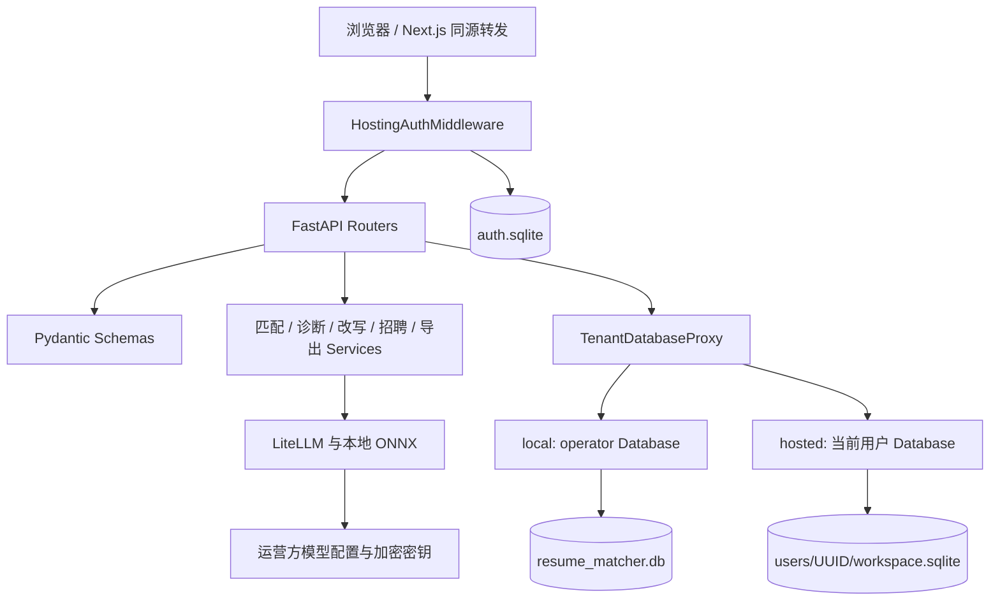
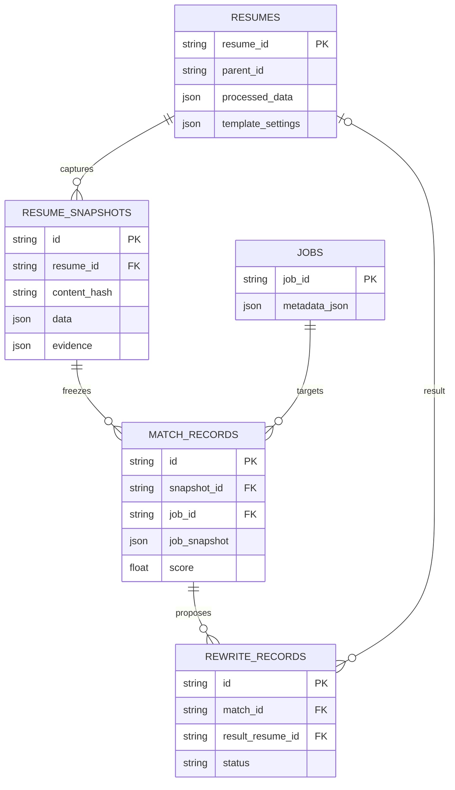
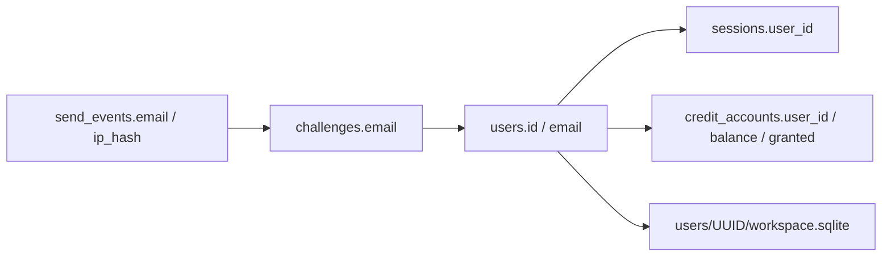
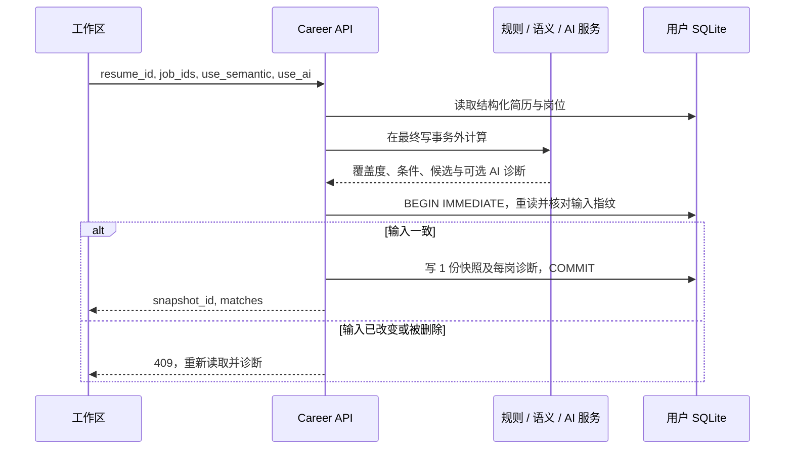
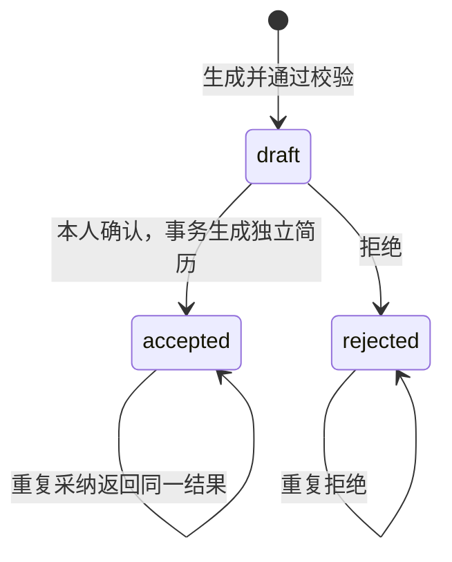
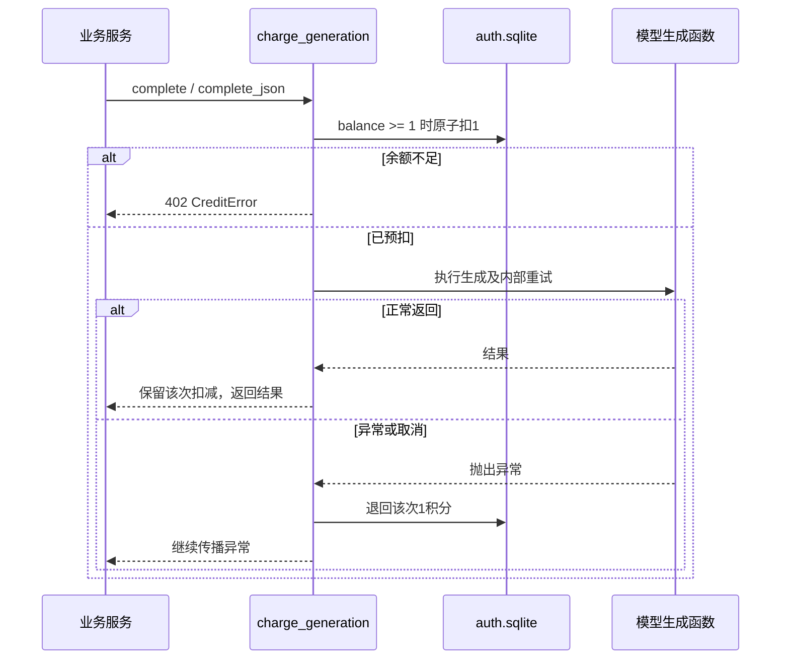

# CareerLens 后端与数据库设计文档

> 版本：v2.0；核对日期：2026-09-09。合并原后端设计与数据库设计，统一说明服务职责、存储结构、数据契约、事务和运维。依据为当前工作区源码，包含网站积分扩展；全部内容保留为一份 Markdown。
>
> 配套文档：[API接口文档](API接口文档.md) · [原型与交互设计](原型与交互设计.md) · [系统设计方案](系统设计方案.md)。请求字段与响应样例由API文档维护，本文件集中说明实现与持久化依据。

## 阅读导航

表0-1 内容导航

| 阅读目标 | 章节 |
| --- | --- |
| 了解后端边界与运行方式 | 第1—2章：目标、技术、模块与生命周期 |
| 查看数据模型与字段 | 第3—6章：存储布局、ER、9张业务表、5张认证与积分表、JSON和索引 |
| 理解一次业务如何完成 | 第7—9章：主流程、评分与AI、认证、积分和错误恢复 |
| 初始化、升级与恢复 | 第10章：迁移、删除和备份 |
| 核对现状与验证证据 | 第11章：源码检查、既有部署与测试记录 |

## 1. 设计目标与技术选型

后端围绕“保存材料—冻结输入—解释诊断—核对事实—采纳定向版—导出”组织业务。确定性规则负责材料覆盖度和岗位统计，AI 负责结构理解、诊断建议与表达优化；每次改写保留来源，采纳后生成独立简历。系统支持本地个人模式和网站登录模式，网站模式将用户业务数据按数据库文件隔离。

表1-1 后端技术选型与理由

| 组成 | 当前选型 | 选择理由与作用 |
| --- | --- | --- |
| Web 与校验 | FastAPI、Pydantic 2 | 异步 HTTP 编排；在入参和 AI 输出边界校验结构 |
| 业务持久化 | SQLAlchemy、aiosqlite、SQLite | 复用现有数据层，用事务保护版本、采纳和删除关系，降低课程部署成本 |
| 登录与积分 | Python sqlite3，独立 `auth.sqlite` | 集中管理邮箱、验证码挑战、会话、发送频控和积分余额 |
| 模型适配 | LiteLLM | 沿用提供商、模型、密钥与有限重试机制 |
| 语义检索 | multilingual-e5-small，ONNX CPU | 本地检索经历候选，不把相似度充当技能得分 |
| 文档处理 | MarkItDown、pdfminer.six、python-docx、Playwright/Chromium | 文件文本提取、可编辑 Word 导出和浏览器打印 PDF |
| 外部岗位 | NCSS、Jobicy、腾讯招聘适配器 | 按需读取公开岗位，用户选择后才写入个人 JD 记忆 |

指导书的 PostgreSQL + pgvector 是推荐选型。本项目采用 SQLite 和本地 ONNX，保留相同的材料存储与语义检索职责；当前没有把 pgvector、Celery 或分布式队列作为已实现能力。依赖版本以 [pyproject.toml](../app/apps/backend/pyproject.toml) 和锁文件为准。

## 2. 模块职责与运行上下文

### 2.1 分层与调用边界

图2-1 后端分层与访问边界



表2-1 分层职责

| 层次 | 主要入口 | 职责 |
| --- | --- | --- |
| 启动与边界 | [main.py](../app/apps/backend/app/main.py)、[hosting.py](../app/apps/backend/app/hosting.py)、[auth.py](../app/apps/backend/app/auth.py) | 校验运行模式，注册路由，处理认证、来源校验、异常与资源释放 |
| 接口 | [routers/career.py](../app/apps/backend/app/routers/career.py) | 组织材料、诊断、核对、改写与市场分析流程；校验状态和并发冲突 |
| 基础接口 | [routers](../app/apps/backend/app/routers/) | 配置、简历向导、上游增强、求职信、投递追踪、PDF/DOCX 与健康检查 |
| 业务契约 | [schemas/career.py](../app/apps/backend/app/schemas/career.py)、[schemas/models.py](../app/apps/backend/app/schemas/models.py) | 字段类型、长度、枚举、来源引用与结构化简历约束 |
| 规则服务 | [matching.py](../app/apps/backend/app/services/matching.py) | 简历规则解析、证据切片、要求抽取、分值、条件与岗位统计 |
| AI 服务 | [career_diagnosis.py](../app/apps/backend/app/services/career_diagnosis.py)、[career_ai.py](../app/apps/backend/app/services/career_ai.py) | AI 诊断、方向推荐、来源约束改写、独立事实核验 |
| 积分计量 | [credits.py](../app/apps/backend/app/credits.py)、[llm.py](../app/apps/backend/app/llm.py) | 在模型生成入口按账号预扣，成功保留扣减，异常或取消时退回本次预扣 |
| 数据访问 | [database.py](../app/apps/backend/app/database.py)、[tenant_database.py](../app/apps/backend/app/tenant_database.py) | 字典外观、事务、处理令牌、租户数据库选择与资源管理 |
| 存储结构 | [models.py](../app/apps/backend/app/models.py)、[db_engine.py](../app/apps/backend/app/db_engine.py) | ORM 表、索引、外键、WAL、初始化与增量列迁移 |

这是已有工程上的模块化单体，`career` 路由仍直接使用 ORM 完成业务事务。文档不把当前代码描述成独立微服务或完整的 Repository 架构。

### 2.2 启动、请求与资源释放

启动阶段先验证 hosted 配置，再创建数据目录。网站模式初始化认证与积分库，为已有验证账号幂等补建积分账户；本地模式尝试将旧 TinyDB 数据幂等迁入 SQLite；旧数据迁移失败会中止启动。随后将旧明文 API Key 迁入运营方加密存储并移除配置文件中的对应明文字段。

业务 `Database` 延迟创建引擎与表。每个实例拥有指向同一文件的异步业务引擎和同步密钥引擎，执行 `create_all` 与已有列的增量迁移。PDF 浏览器延迟至首次导出时启动。请求结束时认证中间件恢复 `ContextVar`，避免复用协程上下文导致身份串用。关闭阶段依次等待解析清理任务、关闭 PDF 渲染器并释放数据库引擎。

网站请求必须由服务端已验证的会话确定 UUID。`TenantDatabaseProxy` 将所有 `db` 外观访问，包括 `_session` 与 `_write_session`，映射到 `DATA_DIR/users/<UUID>/workspace.sqlite`；缺失或非法身份直接失败。租户注册表最多缓存 64 个数据库实例，采用 `NullPool`，淘汰条目不主动销毁仍被活动请求持有的引擎。

容器构建会在`/opt/careerlens-seed`准备固定版本、校验哈希的E5模型，启动脚本检查持久卷文件的哈希，保留校验通过的文件，并从镜像离线补齐缺失或损坏文件。构建还实际启动Chromium检查运行依赖；启动监督与健康检查同时覆盖前后端，任一子进程失败会清理另一进程。以上为[Dockerfile](../app/Dockerfile)和[容器启动脚本](../app/docker/start.sh)中的当前实现。

## 3. 存储布局与实体关系

### 3.1 持久化范围

项目以关系表保存简历身份、岗位身份、分析关系及状态，用 JSON 保存可变的简历章节、证据和 AI 结果。冻结副本使旧诊断能够重现，也避免编辑当前简历后覆盖历史依据。SQLite 满足当前单体应用和个人工作区部署；网站模式通过每用户独立数据库隔离业务数据。

表3-1 持久化文件与访问范围

| 路径（相对 DATA_DIR） | 内容与访问边界 |
| --- | --- |
| `resume_matcher.db` | 本地业务与运营方模型密钥；网站用户不会自动继承本地材料 |
| `users/<UUID>/workspace.sqlite` | 网站用户的业务表；由认证上下文选择，客户端不提交数据库路径 |
| `auth.sqlite` | 集中认证与积分库，包含用户、会话、验证码挑战、发送频控和积分账户 |
| `config.json` | 运营方/本地非密钥配置，原子替换写入 |
| `.secret_key` | Fernet 加密密钥文件，权限 0600，应与加密 API Key 配套保管 |
| `database.json` | 旧 TinyDB 迁移源，不是当前主存储 |

每个业务数据库使用同一套 9 表 ORM。租户文件也会创建 `api_keys` 表，但生产模型凭据统一从运营方数据库读取；不因此拥有网站用户自配系统密钥的能力。认证库采用独立`sqlite3` DDL，共5表。`credit_accounts.user_id`在同一认证库内引用`users.id`；认证库与各业务库之间没有跨文件SQL外键。

### 3.2 业务表与认证关系

图3-1 业务数据库实际外键关系



图中只画已声明的物理外键。`resumes.parent_id`、`jobs.resume_id`、`improvements`、`tailoring_previews` 和 `applications` 中的关联字段是字符串逻辑关系，完整性由业务处理。投递卡片允许关联简历删除后继续保留，详情响应中的简历可以为 `null`。

图3-2 认证库与用户工作区逻辑关系



认证关系图以访问关系为主：`sessions.user_id`和挑战邮箱没有物理外键；`credit_accounts.user_id`具有到`users.id`的物理外键。会话读取联接用户与积分账户，返回身份和余额。验证码挑战先于首次用户记录创建，因此邮箱字段不设置用户外键。

## 4. 业务数据库数据字典

下表从 [models.py](../app/apps/backend/app/models.py) 的当前字段逐项整理。`String` 映射为 SQLite `VARCHAR`，`JSON` 通过 SQLAlchemy 序列化存储，不表示启用了向量数据库。表中默认值均为 ORM 客户端默认，除另行说明外不是数据库 `DEFAULT`；直接执行 SQL 插入时仍需填写必填字段。时间是 UTC ISO 8601 字符串，认证库时间另用 Unix 秒。

### 4.1 `resumes`：简历主表

表4-1 简历主表字段

| 字段 | SQLite 类型 | 可空 | 默认/约束 | 含义 |
| --- | --- | --- | --- | --- |
| `resume_id` | VARCHAR | 否 | PK | 简历标识；具体外键属性见约束 |
| `content` | TEXT | 否 | — | 简历原文 |
| `content_type` | VARCHAR | 否 | 默认 'md' | 正文格式 |
| `filename` | VARCHAR | 是 | — | 上传文件名 |
| `is_master` | BOOLEAN | 否 | 默认 False | 当前工作区主简历标记 |
| `parent_id` | VARCHAR | 是 | — | 定向版来源简历，逻辑关联 |
| `processed_data` | JSON | 是 | — | 经 ResumeData 校验的结构化简历 |
| `processing_status` | VARCHAR | 否 | 默认 'pending' | 解析状态 pending/processing/ready/failed |
| `processing_token` | VARCHAR | 是 | — | 当前处理尝试令牌，阻止旧任务回写 |
| `cover_letter` | TEXT | 是 | — | 求职信正文 |
| `outreach_message` | TEXT | 是 | — | 联系招聘者的消息草稿 |
| `interview_prep` | TEXT | 是 | — | 序列化的面试准备内容 |
| `title` | VARCHAR | 是 | — | 简历标题 |
| `template_settings` | JSON | 是 | — | 照片之外的打印模板与排版配置 |
| `original_markdown` | TEXT | 是 | — | 原始 Markdown；为空时兼容外观省略该键 |
| `created_at` | VARCHAR | 否 | 默认 当前 UTC 时间 | 创建时间 |
| `updated_at` | VARCHAR | 否 | 默认 当前 UTC 时间 | 最后更新时间 |

### 4.2 `jobs`：岗位主表

表4-2 岗位主表字段

| 字段 | SQLite 类型 | 可空 | 默认/约束 | 含义 |
| --- | --- | --- | --- | --- |
| `job_id` | VARCHAR | 否 | PK | 岗位标识；具体外键属性见约束 |
| `content` | TEXT | 否 | — | 完整JD原文 |
| `resume_id` | VARCHAR | 是 | — | 简历标识；具体外键属性见约束 |
| `created_at` | VARCHAR | 否 | 默认 当前 UTC 时间 | 创建时间 |
| `metadata_json` | JSON | 否 | 默认 {} | 岗位及来源元数据，读取时展开为顶层属性 |

### 4.3 `improvements`：定向修改日志

表4-3 定向修改日志字段

| 字段 | SQLite 类型 | 可空 | 默认/约束 | 含义 |
| --- | --- | --- | --- | --- |
| `request_id` | VARCHAR | 否 | PK | 修改请求主键 |
| `original_resume_id` | VARCHAR | 否 | — | 原简历，逻辑关联 |
| `tailored_resume_id` | VARCHAR | 否 | 普通索引 | 定向简历，逻辑关联 |
| `job_id` | VARCHAR | 否 | — | 岗位标识；具体外键属性见约束 |
| `improvements` | JSON | 否 | 默认 [] | 本次定向修改的明细数组 |
| `created_at` | VARCHAR | 否 | 默认 当前 UTC 时间 | 创建时间 |

### 4.4 `tailoring_previews`：上游优化预览与确认记录

表4-4 上游优化预览与确认记录字段

| 字段 | SQLite 类型 | 可空 | 默认/约束 | 含义 |
| --- | --- | --- | --- | --- |
| `improvements` | JSON | 是 | — | 修改明细数组；预览表可为空 |
| `preview_id` | VARCHAR | 否 | PK | 预览主键 |
| `source_id` | VARCHAR | 否 | 普通索引 | 源简历，逻辑关联 |
| `job_id` | VARCHAR | 否 | 普通索引 | 岗位标识；具体外键属性见约束 |
| `payload_hash` | VARCHAR | 否 | — | 预览载荷指纹 |
| `source_hash` | VARCHAR | 否 | — | 源材料指纹 |
| `job_hash` | VARCHAR | 否 | — | 冻结岗位指纹 |
| `created_at` | VARCHAR | 否 | — | 创建时间 |
| `expires_at` | VARCHAR | 否 | 普通索引 | 预览到期时间 |
| `result_resume_id` | VARCHAR | 是 | 普通索引 | 采纳结果；具体外键属性见约束 |
| `claim_token` | VARCHAR | 是 | — | 当前确认操作占用令牌 |
| `claim_expires_at` | VARCHAR | 是 | — | 确认占用截止时间 |
| `response_data` | JSON | 是 | — | 成功确认响应，支持重放 |

### 4.5 `applications`：投递追踪卡片

表4-5 投递追踪卡片字段

| 字段 | SQLite 类型 | 可空 | 默认/约束 | 含义 |
| --- | --- | --- | --- | --- |
| `application_id` | VARCHAR | 否 | PK | 投递卡片主键 |
| `job_id` | VARCHAR | 否 | 普通索引 | 岗位标识；具体外键属性见约束 |
| `resume_id` | VARCHAR | 否 | 普通索引 | 简历标识；具体外键属性见约束 |
| `master_resume_id` | VARCHAR | 是 | — | 用于分组的主简历，逻辑关联 |
| `status` | VARCHAR | 否 | 普通索引；默认 'applied' | 业务状态，取值由接口/流程约束 |
| `company` | VARCHAR | 是 | — | 企业名称 |
| `role` | VARCHAR | 是 | — | 岗位名称 |
| `applied_at` | VARCHAR | 是 | — | 投递日期 |
| `notes` | TEXT | 是 | — | 备注 |
| `position` | INTEGER | 否 | 默认 0 | 看板内位置 |
| `created_at` | VARCHAR | 否 | 默认 当前 UTC 时间 | 创建时间 |
| `updated_at` | VARCHAR | 否 | 默认 当前 UTC 时间 | 最后更新时间 |

### 4.6 `api_keys`：提供商加密凭据

表4-6 提供商加密凭据字段

| 字段 | SQLite 类型 | 可空 | 默认/约束 | 含义 |
| --- | --- | --- | --- | --- |
| `provider` | VARCHAR | 否 | PK | 密钥存储提供商名称 |
| `ciphertext` | TEXT | 否 | — | Fernet 密文 |
| `updated_at` | VARCHAR | 否 | 默认 当前 UTC 时间 | 最后更新时间 |

### 4.7 `resume_snapshots`：不可变简历快照

表4-7 不可变简历快照字段

| 字段 | SQLite 类型 | 可空 | 默认/约束 | 含义 |
| --- | --- | --- | --- | --- |
| `id` | VARCHAR | 否 | PK | 记录主键 |
| `resume_id` | VARCHAR | 否 | FK → `resumes.resume_id`，CASCADE；普通索引 | 简历标识；具体外键属性见约束 |
| `content_hash` | VARCHAR | 否 | — | 结构化简历指纹 |
| `data` | JSON | 否 | — | 冻结的完整 ResumeData |
| `evidence` | JSON | 否 | — | 冻结证据数组 |
| `created_at` | VARCHAR | 否 | 默认 当前 UTC 时间 | 创建时间 |

### 4.8 `match_records`：岗位诊断记录

表4-8 岗位诊断记录字段

| 字段 | SQLite 类型 | 可空 | 默认/约束 | 含义 |
| --- | --- | --- | --- | --- |
| `id` | VARCHAR | 否 | PK | 记录主键 |
| `snapshot_id` | VARCHAR | 否 | FK → `resume_snapshots.id`，CASCADE；普通索引 | 关联简历快照 |
| `job_id` | VARCHAR | 否 | FK → `jobs.job_id`，CASCADE；普通索引 | 岗位标识；具体外键属性见约束 |
| `job_snapshot` | JSON | 否 | — | 冻结岗位与可选 _ai_analysis |
| `job_hash` | VARCHAR | 否 | — | 冻结岗位指纹 |
| `details` | JSON | 否 | — | 要求级评分、引用与语义候选 |
| `conditions` | JSON | 否 | — | 学历、经验与到岗判断 |
| `score` | FLOAT | 是 | — | 规则材料覆盖度；无要求时 NULL |
| `rule_version` | VARCHAR | 否 | — | 计算规则版本 |
| `created_at` | VARCHAR | 否 | 默认 当前 UTC 时间 | 创建时间 |

### 4.9 `rewrite_records`：单段改写与采纳记录

表4-9 单段改写与采纳记录字段

| 字段 | SQLite 类型 | 可空 | 默认/约束 | 含义 |
| --- | --- | --- | --- | --- |
| `id` | VARCHAR | 否 | PK | 记录主键 |
| `match_id` | VARCHAR | 否 | FK → `match_records.id`，CASCADE；普通索引 | 关联诊断记录 |
| `section_id` | VARCHAR | 否 | — | 被改写证据的 id |
| `facts` | JSON | 否 | — | 本人补充事实数组 |
| `payload` | JSON | 否 | — | 草稿、来源、事实核验与改善判断 |
| `status` | VARCHAR | 否 | 默认 'draft' | 业务状态，取值由接口/流程约束 |
| `result_resume_id` | VARCHAR | 是 | FK → `resumes.resume_id`，SET NULL | 采纳结果；具体外键属性见约束 |
| `created_at` | VARCHAR | 否 | 默认 当前 UTC 时间 | 创建时间 |

## 5. 认证与积分数据库数据字典

源码依据：[auth.py](../app/apps/backend/app/auth.py)。本节`DEFAULT 0`与积分非负`CHECK`均为真实DDL约束。`users.id`、挑战 ID、会话令牌摘要的格式在服务层校验；认证库中时间采用 Unix 秒（REAL）。

### 5.1 用户、会话与登录挑战

表5-1 `users`：邮箱用户

| 字段 | 类型 | 约束 | 含义 |
| --- | --- | --- | --- |
| `id` | TEXT | PRIMARY KEY | 服务生成 UUID |
| `email` | TEXT | NOT NULL UNIQUE | 去空格并转小写后的邮箱 |
| `created_at` | REAL | NOT NULL | 首次创建时间 |

表5-2 `sessions`：可撤销会话

| 字段 | 类型 | 约束 | 含义 |
| --- | --- | --- | --- |
| `token_hash` | TEXT | PRIMARY KEY | 原始会话令牌的 SHA-256 |
| `user_id` | TEXT | NOT NULL；无 FK | 关联用户 UUID |
| `expires_at` | REAL | NOT NULL | 7 天会话到期时间 |

表5-3 `challenges`：验证码挑战

| 字段 | 类型 | 约束 | 含义 |
| --- | --- | --- | --- |
| `id` | TEXT | PRIMARY KEY | 一次登录挑战 ID |
| `email` | TEXT | NOT NULL | 待验证邮箱 |
| `code_hash` | TEXT | NOT NULL | 包含挑战、邮箱、验证码的 HMAC-SHA256 |
| `created_at`、`expires_at` | REAL | NOT NULL | 创建时间、10 分钟有效期 |
| `attempts` | INTEGER | NOT NULL DEFAULT 0 | 已验证次数，上限 5 次由逻辑控制 |
| `delivered` | INTEGER | NOT NULL DEFAULT 0 | SMTP 成功后标记为 1 |
| `consumed` | INTEGER | NOT NULL DEFAULT 0 | 已消费、失效或被新挑战替代 |

表5-4 `send_events`：发送频控事件

| 字段 | 类型 | 约束 | 含义 |
| --- | --- | --- | --- |
| `email` | TEXT | NOT NULL | 发送目标邮箱 |
| `ip_hash` | TEXT | NOT NULL | 来源 IP 的 HMAC-SHA256，无明文 IP |
| `created_at` | REAL | NOT NULL | 发送尝试时间 |

`send_events` 无显式主键。认证库实际索引为 `send_email_time(email,created_at)`、`send_ip_time(ip_hash,created_at)`、`challenge_email(email)`，以及主键/邮箱唯一约束产生的索引。没有单独的会话过期索引。除下述积分外键与非负CHECK外，认证ID等格式仍由服务控制。认证DDL的TEXT PRIMARY KEY未显式写NOT NULL，SQLite 普通 rowid 表的约束细节应以该 DDL 为准，正常 API 写入均提供非空标识。


### 5.2 积分账户结构与关系

表5-5 `credit_accounts`：网站积分账户

| 字段 | SQLite类型 | 约束 | 含义 |
| --- | --- | --- | --- |
| `user_id` | TEXT | PRIMARY KEY；REFERENCES `users(id)`，无删除级联 | 一个验证账号唯一对应一个积分账户 |
| `balance` | INTEGER | NOT NULL；CHECK(`balance >= 0`) | 当前可用余额 |
| `granted` | INTEGER | NOT NULL；CHECK(`granted >= 0`) | 本账号首次建账赠送值，后续登录不重置 |

赠送量取`CAREERLENS_SIGNUP_CREDITS`，默认20、允许0—100000。新账号在验证码成功的同一事务内以`INSERT OR IGNORE`建账；启动初始化对尚未建账的旧账号执行同样的幂等补建。改变配置影响之后首次建账，不补发给已有积分账户。

积分账户没有时间戳、逐次消费流水、订单、充值或退款状态列。对外余额字段由`credit_balance`转换为`balance,signup_grant,cost_per_generation`；会话中的`user.credits`来自该表联接查询。删除账号前须处理积分外键，退出登录保留余额与材料。

## 6. 数据契约、索引与完整性

表6-1 索引与关系约束

| 约束 | 当前作用 |
| --- | --- |
| 各表主键 | 标识唯一记录；业务 UUID 由服务生成，数据库未限制字符串长度或 UUID 格式 |
| `ux_resumes_single_master` | 部分唯一索引：`is_master=1`，每个工作区至多一份主简历 |
| `uq_application_job_resume` | `(job_id,resume_id)` 唯一，合并并发创建的重复投递卡片 |
| `ix_preview_compatibility` | `(source_id,job_id,payload_hash,created_at)`，寻找兼容预览 |
| 预览单列索引 | `source_id`、`job_id`、`expires_at`、`result_resume_id` |
| 投递单列索引 | `job_id`、`resume_id`、`status` |
| 修改日志单列索引 | `tailored_resume_id` |
| CareerLens 外键索引 | 快照 `resume_id`；诊断 `snapshot_id/job_id`；改写 `match_id` |

除主键、上述唯一索引/约束和已声明外键外，业务枚举、分数范围、JSON 子字段、不可变快照及要求去重主要由 Pydantic 与服务代码保证，当前没有对应的 SQL CHECK 或快照只读触发器。`jobs` 的来源去重由业务层执行，没有单独的数据库唯一索引。

表6-2 关键 JSON 结构

| 字段 | 主要结构与约定 |
| --- | --- |
| `resumes.processed_data`、`resume_snapshots.data` | `personalInfo,summary,workExperience[],education[],personalProjects[],additional,sectionMeta[],customSections` |
| `personalInfo.photo` | 有效 PNG/JPEG data URL；删除照片时规范化为空；照片数据随 JSON 保存，无独立照片表 |
| `resumes.template_settings` | `template,pageSize,margins,spacing,fontSize,compactMode,showContactIcons,accentColor`，完整 schema 禁止额外字段 |
| `jobs.metadata_json` | `title,company,category,city,salary_text,source_type,source_name,source_url,external_id,published_at,source_updated_at,collected_at,requirements[]`，也保留上游 keywords/preview 元数据 |
| `requirements[]` | `id,name,source_text,priority`；来源引句属于 JD；规范化名称和 ID 不重复 |
| `resume_snapshots.evidence[]` | `id,section_id,title,text,kind,path,source_hash`；AI 模式还包括用于诊断的背景证据 |
| `match_records.details[]` | 要求字段及 `weight,value,contribution,status,evidence_ids,reason,candidates,retrieval` |
| `match_records.conditions[]` | `name,requirement,status,observed`；人工确认可增加 `confirmed_by,confirmed_at` |
| `match_records.job_snapshot` | 冻结完整岗位；AI 诊断以内键 `_ai_analysis` 保存，接口返回时拆出为 `ai_analysis` |
| `rewrite_records.payload` | `draft,claims,sources,missing_facts,reason,fact_check,improvement,changes,mode,model,source_hash` 等；具体字段随规则/AI 模式变化 |

`hash`、`revision` 是接口计算字段，不是 `resumes` 的真实列。快照 `content_hash` 和普通诊断的 `resume_hash` 仅覆盖规范化结构化正文；编辑 `hash` 覆盖正文、原文、标题，`revision` 再纳入排版。方向推荐的 `resume_hash` 使用编辑指纹，故只修改原文或标题也会使该方向结果过期；这些标识不能相互比较或替代。

表6-3 接口对象与数据库字段的转换

| 接口对象/字段 | 持久位置或生成方式 | 契约含义 |
| --- | --- | --- |
| 简历`id,data,source_text` | `resume_id,processed_data,content`及原文缓存 | 接口不直接暴露ORM整行；省略原文与显式更新有不同处理 |
| 简历`template_settings` | `resumes.template_settings` | 独立版式，照片仍位于正文`personalInfo.photo` |
| JD请求`text` | `jobs.content` | 创建请求字段与读取响应`content`名称不同 |
| JD响应`company,requirements,...` | `jobs.metadata_json`展开 | 日期、来源与要求在JSON中，不是各自SQL列 |
| 诊断`ai_analysis` | `match_records.job_snapshot._ai_analysis`拆出 | AI适合度与`score`规则覆盖度分开 |
| 诊断`stale` | 当前结构化正文/JD与记录指纹比较 | 读取时计算，不是持久列 |
| 会话`user.credits` | `credit_accounts.balance` | 会话读取时联接得到的余额，不是Cookie中的可信计费值 |
| 市场`dataset_hash` | 对本次统计样本计算 | 标识样本一致性，不代表结果已进入历史表 |

## 7. 核心业务与持久化流程

### 7.1 材料保存、照片与排版

文本和 PDF/DOCX/TXT/Markdown 导入先返回待校对草稿；用户保存后才创建 CareerLens 简历。文件上限 5 MiB，解析文本最多 300,000 字符，保存后的导入原文最多 3,000,000 字符；扫描件未实现 OCR。除积分异常外，文件 AI 解析失败可返回规则草稿、原文及 `warning`，纯文本 AI 执行失败返回 502。积分异常保留原状态码，不降级。

简历正文、照片和排版分别存于 `processed_data` 和 `template_settings`。照片为 `personalInfo.photo` 中的 PNG/JPEG 内嵌 data URL，解码后不超过 1 MiB，最长边不超过 1,600 像素，总像素不超过 200 万；后端校验真实图片格式，不请求外部图片地址。

编辑响应包含两种指纹：`hash` 覆盖结构化正文、原文和标题；`revision` 再纳入排版。提交 `expected_revision` 时优先校验完整版本；未提交它时才使用可选 `expected_hash`。省略两者不执行这一编辑冲突检查。未显式提供 `source_text` 或 `template_settings` 时保留相应旧值。

### 7.2 诊断与多岗比较

图7-1 诊断输入冻结与原子保存时序



单岗和 2—5 岗比较复用同一计算方法。比较中的所有岗位共用一份简历快照，并保留各自 JD 快照；整批成功后才提交。人工核对要求或条件生成新的诊断记录，不覆盖旧记录。读取历史时返回 `stale`，表示当前材料与冻结输入是否一致。

### 7.3 改写与采纳

图7-2 改写状态转换



`section_id` 在此接口中必须填写快照中一条可改写证据的 `id`，限项目/工作描述或简介，不能自行拼接栏目名称。补充事实最多 8 项，每项不超过 1,000 字符。生成阶段完成引用覆盖、数字与角色等规则检查；AI 模式增加独立逐句来源核验。

生成使用历史诊断的冻结材料，落库前检查该诊断仍存在，不在此时拒绝已过期材料。当前正文/JD的复核在采纳时执行，因此对旧诊断生成成功并不保证后续能够采纳。

采纳必须提交 `confirmed:true`。同一写事务内读取建议状态、复核简历与 JD 指纹、替换快照对应字段、校验完整简历、创建定向版及 `improvements` 日志，并将建议置为 `accepted`。定向版复制源简历的排版设置，原简历保留。已采纳结果被删除后再采纳返回 409；已拒绝建议、过期材料、未完成事实核验的旧 AI 草稿均不能采纳。

### 7.4 导出与实时岗位

PDF 使用 Chromium 打开前端打印页。网站模式创建独立浏览器上下文，只携带当前请求的会话 Cookie；渲染器在导航前核验内部访问地址，防止把身份带给其他站点。PDF 使用本次查询参数控制打印；DOCX 从已保存的正文、照片和 `template_settings` 生成，不能假定两者默认参数天然相同。

实时岗位查询默认 `ncss`，另有 `jobicy`、`tencent`。查询结果暂存于来源适配器缓存；只有“记住 JD”写个人数据库。本页分析接收最多 10 份完整 JD，重新进行确定性要求统计。默认来源、可用地区和缓存边界见 [API 接口文档](API接口文档.md) 与 [国内招聘来源接入记录](国内招聘来源接入记录.md)。

### 7.5 主流程的读写与一致性

表7-1 操作与持久化边界

| 操作 | 主要读取 | 成功写入 | 失败与重复请求 |
| --- | --- | --- | --- |
| 解析材料 | 本次文本或上传文件 | 不创建CareerLens简历记录 | 返回待校对草稿；文件AI失败可降级，积分错误保持原状态码 |
| 保存简历 | 当前记录与编辑revision | 原文、结构化字段、名称、版式 | 条件冲突返回409；不覆盖新编辑 |
| 保存JD | 当前JD及来源元数据 | 原文、要求和来源 | 来源去重由业务层处理；没有JD版本条件参数 |
| 单岗/多岗诊断 | 保存的简历与JD | 简历快照、每岗诊断 | 最终写前复核，整批业务结果成功后提交 |
| 核对要求/条件 | 冻结诊断与证据 | 新诊断记录 | 原记录不变；证据ID必须属于当前快照 |
| 生成改写 | 诊断、选中证据与补充事实 | 校验后的`rewrite_records` | 核验失败不保存可采纳草稿 |
| 采纳 | 改写状态、当前正文/JD、源版式 | 新简历、修改日志、建议状态 | 单事务；同一建议重复采纳返回原结果 |
| 方向与统计 | 当前材料、已存JD或本页完整样本 | 无专用结果历史表 | 请求失败不创造历史结论；AI计费独立处理 |
| 模型生成 | 当前网站身份、积分余额与配置 | 认证库预扣或退款 | 每个生成独立结算，不与业务库最终提交组成同一事务 |

编辑与诊断采用不同指纹：只修改排版会触发编辑revision变化，但不使基于同一正文和JD的诊断失效。采纳继承源简历当前版式，正文使用受检验的快照及改写内容。PDF接口由查询参数决定本次打印版式，前端负责传入已选择配置；不能由数据库保存成功推定任意调用端的PDF参数都一致。

## 8. 规则、语义、AI与岗位统计

令第 $i$ 项要求权重为 $w_i$，证据值为 $v_i$。`required` 对应 $w_i=2$，`preferred` 对应 $w_i=1$；`supported`、`mentioned`、`pending/gap` 分别对应 $v_i=1,0.5,0$。材料覆盖度为

\[
S=\operatorname{round}\left(100\frac{\sum_i w_i v_i}{\sum_i w_i},1\right).
\]

没有有效要求时返回 `null`。规则版本为 `career-1.2`。每项取证据支持的最高值，同一技能重复出现不重复加权；学历、经验和到岗条件单列，不计入 $S$。人工确认 `supported` 至少引用一条经历证据。规则数值反映材料支持程度。

本地 E5 的余弦相似度只用于检索工作或项目经历，每项最多返回 3 条候选，不自动改变规则分值。AI `fit_score` 是另一个 0—100 的模型判断，存于诊断快照并以 `ai_analysis` 返回；不能将它与 $S$ 混成一个统一评分。来源核验检查判断依据，不构成主观适合度的统计校准。

改写中的 `claims` 按顺序覆盖 `draft`，每句关联简历证据或本人补充事实；规则检查新增数字、已识别技能、角色升级、业务成果和占位内容。AI 再核验逐句原文，失败则不保存可采纳草稿。建议无实质改善时可返回 `improvement.status=unchanged`，不强行宣称改善。

市场岗位数、技能频次和薪资分布由代码计算。薪资保留币种与周期，不跨币种换算，不把月薪自动折算成年包；同一岗位同一技能只计一次。AI 只能解析有限筛选与生成建议，不执行任意代码。统计响应保留来源、过滤条件、样本 ID 与指纹，其范围是所选样本。

## 9. 身份、积分、配置与错误恢复

### 9.1 认证与访问权限

表9-1 两种运行模式的权限

| 能力 | local | hosted |
| --- | --- | --- |
| 业务接口 | 个人本地工作区，无需登录 | 除健康与认证公开接口外须登录 |
| 业务数据库 | `resume_matcher.db` | 当前 UUID 的 `workspace.sqlite` |
| 模型配置与密钥 API | 本地设置页可操作 | 统一由运营方配置，普通网站请求返回 403 |
| 语言配置 | 可读写 | 已登录用户仅可 `GET /config/language` |
| OpenAPI 页面 | `/docs`、`/redoc`、`/openapi.json` 可用 | 中间件返回 404 |
| 数据重置 API | 确认标识后清空业务数据并保留密钥 | 配置路由受限，用户不能调用 |

邮箱验证码为 6 位数字，10 分钟有效，同一邮箱间隔 60 秒，最多 5 次验证。频控按邮箱每小时 5 次/每天 10 次、来源 IP 摘要每小时 20 次/每天 100 次执行。登录成功创建 7 天不透明会话，数据库仅保存会话 SHA-256；验证码和 IP 使用带认证密钥的 HMAC。会话 Cookie 为 `HttpOnly`、`SameSite=Lax`，HTTPS 下使用 `Secure` 及 `__Host-` 前缀。退出删除服务端会话并清 Cookie。

网站 API 的非 GET/HEAD/OPTIONS 请求要求 `Origin` 严格等于配置的公开来源；预检请求也校验来源，业务 API 响应设置 `Cache-Control:no-store`。`CAREERLENS_PUBLIC_URL` 必须为 HTTPS，只有 loopback 测试允许 HTTP；认证密钥至少 32 字符，SMTP 账号与密码成对配置，远程 SMTP 禁止明文模式。

API Key 使用 Fernet 加密存于运营方 `api_keys`，`.secret_key` 采用 0600 权限，界面读取仅返回掩码。远程 AI 使用运营方/本地配置的模型服务处理所选材料；照片属于个人信息，导出和解析时须沿用当前身份边界。具体运行变量见 [网站部署指南](网站部署指南.md)。

### 9.2 网站积分与模型调用结算

积分只约束hosted模式下的模型生成；本地模式直接调用原生成函数。`@charge_generation`分别包裹`complete`与`complete_json`，每次入口调用先预扣1积分。该次生成正常返回则保留扣减；抛出异常或取消时退回该次预扣。生成函数内部的传输、JSON修复等重试仍属于同一次计量；业务层重新调用生成入口会重新计量。

图9-1 模型生成与积分结算



余额更新使用带`balance + amount >= 0`条件的单条UPDATE，并结合非负CHECK防止并发扣成负数；更新零行返回402。预扣与安装异常处理之间没有await，避免取消恰好打断两者。数据库操作异常映射503，缺少网站身份返回401，额度错误穿过可选AI降级与错误整理层。

一次“完整润色”可能先生成草稿、再独立核验或重新生成，因此可能消耗多积分。一个步骤成功后，后续业务校验拒绝、材料冲突或另一步骤失败，不会自动退回已成功生成的费用。多岗结果即使整体未保存，已经完成的模型调用也可能收费。确定性规则、编辑保存、建议采纳、导出和读取余额本身不计费。

当前采用余额表与进程异常补偿，没有消费流水、持久化预留记录或跨认证库/业务库事务。进程在预扣后被强制终止时，尚无启动后自动追补流程；退款自身遇到存储异常也不能声称已成功退款。该限制影响故障恢复，不影响正常路径的逐次结算定义。

### 9.3 操作期限与恢复

表9-2 主要操作期限

| 操作 | 源码显式预算 |
| --- | --- |
| Career 简历 AI 解析、一次 `ask_json` | 60 秒 |
| 单岗 AI 诊断、方向推荐、单段改写 | 150 秒 |
| 多岗 AI 比较 | 180 秒 |
| 本地语义候选 | 30 秒 |
| 市场解读、实时检索、记住岗位、本页分析 | 60 秒 |
| 上游通用 AI 操作 | `REQUEST_TIMEOUT_SECONDS`，默认 240 秒 |

错误契约详见 [API 接口文档](API接口文档.md)：404 表示当前工作区无记录；409 表示材料或操作状态冲突；422 表示输入/前提不合法；502/504 表示外部分析失败或超时。部分接口有特定回退，不能统一假定 AI 失败仍会保存结果。

`AIOperationRoute`为上游简历、经历增强和简历向导的POST应用通用操作预算；Career路由另用自身显式期限。嵌套预算继承较早的截止时间，阶段可用时间不超过剩余预算。增加通用超时不会自动放宽Career单项上限。

网站`/status`读取配置和主简历状态，不调用付费模型；此时`llm_healthy=false`表示未执行连通性探测，不能单凭该字段判定模型服务故障。`ready`按`llm_configured`和`has_master_resume`判断；本地状态检查仍有其原模型探测路径。

## 10. 初始化、迁移与数据生命周期

### 10.1 初始化与结构迁移

业务实例首次访问时通过同步引擎执行 `Base.metadata.create_all`。`create_all` 不修改已有表，因此 [db_engine.py](../app/apps/backend/app/db_engine.py) 另行检查并增补旧 `resumes` 的 `interview_prep`、`processing_token`、`template_settings` 及旧 `tailoring_previews.improvements`，并幂等创建兼容预览索引。当前采用增量、幂等迁移，尚未引入 Alembic 迁移版本表。

本地启动尝试迁移旧 TinyDB；网站启动初始化认证与积分库，并为缺少积分账户的已有用户一次性补建，不把旧个人材料导入某个网站账户。运营方旧明文密钥迁入加密表。创建工作区可通过既有 [career_data.py](../app/apps/backend/app/scripts/career_data.py) 初始化命令；具体命令见 [运行说明](../README.md)。截至本次核对，[data/schema.sql](../data/schema.sql) 是较早的业务 DDL 快照，缺少当前 `resumes.template_settings`，且不包含认证库，不能视为完整最新结构。已有数据库升级以代码初始化逻辑为准；认证 DDL 由 `AuthStore.initialize` 独立执行。可在项目根目录执行以下命令导出当前 ORM 的业务 DDL 到临时文件，人工审阅后再同步交付脚本；该命令不导出个人数据，也不包含认证 DDL。

```bash
cd app/apps/backend
CAREERLENS_MODE=local uv run --frozen python -m app.scripts.career_data schema /tmp/careerlens-schema-current.sql
```

业务库连接均设置 WAL、外键检查与 5 秒 busy timeout；认证连接使用5秒timeout并启用`foreign_keys=ON`，初始化设置WAL。需要串行复核的业务复合写，以及验证码准备、发送结果处理和验证登录使用 `BEGIN IMMEDIATE`；退出采用普通事务中的单条删除。模型请求在最终业务写事务外运行；诊断落库与建议采纳复核当前输入，草稿落库检查关联诊断仍存在。

### 10.2 删除、保留与备份

表10-1 数据生命周期

| 操作 | 实际影响 |
| --- | --- |
| 删除简历 | 删除以它为来源的预览、相关修改日志；外键级联删除快照、对应诊断和改写 |
| 删除某次采纳结果简历 | 引用它的改写 `result_resume_id` 置 NULL，`accepted` 状态保留，阻止重试再创建；相关预览清除缓存个人响应 |
| 删除岗位 | 外键级联删除该岗位诊断与改写；简历快照可保留；上游无外键的字符串关系不自动级联 |
| 本地重置 | 清空预览、投递、修改、岗位、简历，外键处理 CareerLens 从属记录；清理同目录 uploads；保留 API Key |
| 登录准备 | 清除一天以前的发送事件、到期一天以前的挑战及已过期会话；当前不是独立定时清理任务 |
| 退出登录 | 删除当前会话，保留用户、积分余额和个人工作区 |

快照和建议没有自动保留天数，用户删除/重置决定业务材料寿命；方向推荐和统计解读没有专用结果历史表。复制数据库时须处理 WAL：稳妥交付方式是停服务后备份整个 `DATA_DIR`，并保留 `.secret_key` 与网站认证密钥配置。备份包含私有简历、邮箱和密钥材料，不放入源代码交付包。恢复演练应使用独立路径，核对材料数、历史诊断、用户隔离和解密结果后再记录验收。

## 11. 设计验证与实现状态

表11-1 后端验证入口

| 设计性质 | 可检查证据 |
| --- | --- |
| 匹配分数、条件、引用与去重可复算 | [test_career_matching.py](../app/apps/backend/tests/unit/test_career_matching.py) |
| 冻结输入、比较原子性、幂等采纳、删除 | [test_career_api.py](../app/apps/backend/tests/integration/test_career_api.py) |
| 登录、验证码、来源与会话 | [test_hosted_auth.py](../app/apps/backend/tests/integration/test_hosted_auth.py) |
| 赠送额度、扣费、异常退款与余额隔离 | [test_hosted_credits.py](../app/apps/backend/tests/integration/test_hosted_credits.py) |
| 所有业务入口与并发上下文的用户隔离 | [test_tenant_isolation.py](../app/apps/backend/tests/integration/test_tenant_isolation.py) |
| 事实核验、虚构引用、失败不写入 | [test_career_diagnosis.py](../app/apps/backend/tests/integration/test_career_diagnosis.py) |
| 照片、排版、Word 与 PDF 身份 | [test_resume_docx.py](../app/apps/backend/tests/integration/test_resume_docx.py)、[test_pdf_identity.py](../app/apps/backend/tests/integration/test_pdf_identity.py) |
| 写竞争、处理令牌、预览确认 | [integration](../app/apps/backend/tests/integration/) 中 storage、processing、confirmation 相关测试 |

本次合并已通过源码字段比对：9张业务表的80个字段、5张认证与积分表的20个字段均有对应字典，认证DDL在临时内存空库执行通过。核对未读取用户数据库内容，也未重新执行应用全量回归、真实AI或公网操作。历史133项后端、70项前端专项结果见[测试报告](测试报告.md)，积分版246项后端及35项前端相关验证见[Azure部署记录](Azure部署记录.md)，两组结果分别对应各自记录的版本与时间。

现有部署记录说明容器、Caddy与正式域名已上线，并有69条线上检查及事件记录，包含积分、账号隔离、真实模型和PDF/Word。本文将其作为已有证据引用，不表述为本次重新测量；邮件收件箱的实际到达仍以部署记录的确认范围为准。

当前设计的主要未覆盖能力为：JD编辑没有版本条件，方向/统计没有独立历史表，认证及业务库没有版本化迁移体系；积分没有逐次消费流水、充值订单或跨库事务。后续改进按实际需求与验证结果安排，不把这些能力画入当前架构。
