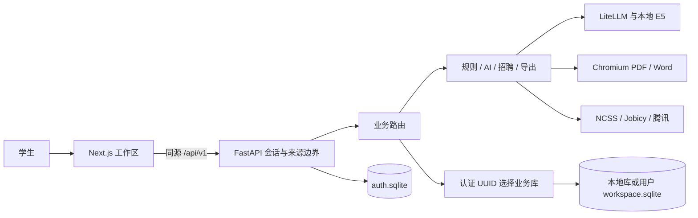
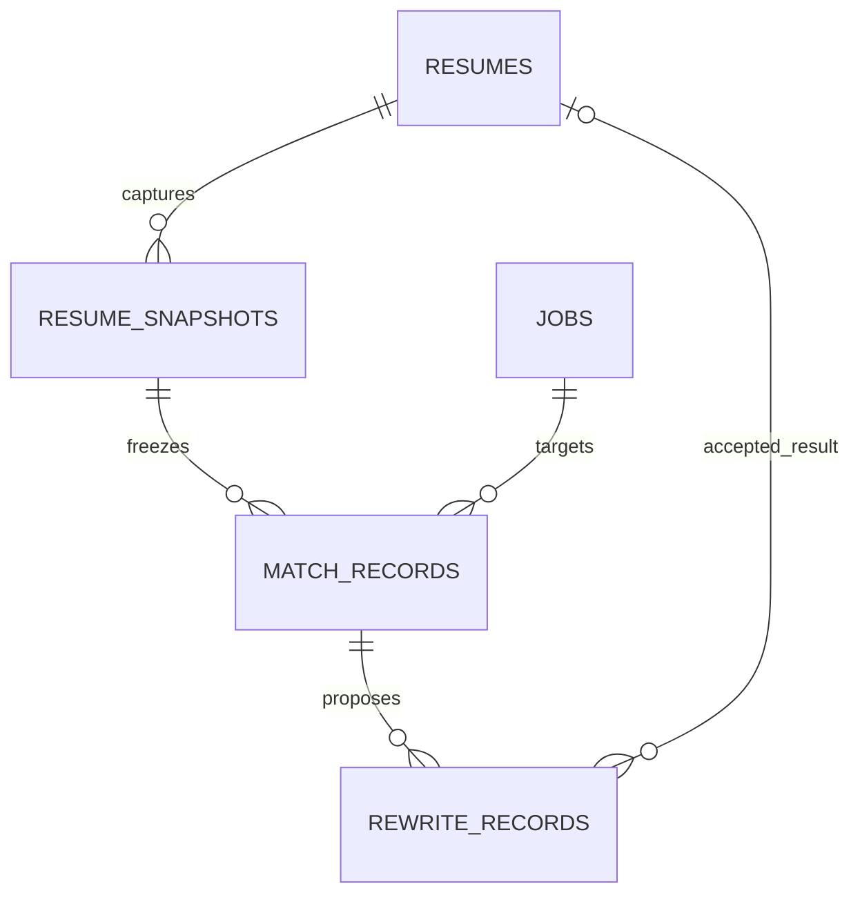

# CareerLens 架构与接口总览

更新日期：2026-09-10。本文为项目架构入口。后端流程与数据字典合并维护；完整 API 契约与原型交互分别说明，供设计评审和接口联调使用。

**2026-09-10 更新：**以下条目已对齐当前工作区；旧设计中的事实核验门槛、表数量及接口数量，以[规则调整与账务升级](规则调整与账务升级_2026-09-10.md)及现行迁移为准。本次升级已于 2026-09-10 上线，线上验收见带日期的部署记录；真实微信收款未开放。

表 1-1 设计文档导航

| 文档 | 内容 |
| --- | --- |
| [系统设计方案](系统设计方案.md) | 产品闭环、总体架构、模块与需求映射、评分与技术选型 |
| [后端与数据库设计](后端与数据库设计文档.md) | 分层、生命周期、基线数据字典、ER、字段、事务及恢复 |
| [API 接口文档](API接口文档.md) | 基线接口、字段与嵌套响应、积分、错误码及联调步骤 |
| [规则调整与账务升级](规则调整与账务升级_2026-09-10.md) | 当前生成规则、JD 版本、历史表、认证/业务迁移、积分流水与微信订单 |
| [原型与交互设计](原型与交互设计.md) | 页面线框、控件与状态、失败恢复、积分提示及操作验收 |
| [UI/UX 设计文档](UIUX设计文档.md) | 页面、原型与交互设计 |
| [网站部署指南](网站部署指南.md) | local/hosted 配置、邮件与 HTTPS 部署 |

## 1. 当前架构

CareerLens 在 Resume Matcher 的 Next.js、FastAPI、SQLite 和模型适配层上扩展中文求职工作区。业务模块沿用结构化简历、编辑器、PDF 和加密密钥能力，新增不可变快照、要求级诊断、段落润色、实时岗位、样本分析与历史记录。当前同时支持本地个人模式与网站邮箱登录模式。

图 1-1 系统调用关系

网站认证先于业务路由执行，local 模式访问本地工作区。网站模型与密钥由运营方统一配置，网站用户业务数据通过 `TenantDatabaseProxy` 访问 `users/<UUID>/workspace.sqlite`。

认证、积分和充值订单保存在 `auth.sqlite`，账单与订单接口限定当前用户归属。微信 Native v3 接口负责商户签名、微信响应及回调验签、通知解密和幂等到账；缺少套餐或商户配置时关闭真实支付。

## 2. 核心数据与一致性

图 2-1 证据驱动业务的实际外键关系

快照冻结简历数据与证据，诊断冻结 JD 和评分明细，改写保存建议及来源引用。人工核对创建新诊断；采纳在一次事务中生成独立简历、写修改日志并更新建议状态。重试采纳返回同一结果，材料发生变化则返回 409。当前简历编辑使用包含正文、原文、标题和排版的 `revision`；旧 `hash` 不包含排版。

JD 使用整数 `version`，编辑携带 `expected_version`；旧版本请求返回 409。`direction_history` 与 `market_history` 分别保存方向推荐和岗位样本分析的输入快照、指纹、结果与时间，支持列表、查看、导出和删除。历史快照独立保留，不随原简历或 JD 删除而消失。

认证库和业务库分别由 `app/migrations/auth/`、`app/migrations/business/` 的编号迁移维护，`schema_migrations` 保存版本与 SHA-256 校验和。积分以持久操作和生成记录管理预留、结算、释放；保存型操作使用 SQLite ATTACH，将业务结果与积分在同一事务中提交或回滚。跨库采用 DELETE 回滚日志和 FULL 同步，模型/支付网络调用在写事务外执行；启动及每 60 秒恢复过期预留。迁移保留原余额并记录“期初余额”，不推算缺失的历史消费。

已有 `data/schema.sql` 是旧业务 DDL 快照，不包含本次迁移新增的全部表与字段，也不包含独立认证库。升级执行以编号迁移及[规则调整与账务升级](规则调整与账务升级_2026-09-10.md)为准；基线字典与重导出说明见[后端与数据库设计](后端与数据库设计文档.md)。

## 3. 业务接口分组

所有下表路径都以 `/api/v1` 为前缀，表中只列分组入口，完整方法和字段见 API 文档。

表 3-1 API 分组与用途

| 分组 | 关键路径 | 作用 |
| --- | --- | --- |
| 登录与积分 | `/auth/session`、`/auth/credits`、`/auth/email/start`、`/auth/email/verify`、`/auth/logout` | 会话检查、余额、邮箱验证码与退出 |
| 账单与充值 | `/billing/summary`、`/billing/ledger`、`/billing/orders`、`/billing/orders/{id}/refresh`、`/billing/orders/{id}/qr.svg`、`/billing/wechat/notify` | 余额与预留、流水分页、订单、查询、二维码及验签到账 |
| 材料 | `/career/state`、`/career/resumes*`、`/career/jobs*` | 导入、校对、保存与删除 |
| 诊断 | `/career/matches`、`/career/matches/compare`、`/career/matches/{id}/review`、`/conditions` | 单岗/多岗诊断与人工确认 |
| 方向 | `/career/directions`、`/career/directions/history`、`/career/directions/history/{id}` | 岗位方向推荐与历史查看/删除 |
| 改写 | `/career/rewrites`、`/{id}/apply`、`/{id}/reject` | 段落建议、采纳、拒绝 |
| 市场 | `/career/live/*`、`/career/market/*`、`/career/market/history/{id}` | 实时岗位、样本统计与分析历史 |
| 导出 | `/resumes/{id}/pdf`、`/resumes/{id}/docx` | 当前身份下的照片简历 PDF 和可编辑 Word |
| 保留能力 | `/resumes/*`、`/jobs/*`、`/enrichment/*`、`/applications/*`、`/resume-wizard/*` | 上游优化、向导、增强、投递与辅助材料 |
| 配置与健康 | `/config/*`、`/health`、`/status` | 模型、密钥、运行与数据状态 |

网站请求除健康、认证公开接口及微信支付通知外须登录，配置路由仅允许已登录用户读取语言，其余由运营方管理。浏览器写请求严格检查 Origin；仅 `POST /billing/wechat/notify` 免登录和 Origin 检查，改由微信签名及订单金额、币种、商户等核对授权入账。local 提供 `/docs`，hosted 关闭文档入口。响应没有统一 envelope，错误通常为 `detail`，校验错误也可能是数组或对象。

## 4. 模型与分数契约

要求包含 `id,name,source_text,priority`；证据包含 `id,section_id,title,text,kind,path,source_hash`。规则根据要求权重 $w_i$ 与证据值 $v_i$ 计算

\[
S=\operatorname{round}\left(100\frac{\sum_i w_iv_i}{\sum_i w_i},1\right).
\]

普通要求权重 2、加分项权重 1；支持、提及、待核实/缺口的证据值为 1、0.5、0，无要求返回 null。学历、经验与到岗条件单列。E5 仅检索经历候选，AI `fit_score` 独立显示；两者均不自动替代规则分值。

AI 诊断、方向推荐和段落润色提供求职建议，引用用于定位材料；当前检查输出结构和来源标识，已取消独立事实核验及角色、数字、技能等生成门槛。正常单岗位诊断、一次方向推荐、一次段落润色各生成 1 次，多岗位比较逐岗生成；市场解读可能生成 2 次，旧完整简历优化仍包含多个生成步骤。市场统计的数值由代码计算，AI 负责筛选与建议。默认实时来源为 NCSS，Jobicy 和腾讯仍可选；查询不自动入库，记住操作才保存 JD。

## 5. 文档与验收边界

当前已实现照片、独立排版、Word 导出、邮箱登录和用户隔离；这些均纳入本轮文档修订。真实部署、SMTP、外部模型质量及最终集成仍应以带日期的实际记录验收。设计入口对应 [系统设计方案](系统设计方案.md)，历史测试证据对应 [验证记录](验证记录.md) 与 [网站模式验证记录](网站模式验证记录.md)，后续测试不能提前记为通过。

网站积分按每次成功模型生成计量，默认首次赠 20 积分；额度不足返回 402，规则、编辑、采纳和导出本身不扣费。账户页已实现积分流水与微信订单，暂定套餐已保存；现有个人账户尚不具备 Native 直连商户条件，真实收款未开放。当前工作区的验证结果见[规则调整与账务升级](规则调整与账务升级_2026-09-10.md)，已完成的线上验收见[Azure部署记录](Azure部署记录.md)；本次镜像已部署，数据库迁移、历史记录和积分流水均通过线上验收。
