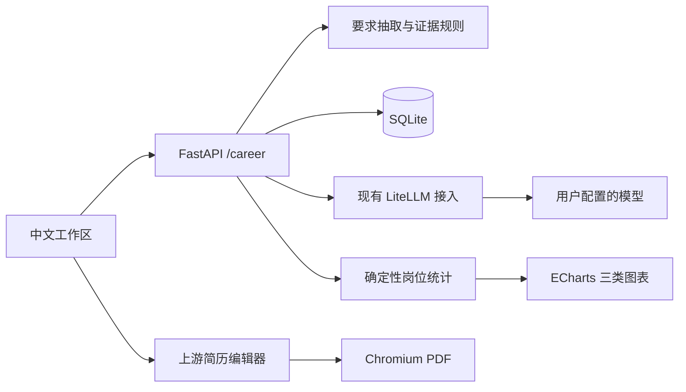
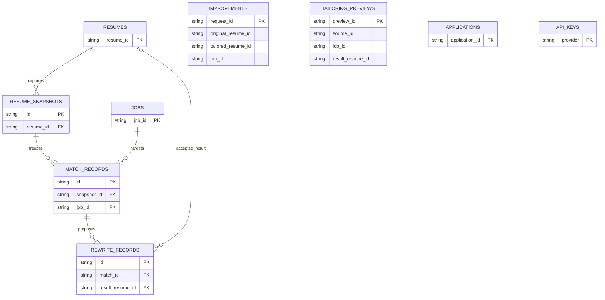

# CareerLens 架构与接口

首版采用单个 Next.js 前端、单个 FastAPI 后端和 SQLite。新增业务集中在 `career` 模块，原编辑器、PDF、模型提供商和密钥管理继续使用上游实现。

## 数据库

完整 DDL 在 [data/schema.sql](../data/schema.sql)。保留上游的 `resumes`、`jobs`、`improvements`、`tailoring_previews`、`applications`、`api_keys`，新增以下三张业务表：

| 表 | 主要字段及约束 |
| --- | --- |
| `resume_snapshots` | `id`、`resume_id`、`content_hash`、`data`、`evidence`、`created_at`；内容不可覆盖 |
| `match_records` | `id`、`snapshot_id`、`job_id`、`job_snapshot`、`job_hash`、`details`、`conditions`、`score`、`rule_version`、`created_at` |
| `rewrite_records` | `id`、`match_id`、`section_id`、`facts`、`payload`、`status`、`result_resume_id`、`created_at` |

图中连线表示实际外键。上游 `improvements`、`tailoring_previews` 等表的业务关联保留为字符串，未画成数据库外键。

简历删除在事务内清理上游修改记录，新增关系沿外键级联删除。已采纳结果被删除后，建议保留已消费状态并清空结果指针，重复采纳返回冲突。个人工作区重置沿用上游设置流程，保留密钥。

## 核心契约

证据项包含 `id`、`section_id`、`title`、`text`、`kind`、`path`、`source_hash`。`path` 指向冻结简历中的具体字段；`kind` 区分经历、技能自述和简介。用户补充事实保存在改写记录的 `facts` 与 `payload.sources` 中，通过 `type=user` 与原简历引用区分。

岗位要求包含 `id`、`name`、`source_text`、`priority`。常见中英文别名归一；重复 ID 或归一后名称会被拒绝。要求及元数据保存在现有岗位 JSON 字段中，避免另建技能图谱。

评分明细复制要求字段，加入 `evidence_ids`、`status`、`weight`、`value`、`contribution` 和 `reason`。设第 i 项权重为 wᵢ、支持系数为 vᵢ，则覆盖度为 `100 × Σ(wᵢvᵢ) / Σwᵢ`。普通要求权重 2，优先项权重 1；系数分别为 1、0.5、0。没有有效要求时返回 `null`。

学历、经验和到岗条件不混入分数。学历区分符合、不满足、未知和 JD 未说明；经验仅统计明确年月区间，重叠月份去重，岗位相关性需本人确认。规则对陌生任务、复杂否定与“二选一”要求的理解有限，界面允许校对要求及证据，人工修正产生新的诊断记录。

## HTTP 接口

以下新增接口统一使用 `/api/v1/career` 前缀，详细请求结构与校验见运行中的 `/docs`。独立前缀用于避免覆盖上游同名路由。

| 方法 | 路径 | 用途 |
| --- | --- | --- |
| GET | `/state` | 简历、岗位、最近 100 条诊断索引及模型配置状态 |
| POST | `/demo` | 显式、幂等载入虚构示例 |
| POST | `/resumes/parse` | `{text,use_ai}` → 待校对结构化草稿 |
| POST | `/resumes/file` | Multipart `file`，提取文本并规则解析 |
| POST | `/resumes` | `{title,data,source_text}` 创建简历 |
| PUT | `/resumes/{id}` | 保存结构化内容；`expected_hash` 防止编辑覆盖冲突 |
| DELETE | `/resumes/{id}` | 删除当前版本及关联分析材料 |
| POST | `/jobs/parse` | 抽取岗位要求，规则或 AI 可选 |
| POST / PUT | `/jobs` / `/jobs/{id}` | 新建或校对岗位、元数据及要求 |
| DELETE | `/jobs/{id}` | 删除岗位及对应分析、建议 |
| POST | `/matches` | `{resume_id,job_id}` 创建材料快照和诊断 |
| GET | `/matches/{id}` | 重现诊断、草稿历史及 `stale` 状态 |
| POST | `/matches/{id}/review` | 确认要求状态与证据，产生新诊断记录 |
| POST | `/rewrites` | `{match_id,section_id,facts,use_ai}` 生成单段草稿 |
| POST | `/rewrites/{id}/apply` | `{confirmed:true}` 原子采纳并返回独立定向版 |
| POST | `/rewrites/{id}/reject` | 拒绝草稿，保留记录 |
| POST | `/market/summary` | 按类别、城市、日期与示例开关聚合岗位 |
| POST | `/market/analyze` | 问题 → 受限筛选 → 固定统计 → 解读 |

PDF 继续使用上游 `GET /api/v1/resumes/{id}/pdf?template=swiss-single&pageSize=A4&lang=zh`。设置页继续使用上游 `/api/v1/config/*`。

## 模型与失败路径

AI 调用只用于结构抽取、单段 STAR 表达及市场问题解析和建议。匹配分数与全部市场数值由代码计算。市场流程只允许选择已经存在的类别和城市，不执行模型生成的代码或任意工具；明确显示最终筛选条件与岗位来源。

改写输出必须是 `draft`、`claims`、`missing_facts`、`reason` 组成的结构。每个 claim 指定已有来源 ID，拼接后覆盖整段正文；新增数字、词表内技能和待补充占位符会被拒绝。引用格式检查不能代替对角色和结果含义的人工核对。

改写及 JD 抽取调用限制为 60 秒、至多一次模型层修复重试；简历 AI 解析复用上游有限重试，并由外层 60 秒超时限制。市场两阶段 AI 流程总计最多 60 秒。错误响应不包含密钥或原始简历，已有记录保持可读。

采纳操作在同一写事务中检查简历与 JD 指纹、创建新简历、写入修改记录并更新建议状态；重复点击返回同一结果。材料已变化则返回 409，要求重新诊断。

## 市场统计

每个岗位对同一技能计数一次，以机构和去空白 JD 内容去重。薪资保留原文，支持常见人民币／美元区间、K／万单位和日／月／年周期；13 薪等附加说明不自动换算成年包。面议或无法可靠解析的薪资计为缺失。

三类图表分别展示技能频次、同币种同周期的区间中点散点、类别内技能占比。热力图显示总体前八项技能，明细表保留全部已统计技能及分母。默认排除合成数据；设置发布日期起点后排除日期未知记录。JSON 导出附带筛选条件、日期、样本指纹和岗位 ID。
