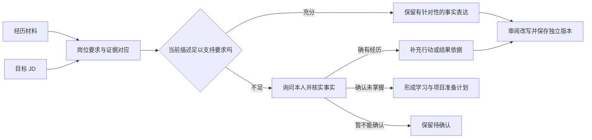

# CareerLens 求职市场痛点分析报告

> 版本：v1.0｜编制日期：2026-09-09｜课程对应：T5 问题定义任务、第二天需求分析。本文基于既有公开资料、当前实现和课程要求形成问题基线；学生样本与 APP 实测结论须在采集后补入。

## 1. 问题陈述与产品定位

CareerLens 定位为**以证据核对为核心的智能匹配工具**。系统以一份学生简历和一份目标岗位描述（JD）为基本单元，在经历信息不完整、岗位用语不同、简历需要针对性调整的条件下，将岗位要求与简历原文逐项对应，区分表达不足、待核实事实和已确认技能缺口，再生成用户可审阅的定向版本。简历排版与就业市场统计分别承担材料交付和岗位探索功能。

这一定位对应指导书第 10—11 页提出的“信息表达鸿沟”与“技能匹配盲区”。项目优先解决学生能实际控制的材料准备问题：看清要求、提供证据、核实事实、调整表达。是否减少准备时间、改善投递结果，应由真实任务记录回答。

## 2. 证据基础与研究边界

表 1 研究依据与当前完成状态

| 依据 | 当前可用材料 | 支撑内容 | 当前状态 |
| --- | --- | --- | --- |
| 课程原文 | 《信息系统开发实训—实验指导要求与评分标准—2026版》第 10—11、17—18 页 | T5 任务、交付层级、每日安排 | 本轮已核对 |
| 公开资料 | [调研报告](调研报告.md)中 2026-09-08 的产品与就业指导记录 | 产品能力观察与内容原则 | 沿用旧记录，未再次联网核验 |
| 软件实现 | 简历、岗位、匹配、改写、市场、认证及导出代码 | 系统现状与可操作的验证任务 | 本轮已核对关键实现 |
| 招聘 APP 实测 | BOSS 直聘、智联招聘计划任务 | 操作成本、反馈理解、改写控制 | 待实际体验与截图归档 |
| 真实材料 | 5 份真实 JD、3 位学生授权简历 | 表达与技能差距的实际分布 | 待采集及人工标注归档 |
| 公开合成样本 | `data/examples/` 中的虚构材料 | 说明编码方法与规则算例 | 可演示，不计入真实样本 |

本轮可形成产品判断、研究问题、采集方案和完整分析示例。常见差距的排序、发生比例及学生反馈，在真实记录齐备后计算。

## 3. 用户与任务链

主要对象为准备实习、校招及首次求职的学生。已有目标岗位的学生从 JD 对照进入诊断；方向不明确的学生从经历梳理进入方向探索，再选择真实 JD。教师可在学生授权下复核脱敏材料，当前没有专用教师管理界面。

图 1 材料准备中的关键判断

## 4. 痛点假设与产品响应

表 2 五项痛点假设及其验证方式

| 编号 | 待验证的实际困难 | 成因判断 | 系统响应 | 验证证据 |
| --- | --- | --- | --- | --- |
| H-01 | 简历与目标 JD 分散，重复查找和复制 | 岗位发现与材料准备之间缺少连续记录 | 保存 JD 原文与来源，定向版关联目标 | 一次准备过程中的切换次数、返工位置与用时 |
| H-02 | 有分数但不知道具体改哪一段 | 总分没有连接到要求和经历证据 | 展示要求、权重、证据片段与贡献 | 用户能否定位一项扣分原因并指出下一步 |
| H-03 | “没有写明”被理解为“本人不会” | 材料表达、事实确认和能力判断混为一体 | 区分具体证据、仅提及、待确认和确认未掌握 | 用户解释状态、本人确认记录及误判修正 |
| H-04 | AI 改写流畅，但新增职责或成果难以发现 | 生成内容缺少逐句来源和明确采纳节点 | 原文对照、本人补充事实、核验后独立采纳 | 无依据新事实计数、接受/拒绝理由与定向变化 |
| H-05 | 从少量岗位图表推断整个市场 | 来源、分母、时间和缺失字段说明不足 | 展示本页样本及来源，分开薪资口径 | 用户对图表分母的解释和手算复核结果 |

以上是从既有资料与产品机制提出的研究假设。采集时优先观察实际操作，避免用“是否需要 AI”“是否喜欢解释”等诱导性问题代替事实记录。

## 5. 表达差距、技能差距与条件差距

表 3 差距分类规则

| 类别 | 识别依据 | 对应处理 | 示例含义 |
| --- | --- | --- | --- |
| 表达差距 E | 本人确有相关经历，但简历未说明任务、行动、工具或结果 | 核实后补全事实，按目标 JD 组织表达 | 写了 SQL，却未描述如何使用；需本人补证 |
| 技能差距 S | 本人明确确认尚未掌握岗位要求的技能 | 提出学习或实践计划，不写为已完成经历 | 本人确认未接触 Tableau |
| 条件差距 C | 学历、到岗、地域或经历年限与要求不符 | 单独标示，影响岗位选择 | JD 要求每周到岗 3 天，本人确认不能满足 |
| 待确认 U | 材料不足且尚无本人确认 | 保留问题与需补证项 | 简历没有到岗时间，不能直接判为不满足 |
| 已有支持 M | 引文可定位且足以支持对应要求 | 保留并按需突出 | 描述使用 Pandas 检查重复与缺失记录 |

E、S、C、U 为人工研究标签，不替换接口的证据状态。没有成果数字本身不能确定为表达缺陷；应先判断岗位是否需要该结果、本人是否有可核查记录。

## 6. 合成材料上的完整分析示例

示例来自[虚构学生简历](../data/examples/resume.synthetic.txt)和[合成岗位集](../data/examples/jobs.synthetic.json)的“数据分析实习生”。该简历说明使用 Python 和 Pandas 清洗报名数据、检查重复与缺失值，并使用 Excel 整理渠道数据；技能栏列出 SQL。

表 4 单组对照示例（非真实调研结果）

| JD 要求 | 简历依据 | 材料判断 | 可提出的动作 |
| --- | --- | --- | --- |
| Python 数据清洗 | “使用 Python 和 Pandas 清洗校园活动报名数据” | 有具体证据 | 在数据分析目标版中突出清洗对象和检查动作 |
| SQL | 技能栏列出 SQL | 仅提及；实际使用待核实 | 询问是否写过查询、使用何种数据及完成何种任务 |
| Excel 分析表 | “使用 Excel 整理报名渠道数据，并制作每周统计表” | 有具体证据 | 保留频率与用途，核实是否有可说明的应用结果 |
| Tableau 优先 | 未出现相关内容 | 待确认 U | 询问是否掌握，确认不会后再归 S |
| 本科及以上 | 教育背景为本科在读 | 学历信息可见 | 是否接受在读身份仍按岗位原文与本人情况核对 |
| 每周 3 天、实习 3 个月 | 无安排信息 | 待确认 U | 单独核实可到岗安排 |

在手工选定 Python、SQL、Excel 为普通要求、Tableau 为加分项的四项技能集合中，权重为 2、2、2、1，证据值为 1、0.5、1、0。材料覆盖度为 `100 × (2 + 1 + 2) / 7 = 71.4%`。这是指定要求集合上的手工示例，不是本轮接口实测输出；条件要求单列。

据此可形成的事实内改写为：“使用 Python 与 Pandas 清洗校园活动报名数据，检查重复记录和缺失值；使用 Excel 整理报名渠道并制作每周统计表。”它保留已给事实，尚未增加工作量、成果数字或 SQL 实践。真实学生案例只有在本人补充事实后才能进一步丰富。

## 7. 需求优先级与课程层级

表 5 产品目标和交付映射

| 层级 | 课程目标 | CareerLens 交付 | 验收关注点 |
| --- | --- | --- | --- |
| Level 1 | 结构化编辑、文本解析、JD 输入、关键词分数和差距 | FR-01—04、FR-07 | 输入可校对、规则可复算、差距有依据 |
| Level 2 | STAR 建议和针对 JD 的内容强化 | FR-05、FR-08—09 | 事实忠实、建议可操作、采纳保留原版本 |
| Level 3 | 聚合 JD、技能词云、薪资与技能分布 | FR-11—12 | 已存 JD 聚合接口与实时页统计分别验收，图表来源及分母正确 |
| 工程支撑 | 完整运行与使用体验 | FR-13—16 | 模型模式、认证隔离、照片排版及保存后导出 |

现有首页重点展示实时查询当前页的完整 JD；后端另有已存 JD 聚合接口。课程 Level 3 对“已录入 JD 聚合”的验收应记录接口样本和结果，不能用实时页截图自动证明独立聚合页面已完成。

## 8. 下一步采集与问题定稿

[竞品体验与样本差距分析](竞品体验与样本差距分析.md)提供两款 APP 的统一任务表、5 份 JD 与 3 位学生的登记表、15 组对照和访谈提纲。采集完成后按以下顺序形成最终结论：核查来源和授权，完成逐项编码，讨论分歧，统计各类差距，比较改写前后内容，再修订本报告表 2 的假设状态。

表 6 待补证据与定稿条件

| 待补材料 | 定稿标准 | 建议完成环节 |
| --- | --- | --- |
| 两款 APP 实测 | 每款有设备、版本、日期、具体步骤及脱敏证据 | 需求补充与第 4 天迭代同步进行 |
| 5 份真实 JD | 正文完整、可追溯来源和采集时间 | 第 4 天质量验证前 |
| 3 位学生简历 | 不同学生、同意记录与匿名副本 | 第 4 天质量验证前 |
| 15 组人工对照 | 要求与证据均可定位、分歧已记录 | 第 4—5 天测试和集成 |
| 痛点排序与效果结论 | 按实际分母统计，不以合成材料充数 | 第 5—6 天成果整理 |

上述日期是截至 2026-09-09 的后续安排，不记录为已执行活动。真实材料不齐时，交付状态应保持“研究基线已完成、实证结论待补”。
