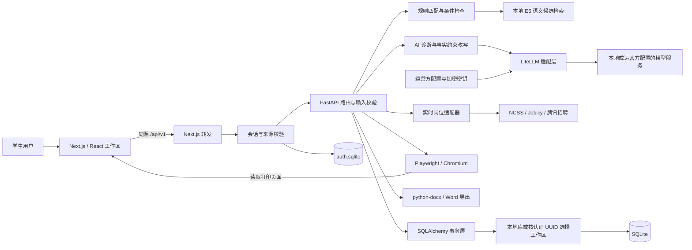
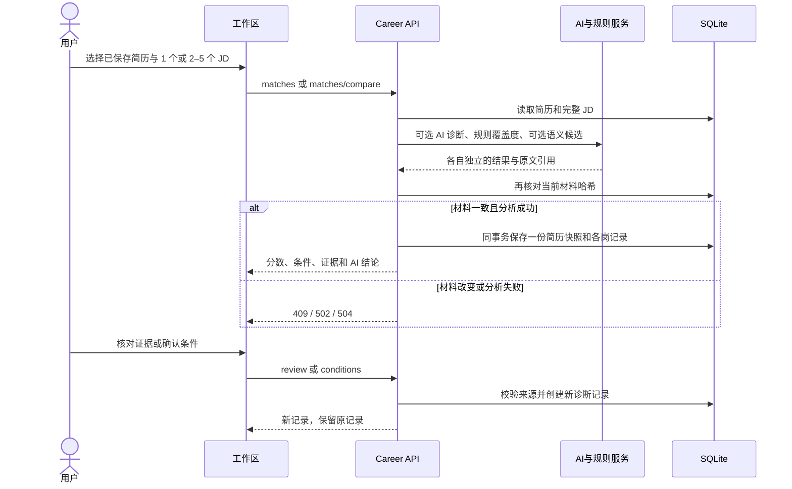
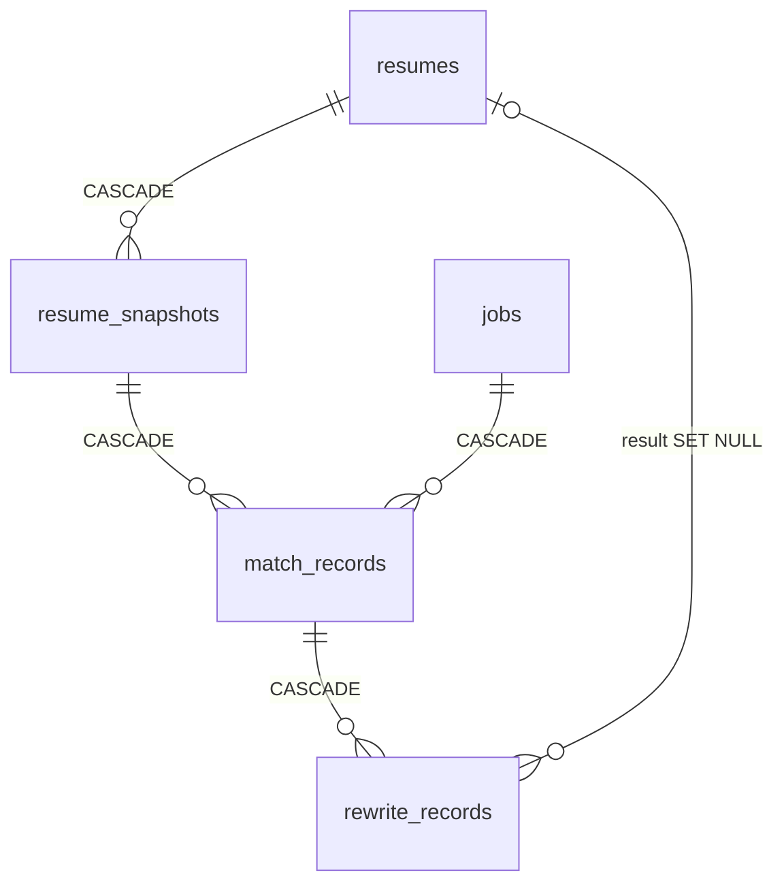

# CareerLens 系统设计方案

表 0-1 文档信息

| 项目 | 内容 |
| --- | --- |
| 文档版本 | v1.1 |
| 编制日期 | 2026-09-09 |
| 设计依据 | 当前工作区源码，包含尚未提交的新增和修改文件 |
| 适用范围 | 本地个人工作区、网站登录工作区及课程项目交付 |
| 配套文档 | [需求分析](需求分析.md)、[UI/UX 设计文档](UIUX设计文档.md)、[后端与数据库设计](后端与数据库设计文档.md)、[API 接口](API接口文档.md) |
| 核查方式 | 静态检查路由、业务服务、数据模型、前端调用与部署配置；不等于本次运行验收 |

本文对应第 3 天设计交付，并为第 4—5 天联调、集成与个人报告提供设计依据。

## 1. 项目定位与设计范围

CareerLens 面向学生求职，以简历中的真实经历和目标岗位 JD 为输入，提供材料整理、要求核对、岗位诊断、表达优化与独立版本导出。系统将每项判断关联到原文，使用户能够回答“要求是什么、材料写了什么、还需核实什么、如何改进表达”。

核心业务闭环为：**创建或导入简历 → 编辑并保存 → 记住和校对 JD → 诊断与证据确认 → 审阅单段建议 → 生成定向版 → 同岗复评和导出**。实时岗位查询和本页统计为选岗提供材料；无目标 JD 时，可根据已保存简历获取 AI 岗位方向建议。

项目复用 Resume Matcher 的前后端框架、简历数据结构、编辑器、PDF 渲染、数据库和模型适配层，新增 CareerLens 工作区及证据驱动的业务流程。复用来源和许可见 [UPSTREAM.md](../UPSTREAM.md)。

### 1.1 当前实现与后续建设

表 1-1 当前实现与后续建设

| 范围 | 当前源码实现 | 后续建设或验收事项 |
| --- | --- | --- |
| 简历与 JD | 创建、解析、校对、保存、删除；简历编辑哈希冲突检查 | 真实材料解析质量评估；JD 并发编辑保护 |
| 规则诊断 | 要求级加权覆盖度、证据引用、条件确认、不可变诊断记录 | 扩充经人工校对的词表和样本，评估误判 |
| AI 诊断 | 独立适合度、优势、材料缺口、分类行动、原文引用与核验 | 对主观判断开展人工一致性评估 |
| 方向推荐 | 根据简历推荐职类，并从已保存 JD 中选取具体岗位 | 结果当前仅返回页面；持久化历史如有需要再新增设计 |
| 定向改写 | 单段来源约束、逐句事实核验、明确采纳、独立版本和幂等写入 | 扩充复杂因果、角色和否定表达的验证材料 |
| 实时岗位 | 国家大学生就业服务平台、Jobicy、腾讯招聘按需查询 | 来源可用性、字段漂移和容器环境验收 |
| 登录与隔离 | 网站邮箱验证码、可撤销会话、来源校验、每用户独立 SQLite | SMTP 与正式域名需要在部署环境验收 |
| 照片与排版 | 内嵌照片、独立排版设置、revision 冲突控制、PDF/Word 导出 | 目标环境中文字体、照片和多页布局验收 |
| 运行方式 | local/hosted；本地 Compose 与 Caddy HTTPS 网站 Compose | 本文未执行容器构建、性能压测或备份恢复演练 |

当前系统已实现网站邮箱登录与按用户数据库隔离，本地模式保留无需登录的个人工作区。GitHub 配置项用于项目链接，没有 GitHub OAuth。招聘企业后台、自动投递和多人协作权限不在当前实现范围。上游投递追踪、求职信和面试准备等接口继续保留，接口覆盖见 [API 接口文档](API接口文档.md)。

## 2. 总体架构

采用浏览器、Next.js 前端、FastAPI 后端和 SQLite 数据库组成的模块化单体架构。浏览器通过同源 `/api/v1` 访问接口，Next.js 转发至后端；网站请求先经过会话与来源校验，再由认证 UUID 选择业务库。规则与统计在后端执行，本地语义模型和外部 LLM 作为可选能力接入。

图 2-1 总体架构

### 2.1 技术组成

表 2-1 技术组成

| 层次 | 当前工程选型 | 作用 |
| --- | --- | --- |
| 前端 | Next.js 16、React 19、TypeScript、Tailwind CSS 4、CSS Modules | 工作区、表单、状态与 API 调用 |
| 编辑与图表 | 复用简历编辑组件；ECharts 5.6.0、echarts-wordcloud 2.1.0 | 连续编辑、证据展示和岗位样本图表 |
| 后端 | Python ≥3.13、FastAPI 0.128.4、Pydantic 2.12.5 | HTTP 接口、输入输出约束和流程编排 |
| 数据层 | SQLAlchemy 2.0.36、aiosqlite、SQLite | 本地持久化、事务和引用完整性 |
| 文档处理 | MarkItDown、pdfminer.six、python-docx、Playwright 1.58.0 | PDF/DOCX 文本提取、照片校验、中文 PDF 与可编辑 Word 导出 |
| AI 接入 | LiteLLM 1.86.2 | 提供商适配、结构化响应和错误处理 |
| 语义候选 | ONNX Runtime、tokenizers、量化 multilingual-e5-small | 本地检索相关经历，不生成技能分数 |
| 依赖与部署 | uv、npm、前后端锁文件、Docker Compose、Caddy | 可复现安装、本地运行与网站 HTTPS 入口 |

版本以上述项目清单及锁文件为准，不表示所列组件的最新版本。依据：[后端依赖](../app/apps/backend/pyproject.toml)、[前端依赖](../app/apps/frontend/package.json)、[转发配置](../app/apps/frontend/next.config.ts)。

### 2.2 模块职责与需求映射

表 2-2 模块职责与需求映射

| 模块 | 主要职责 | 源码入口 | 对应需求 |
| --- | --- | --- | --- |
| 工作区与简历 | 页面导航、简历编辑、保存、导入导出 | [career 组件](../app/apps/frontend/components/career/)、[前端接口](../app/apps/frontend/lib/api/career.ts) | FR-01、02、09 |
| 业务接口 | 简历、JD、匹配、核对、改写和统计的编排 | [career.py](../app/apps/backend/app/routers/career.py) | FR-01—10、12、14 |
| 规则服务 | 文本解析、要求抽取、证据评分、条件和样本统计 | [matching.py](../app/apps/backend/app/services/matching.py) | FR-03、04、07、12 |
| AI 诊断 | 目标 JD 诊断、岗位方向、双向引用核验 | [career_diagnosis.py](../app/apps/backend/app/services/career_diagnosis.py) | FR-05、06 |
| 改写服务 | 草稿生成、逐句来源检查、改善检查 | [career_ai.py](../app/apps/backend/app/services/career_ai.py) | FR-08、09 |
| 语义检索 | 根据 JD 要求检索项目和工作经历 | [semantic.py](../app/apps/backend/app/services/semantic.py) | FR-04、07 |
| 实时岗位 | 查询、详情补全、缓存、记住和本页解读 | [recruitment 路由](../app/apps/backend/app/routers/recruitment.py) | FR-11、12 |
| 基础设施 | 存储、密钥、模型配置、通用请求和 PDF | [database.py](../app/apps/backend/app/database.py)、[config 路由](../app/apps/backend/app/routers/config.py) | FR-02、13、14 |
| 网站认证与隔离 | 邮箱验证码、会话、来源校验与租户数据库代理 | [auth.py](../app/apps/backend/app/auth.py)、[tenant_database.py](../app/apps/backend/app/tenant_database.py) | FR-15 |
| 照片与独立排版 | 图片校验、版式持久化、完整 revision、PDF/Word 导出 | [resume_photo.py](../app/apps/backend/app/services/resume_photo.py)、[resume_exports.py](../app/apps/backend/app/routers/resume_exports.py) | FR-16 |

## 3. 关键业务流程

### 3.1 简历导入与编辑

文本解析和文件解析只返回结构化草稿及 `source_text`，不立即创建数据库记录。用户校对后调用保存接口。规则解析按标题、日期和关键词归组；AI 解析复用上游结构化简历解析服务。文件支持 PDF、DOCX、TXT、Markdown；扫描件需要先转成文本。

更新简历优先提交 `expected_revision`，覆盖结构化数据、原文、标题和排版；未提交它时才使用可选 `expected_hash`，后者不包含排版。条件不一致返回 `409`；两个条件均省略时不执行这一编辑冲突检查。原文和排版分别在请求显式包含 `source_text`、`template_settings` 时更新。照片存于 `personalInfo.photo`，只接受有大小与像素限制的 PNG/JPEG data URL。照片、排版和导出契约见 [简历照片与排版导出](简历照片与排版导出.md)。

### 3.2 诊断、比较与人工确认

图 3-1 诊断、比较与人工确认

同一次多岗比较共享一个 `snapshot_id`，各岗位保留独立 `job_snapshot` 和 `job_hash`。启用 AI 时，最多并发分析 3 个岗位；任一分析失败会取消尚未完成的同批任务，整批不写入。人工确认会复制旧记录的 AI 结果，重新计算规则分数或更新条件；不会自动重新调用 AI。

读取历史详情时，服务端比较当前结构化简历与 JD 的哈希，返回 `stale`。快照冻结的是结构化数据和证据，未额外冻结完整原始导入文件；只修改原文或简历标题不会改变历史诊断使用的结构化简历哈希。

### 3.3 来源约束改写与独立版本

1. 用户从诊断快照中选择一条项目描述、工作描述或个人简介，并可补充本人确认的事实。
2. 服务生成 `draft`、逐句 `claims`、`missing_facts`、`reason`。JD 用于确定表达重点，候选人事实只能来自所选片段及补充事实。
3. 规则模式完成规则校验，AI 模式另经逐句来源核验后，保存状态为 `draft` 的建议。核验失败不保存草稿，原简历不变。
4. 用户提交 `confirmed: true` 采纳。服务再次检查草稿、当前简历和 JD 哈希。
5. 在同一写事务中创建独立简历、写入 `improvements`、将建议改为 `accepted` 并绑定结果 ID。
6. 重复采纳返回已生成结果；结果已删除则返回 `409`，不会重新创建。拒绝草稿后不能采纳，已采纳草稿不能拒绝。

每条建议基于其诊断快照生成一个独立版本。若要连续修改多个段落，应选择刚生成的版本重新诊断，再执行下一次改写；同一基础版的多条建议不会自动合并。

### 3.4 实时岗位与本页统计

查询仅获取指定来源和范围的岗位，不写入 `jobs`。NCSS 和腾讯对当前页补充完整详情；不完整 JD 可以展示预览，但排除统计且不能直接记住。点击“使用并记住这份 JD”后，服务才创建当前工作区的岗位记录。

表 3-1 实时岗位与本页统计

| 来源 | 单页与缓存策略 | 数量含义 | 记住 JD 的依据 |
| --- | --- | --- | --- |
| NCSS | 每页 10 条，按关键词和页码缓存 300 秒，最多 32 个缓存项 | `total_kind=capped`，保留公开查询计数及 `has_more` | 有效服务端缓存中的完整 JD |
| Jobicy | 单次最多 200 条有效样本，再按 10 条分页；缓存 3600 秒，最多 32 个查询 | `total_kind=sample`，只代表当前批次 | 对应关键词和地区的有效缓存 |
| 腾讯招聘 | 每页 10 条，详情并发最多 3，不设置应用级结果缓存 | `total_kind=platform`，仅腾讯自身岗位 | 重新读取指定岗位完整详情 |

上述为当前适配器行为，不能据此推导全市场岗位数量。重复记住同一来源和外部 ID 时返回已保存 JD，保留用户校对内容；手工岗位按相同原文与公司去重。

时间字段分别解释：`published_at` 表示来源提供的发布日期，`source_updated_at` 表示来源更新时间，实时响应的 `fetched_at` 表示本次查询获取时间。保存接口另将 `collected_at` 设为保存时刻；当前 `JobInput` 不接收 `fetched_at`，因此记住后的 JD 未保留原查询获取时刻。若后续要求贯穿查询与保存的来源追溯，应新增独立字段，不将入库时间替代原始获取时间。

## 4. 数据设计

### 4.1 持久化实体

当前业务 ORM 共 9 张表，认证库另有 `users/sessions/challenges/send_events/credit_accounts` 5 张表。本地业务存入 `resume_matcher.db`，网站业务存入 `users/<UUID>/workspace.sqlite`，认证与积分集中存入 `auth.sqlite`。业务时间主要以 UTC ISO 8601 字符串保存，认证时间使用 Unix 秒。完整类型、外键、索引和 JSON 结构见 [后端与数据库设计](后端与数据库设计文档.md)。现有 [schema.sql](../data/schema.sql) 缺少当前 `template_settings` 列，也未包含认证库，合并设计文档已给出当前结构和重导出命令。

表 4-1 持久化实体

| 表 | 主键 | 核心字段 | 用途 |
| --- | --- | --- | --- |
| `resumes` | `resume_id` | `content`、`processed_data`、`template_settings`、`is_master`、`parent_id`、`title`、处理状态、时间 | 基础与定向简历；保留上游扩展内容字段 |
| `jobs` | `job_id` | `content`、`metadata_json`、`resume_id`、`created_at` | JD 原文、岗位属性、来源和要求 |
| `resume_snapshots` | `id` | `resume_id`、`content_hash`、`data`、`evidence`、`created_at` | 诊断使用的冻结简历材料 |
| `match_records` | `id` | `snapshot_id`、`job_id`、`job_snapshot`、`job_hash`、`details`、`conditions`、`score`、`rule_version` | 要求级诊断及 AI 结果 |
| `rewrite_records` | `id` | `match_id`、`section_id`、`facts`、`payload`、`status`、`result_resume_id` | 改写草稿、来源、核验及采纳状态 |
| `improvements` | `request_id` | 原简历、定向简历、岗位 ID、`improvements` | 简历改写关联和前后文本 |
| `tailoring_previews` | `preview_id` | 来源与岗位哈希、过期时间、领取状态、结果缓存 | 上游完整简历优化的预览确认流程 |
| `applications` | `application_id` | `job_id`、`resume_id`、状态、公司、岗位、备注、顺序 | 保留的上游投递追踪 |
| `api_keys` | `provider` | `ciphertext`、`updated_at` | 按提供商加密存储凭据 |

图 4-1 持久化实体

图中仅绘制真实外键。`parent_id`、`improvements`、`applications` 和 `tailoring_previews` 的相关 ID 大多是业务引用，不能视为自动级联关系。简历主版本通过部分唯一索引保证“最多一个 `is_master=true`”；空库或删除后的状态不保证始终存在一个主版本。

删除简历会显式清理相关优化日志和上游预览，并由外键清理对应快照、诊断和建议，其他独立简历保留。删除 JD 通过外键清理诊断和建议；该路由未同时清理上游无外键的优化日志等记录，这属于后续统一数据生命周期时需核对的范围。

### 4.2 核心 JSON 结构

表 4-2 核心 JSON 结构

| 对象 | 字段与语义 |
| --- | --- |
| `ResumeData` | `personalInfo`、`summary`、`workExperience[]`、`education[]`、`personalProjects[]`、`additional`、`sectionMeta[]`、`customSections` |
| 照片与排版 | `personalInfo.photo` 保存内嵌 PNG/JPEG；`template_settings` 保存模板、页面、边距、间距、字号与配色；完整编辑 `revision` 同时覆盖排版 |
| 经历条目 | 标题/公司或项目名、角色、`years`、`description[]`、`descriptionStyles[]`；描述行样式与内容对应 |
| `additional` | `technicalSkills[]`、`languages[]`、`certificationsTraining[]`、`awards[]` |
| JD 元数据 | `title`、`company`、`category`、`city`、`salary_text`、`source_type`、`source_name`、`source_url`、`external_id`、`published_at`、`source_updated_at`、保存时刻 `collected_at`、`requirements[]` |
| 要求 | `{id,name,source_text,priority}`；`priority` 为 `required` 或 `preferred` |
| 证据 | `{id,section_id,title,text,kind,path,source_hash}`；`path` 定位结构化数据，ID 在所属快照内解释 |
| 匹配明细 | 要求字段加 `weight,value,contribution,status,evidence_ids,reason,candidates,retrieval` |
| 条件 | `{name,requirement,status,observed}`；人工确认后增加 `confirmed_by,confirmed_at` |
| AI 诊断 | `fit_score,summary,strengths,gaps,actions,fact_check,provider,model,analyzed_at,score_note` |
| 改写载荷 | `draft,claims,sources,missing_facts,reason,fact_check,improvement,changes,mode,model,source_hash` |

`claims` 的每项包含 `text` 与 `source_ids[]`；AI 判断的简历引用为 `{evidence_id,quote}`，JD 引用为 `{quote}`。这些 `quote` 在服务端检查为对应原文的连续子串。

AI 诊断以内部键 `_ai_analysis` 存入 `match_records.job_snapshot`；接口将其拆为顶层 `ai_analysis` 返回。方向推荐、实时岗位查询和市场解读目前没有专用持久化表；响应中的 `dataset_hash` 是当前统计样本标识，不表示已经保存一份可恢复的统计快照。

## 5. 规则、语义与 AI 设计

### 5.1 规则覆盖度

当前规则版本为 `career-1.2`。对第 $i$ 项要求，权重记为 $w_i$，证据值记为 $v_i$，贡献记为 $c_i$：

\[
w_i=\begin{cases}2,&\text{普通要求}\\1,&\text{加分项}\end{cases},
\qquad c_i=100\frac{w_iv_i}{\sum_j w_j},
\qquad S=\operatorname{round}\!\left(\sum_i c_i,1\right).
\]

表 5-1 规则覆盖度

| 状态 | $v_i$ | 判定与操作 |
| --- | --- | --- |
| `supported` | 1 | 项目/工作描述中命中要求，并出现规则认可的具体行动表达；或用户选择经历证据后确认 |
| `mentioned` | 0.5 | 材料提及要求，但尚无规则识别的应用证据；或用户带引用确认 |
| `pending` | 0 | 当前材料未找到支持；允许补充事实或核对语义候选 |
| `gap` | 0 | 用户核对后确认的缺口；自动规则不因未命中而直接生成该状态 |

规则在项目描述、工作描述、技能自述和简介中检索，识别词表别名和部分否定、计划表达；同一要求取候选证据的最高值。空要求集合返回 `score=null`，不能解释为零分。覆盖度衡量材料对已校对要求的支持程度，不能作为录用概率。

自动规则仍是词表、分句与动作词启发式；不覆盖所有行业术语和语义关系。用户确认 `supported` 必须至少选择一条 `kind=experience` 的证据；确认 `mentioned` 也必须有引用。核对产生新记录，旧记录分值保持不变。

例如，Python、SQL 和数据可视化为普通要求，Tableau 为加分项；四项证据值分别为 1、0.5、1、0，则加权证据之和为 5，总权重为 7，材料覆盖度为 $S=71.4$。重复写入相同技能不增加该项权重或证据值。这里的普通要求对应 `required`，包含 JD 未标注优先级的要求；加分项对应 `preferred`，界面当前标为“优先”。

### 5.2 条件检查

条件单列展示，不进入 $S$ 的分子、分母，也没有统一“一票否决”算法。

表 5-2 条件检查

| 条件 | 当前判定逻辑 |
| --- | --- |
| 学历 | 在非优先要求分句中识别大专、本科、硕士、博士；与简历学历字段比较，得到 `met/unmet/unknown/not_stated` |
| 经验 | 提取明确年限；仅统计可识别的两个年月端点之间的工作月份并去重重叠区间；岗位相关性仍待用户确认 |
| 到岗与实习时长 | 提取每周天数、到岗或实习月数的相关原文；由本人依据课程和时间安排确认 |

经验和到岗要求存在时默认 `unknown`，不根据累计月份自动判定满足；“至今”和只有年份的区间不纳入当前明确月份计算。人工确认支持 `met/unmet/unknown`，必须填写实际情况；JD 未声明的条件不能强行确认。

### 5.3 本地语义候选

语义服务使用固定修订的 `Xenova/multilingual-e5-small` ONNX 量化模型。准备脚本下载并校验文件 SHA-256；推理采用 CPU、最长 512 token、批量 8 条，并以锁串行访问模型。

JD 要求作为 `query:`，项目和工作描述作为 `passage:`。归一化向量点积用于排序，每项最多返回 3 条，阈值为 `max(0.85, 最高相似度−0.04)`。候选不会自动改变 `status`、`value` 或分数，必须经用户核对后计入覆盖度。模型未准备或检索超过 30 秒时返回关键词结果及不可用提示。

### 5.4 AI 诊断与方向推荐

AI 诊断读取比规则更完整的背景：教育、岗位和项目标题、日期、语言、证书、奖项及自定义章节；这些背景不会因此自动加入规则评分或成为可改写片段。返回的 `fit_score` 为 0–100 的模型判断，与确定性 `score` 分别保存、分别解释。

优势必须有简历和 JD 的双向引文；材料缺口可以没有简历引用，但必须引用 JD。行动区分 `expression`（调整已有表达）、`verify_fact`（先核实未知事实）和 `practice`（先完成实践）。服务拒绝无依据的角色升级、生成招聘链接及将未知事实包装成可直接写入简历的内容。

生成后进行一次独立来源核验；未通过可修正一轮，再次未通过则失败。核验约束判断的事实依据，不重新校准主观适合度。`fit_score` 的稳定性和人类评价一致性仍需专门评估。

方向推荐不要求选择目标 JD。当前候选库取最新 20 条非 `course/synthetic` 的已保存 JD；具体推荐只能使用这些 ID，标题、公司和来源链接由服务端回填。提示词期望 2–3 个职类、最多 3 个具体岗位；结构校验容许 1–4 个职类、最多 5 个具体岗位，应按真实 schema 处理响应。

### 5.5 改写事实约束

规则校验要求 `claims` 按序覆盖完整 `draft`，引用 ID 有效，并拒绝来源中不存在的数字、已识别技能、角色强化、上线范围、业务成果和占位符；对用途与因果表达另设检查。AI 模式再对每句话执行来源核验，返回逐句原文引文和表达改善判断。

若新旧文本归一化相似度达到 0.92，或核验认为没有实质改善，最多再尝试一次；仍无明显改善时如实返回 `improvement.status=unchanged`。规则模式只整理已有片段和补充事实，不宣称完成 AI 优化。AI 草稿缺少 `fact_check.status=checked` 时不能被新版采纳接口接受。

这些检查降低无依据改写的风险，但来源核验仍含模型判断，不能替代本人对事实的确认。此限制直接决定采纳交互必须保留完整草稿和来源审阅。

### 5.6 样本统计与解读

统计基于过滤后的去重岗位，按岗位计数技能而非按词频重复计数；输出技能数、类别内占比、可比较薪资、缺失薪资数及来源岗位 ID。`synthetic` 默认排除。薪资只解析当前规则支持的范围，保留原文、币种和日/月/年周期，不做跨币种兑换或跨周期推算；Jobicy 的展示薪资当前未纳入图表。

AI 只将问题映射到现有 `category/city` 值，再提出有限建议。岗位数和技能数等数字描述由固定统计结果生成。建议校验拒绝数字及部分增长、下降、概率等表述；当前功能不提供行业趋势预测。

## 6. API 设计

接口基路径为 `/api/v1`。下表路径需加上该前缀，文件导入使用 multipart，PDF/DOCX 返回二进制，其他接口主要使用 JSON。完整 83 个方法与路径组合、认证约定及示例见 [API 接口文档](API接口文档.md)。local 模式可访问 `/openapi.json`，hosted 模式关闭文档入口。

### 6.1 材料与诊断

表 6-1 材料与诊断

| 方法与路径 | 请求关键字段 | 响应关键字段 |
| --- | --- | --- |
| `GET /career/state` | 无 | `resumes,jobs,matches,model,semantic,rule_version`；历史摘要最多 100 条 |
| `POST /career/resumes/parse` | `text,use_ai` | `data,source_text,mode` |
| `POST /career/resumes/file` | multipart：`file,use_ai` | 同文本解析；AI 失败时可含规则回退 `warning` |
| `POST /career/resumes` | `title,data,source_text,template_settings` | 简历 `id,data,hash,revision,template_settings,parent_id,is_master` 及时间、原文 |
| `PUT /career/resumes/{id}` | 上述字段及可选 `expected_revision/expected_hash` | 保存后的简历；revision 优先且覆盖排版 |
| `DELETE /career/resumes/{id}` | 无 | `deleted:true` |
| `POST /career/jobs/parse` | `text,use_ai` | `requirements,mode` |
| `POST /career/jobs` | `title,text` 及来源、属性、`requirements` | `job_id,content` 和岗位元数据 |
| `PUT /career/jobs/{id}` | 同创建；当前无 `expected_hash` | 保存后的岗位 |
| `DELETE /career/jobs/{id}` | 无 | `deleted:true` |
| `POST /career/matches` | `resume_id,job_id,use_semantic,use_ai` | 匹配记录、证据、明细、条件、`score,ai_analysis` |
| `POST /career/matches/compare` | `resume_id,job_ids[],use_semantic,use_ai` | 共用 `snapshot_id,resume_hash` 及 `matches[]` |
| `GET /career/matches/{id}` | 无 | 匹配详情加 `stale,rewrites[]` |
| `POST /career/matches/{id}/review` | `requirement_id,status,evidence_ids[]` | 新匹配记录及重新计算的规则分数 |
| `POST /career/matches/{id}/conditions` | `name,status,observed` | 新匹配记录；规则分数不变 |
| `POST /career/directions` | `resume_id,use_ai:true` | `directions,saved_jobs,summary,evidence,resume_hash,scope_note` 及模型元数据 |

### 6.2 改写、招聘来源与统计

表 6-2 改写、招聘来源与统计

| 方法与路径 | 请求关键字段 | 响应关键字段 |
| --- | --- | --- |
| `POST /career/rewrites` | `match_id,section_id,facts[],use_ai` | 草稿、逐句来源、核验结果、改善状态、`id,status` |
| `POST /career/rewrites/{id}/apply` | `confirmed:true` | `resume,rewrite` |
| `POST /career/rewrites/{id}/reject` | 空对象 | 状态为 `rejected` 的建议 |
| `GET /career/live/jobs` | query：`keyword,page,provider,geo` | `jobs,summary,total,total_kind,cached,fetched_at,warnings` 等 |
| `POST /career/live/jobs/{post_id}/remember` | query：`provider,keyword,geo` | 已保存岗位 |
| `POST /career/live/analyze` | `jobs[],question,use_ai` | 本页 `summary,points,advice,mode,job_ids` |
| `POST /career/market/summary` | `category,city,since,include_demo` | `count,skills,salaries,distribution,dataset_hash,job_ids` 等 |
| `POST /career/market/analyze` | 同筛选，另有 `question,use_ai` | `summary,points,advice,mode,job_ids` |
| `POST /career/demo` | 空对象 | 添加虚构示例后的工作区状态；仅供显式演示 |

### 6.3 复用基础接口

表 6-3 复用基础接口

| 方法与路径 | 关键约定 |
| --- | --- |
| `GET /resumes/{id}/pdf` | 前端传当前模板、页面、边距、字号和语言；返回 PDF 二进制 |
| `GET /resumes/{id}/docx` | `lang=zh`，按已保存正文、照片及排版导出 Word |
| `/auth/session`、`/auth/email/start`、`/auth/email/verify`、`/auth/logout` | 网站会话、验证码登录和退出；完整方法与字段见 API 文档 |
| `GET /config/llm-api-key` | 返回提供商、模型、Base URL、推理参数和掩码密钥 |
| `PUT /config/llm-api-key` | 保存 `provider,model,api_base,reasoning_effort`；此接口不持久化 `api_key` |
| `GET /config/api-keys` | 返回各提供商是否配置和密钥掩码 |
| `POST /config/api-keys` | 按提供商字段更新凭据；空字符串清除对应密钥 |
| `POST /config/llm-test` | 用传入或已存配置测试连接 |
| `DELETE /config/api-keys/{provider}` | 删除单个提供商密钥 |
| `DELETE /config/api-keys?confirm=CLEAR_ALL_KEYS` | 显式清除全部密钥 |
| `POST /config/reset` | body 为 `{"confirm":"RESET_ALL_DATA"}`；清理业务数据和上传文件，保留密钥 |
| `GET /health`、`GET /status` | 分别提供存活检查及模型/数据状态；`health` 不调用 LLM |

### 6.4 输入限制与异常契约

文本解析和 JD 正文为 1–300,000 字符，已保存的导入原文最多 3,000,000 字符；空白输入无效。单份文件上限 5 MiB。JD 要求最多 60 项，ID 和名称不得重复，`source_text` 必须来自 JD 原文。比较必须选择 2–5 个不同岗位；补充事实最多 8 项、每项最多 1,000 字符。本页分析最多 10 份完整 JD。实时检索页码为 1–100，关键词最多 100 字符，提供商和地区采用枚举校验。

表 6-4 输入限制与异常契约

| HTTP 状态 | 核心触发条件 | 页面恢复方式 |
| --- | --- | --- |
| `400` | 验证码错误/过期、缺少重置/清密钥确认标识等 | 返回确认流程或修正请求 |
| `401` | 网站会话缺失或失效 | 重新登录 |
| `403` | 来源校验失败或访问受限配置接口 | 从本站操作；网站配置由管理员处理 |
| `404` | 简历、JD、匹配、建议或缓存中的岗位不存在 | 刷新材料列表或重新查询 |
| `409` | 材料已变、草稿状态冲突、历史草稿未核验、岗位缓存失效 | 重新加载、诊断或生成建议 |
| `413` | 导入文件超过大小限制 | 缩小文件或粘贴文本 |
| `422` | 字段、引用、文件类型、AI 前提或条件确认不合法 | 定位输入，保留原文并校对 |
| `429` | 验证码频控或招聘查询缓存容量已满 | 遵循 Retry-After（如提供）或等待缓存过期 |
| `502` | 模型输出未通过检查或上游来源失败 | 显示失败原因并允许重试；按操作选择规则模式 |
| `503` | SQLite 写竞争；PDF 等基础能力可能暂不可用 | 稍后重试；数据库竞争含 `Retry-After: 1` |
| `504` | AI 或实时查询超过操作期限 | 保留材料，结束加载并提供重试 |

Career 接口通常返回 `{"detail":"说明"}`；Pydantic 校验使用 `detail` 数组，部分配置校验使用结构化 `detail` 对象。前端应按实际接口解析，不能假定全部错误均为字符串。

## 7. 配置、部署与运行保障

### 7.1 本机与容器

项目根目录执行 `bash scripts/setup.sh` 安装依赖、准备 Chromium、初始化数据库及下载语义模型；执行 `bash scripts/dev.sh` 启动前后端。开发脚本将前端绑定 `127.0.0.1:3000`，后端绑定 `127.0.0.1:8000`，日志写入 `.local/logs/`。

根目录 [compose.yaml](../compose.yaml) 从 `app/` 构建镜像，只向宿主机映射 `127.0.0.1:3000`。容器内运行 Next.js standalone 与单个 uvicorn 进程，数据卷挂载 `/app/backend/data`，Chromium 通过前端打印页生成 PDF。Dockerfile 提供非 root 用户、中文字体及内部健康检查。

网站部署另使用 [compose.hosted.yaml](../compose.hosted.yaml)，由 Caddy 对外提供 80/443 入口，应用只在容器网络暴露 3000，使用独立 hosted-data 卷。网站模式须配置公开 HTTPS 地址、至少 32 字符认证密钥和 SMTP；模型由运营方配置。步骤见 [网站部署指南](网站部署指南.md)。

Docker 构建通过 `prepare_embeddings` 在镜像内准备固定版本、校验哈希的 E5 模型；启动时校验数据卷中的文件，从镜像种子离线补齐缺失或损坏文件。构建期还实际启动 Chromium 验证运行依赖。2026 年 9 月 9 日的正式网站部署、积分及 PDF/Word 验收见 [Azure部署记录](Azure部署记录.md)，本次文档修订引用其已有证据。

表 7-1 本机与容器

| 配置 | 用途与当前默认 |
| --- | --- |
| `DATA_DIR` | 后端数据目录；默认 `app/apps/backend/data/` |
| `CAREERLENS_MODE` | local 或 hosted，默认 local |
| `CAREERLENS_PUBLIC_URL / CAREERLENS_AUTH_SECRET` | 网站来源与认证密钥；公网必须 HTTPS，密钥至少 32 字符 |
| `CAREERLENS_SMTP_*` | 验证码邮件服务；远程 SMTP 使用 STARTTLS 或 SSL |
| `CAREERLENS_SIGNUP_CREDITS` | 网站账号初始赠送额度，默认 20；不回填既有账号余额 |
| `LLM_PROVIDER / LLM_MODEL / LLM_API_BASE / LLM_API_KEY` | 环境层模型配置；界面保存的提供商配置经现有适配层解析 |
| `FRONTEND_BASE_URL` | Chromium 访问的前端地址；本机脚本设为 `http://127.0.0.1:3000` |
| `BACKEND_ORIGIN` | Next.js 转发目标，默认 `http://127.0.0.1:8000` |
| `NEXT_PUBLIC_API_URL` | 浏览器 API 地址，默认 `/`，使用同源转发 |
| `REQUEST_TIMEOUT_SECONDS` | 上游通用 AI 操作预算，默认 240 秒 |
| `NEXT_PUBLIC_REQUEST_TIMEOUT_MS` | 前端请求和 Next.js 代理预算，默认 240,000 毫秒 |
| `LOG_LEVEL / LOG_LLM` | 默认 `INFO / WARNING` |

CareerLens 自身另有更短操作期限：`ask_json` 每次 60 秒、单岗诊断和方向推荐 150 秒、多岗 AI 比较 180 秒、改写 150 秒、语义检索 30 秒、市场解读和实时查询 60 秒。仅增加通用超时配置不会改变这些显式上限。

### 7.2 一致性与恢复

SQLite 启用 WAL、真实外键与 5 秒 `busy_timeout`；写会话将锁竞争映射为可重试错误。耗时模型分析在最终写事务前执行，写入前检查材料哈希，减少持锁时间。采纳使用单事务保护结果简历、日志和建议状态的一致性。

非密钥配置写入 `config.json` 时采用临时文件、`fsync` 和原子替换，API Key 单独加密入运营方数据库。本地模式启动迁移旧 TinyDB，网站模式初始化认证库，两个模式均处理旧明文密钥。业务数据库采用 `create_all` 加幂等列迁移，包括 `template_settings`；认证使用独立 DDL，尚未形成完整版本化迁移体系。

运行目录包括数据库及 WAL 文件、配置、密钥文件、模型和可能存在的上传材料。推荐停止服务后备份整个后端 `data/`，恢复时保持数据库与 `.secret_key` 配套。当前没有自动备份调度和已验证的恢复目标。

### 7.3 安全边界

密钥以 Fernet 加密存入 `api_keys`，本地 `.secret_key` 使用 0600 权限，响应只提供配置状态或掩码；配置 JSON 不保存密钥。远程模型启用后，所选简历材料、JD 及补充事实会发送给本地或运营方配置的服务；本地规则和已准备的 E5 推理不依赖远程 LLM。

网站模式采用 6 位邮箱验证码与 7 天可撤销会话。会话 Cookie 为 HttpOnly、SameSite=Lax，HTTPS 下为 Secure；非安全方法要求 Origin 等于公开来源。认证 UUID 绑定整个请求的数据库上下文，每用户使用独立 SQLite 文件。网站配置接口由运营方控制，仅向已登录用户开放语言读取；所有 API 响应禁用缓存。PDF 的独立浏览器上下文只向内部打印来源转发当前会话。具体限制和频控见 [后端与数据库设计](后端与数据库设计文档.md)。

网站积分按一次成功返回的模型生成函数计量，调用前原子预扣 1 分，异常或取消退回该次预扣。一次业务操作中的生成、独立核验和重新生成分别计量，函数内部重试合计仍计 1 分；余额不足返回 402。规则、采纳与导出不扣积分，当前没有逐笔流水或跨步骤统一结算。

模型材料按数据处理，提示词要求忽略其中的指令；服务端进一步执行结构、引用和事实校验。日志默认降低 LLM 细节级别，业务边界返回经整理的错误。源码具备这些控制，不意味着已经完成全面安全审计。

## 8. 验收设计与已知差距

设计说明以当前源码为依据。此前后端133项、前端70项专项回归见[测试报告](测试报告.md)，后续积分版与正式网站验收见[Azure部署记录](Azure部署记录.md)，各项结果对应原记录中的版本和时间。本次合并与接口、交互文档修订检查源码及文档一致性，未重新执行应用回归或公网操作。

表 8-1 验收设计与已知差距

| 验收域 | 关键判据 | 已有验证入口 |
| --- | --- | --- |
| 规则结果 | 已知样本能复算分数；否定/计划不误计；空要求为 null；条件不改覆盖度 | [规则单测](../app/apps/backend/tests/unit/test_career_matching.py) |
| 数据与版本 | 采纳幂等、旧记录不变、过期材料拒绝写入、删除级联正确、比较共用快照 | [Career API 集成测试](../app/apps/backend/tests/integration/test_career_api.py) |
| AI 事实边界 | 非法引用、角色升级、无依据用途被拒绝；AI 与规则分开；失败不写结果 | [AI 诊断集成测试](../app/apps/backend/tests/integration/test_career_diagnosis.py) |
| 招聘来源 | 查询不入库、完整 JD 才统计、记住去重、缓存过期明确、范围与日期正确 | [NCSS](../app/apps/backend/tests/integration/test_ncss_api.py)、[Jobicy](../app/apps/backend/tests/integration/test_jobicy_api.py)、[腾讯](../app/apps/backend/tests/integration/test_recruitment_api.py) |
| 登录与隔离 | 匿名请求、验证码、来源校验、用户数据与 PDF 身份互不串用 | [认证测试](../app/apps/backend/tests/integration/test_hosted_auth.py)、[隔离测试](../app/apps/backend/tests/integration/test_tenant_isolation.py) |
| 页面与导出 | 关键操作、完整 revision 冲突、同岗复评、照片、Word 与中文一页及多页 PDF | [前端测试](../app/apps/frontend/tests/)、[HTTP smoke](../scripts/smoke.py) |
| 实际效果 | 真实学生材料和 JD 的解析、判断与改写，经人工评阅形成证据 | [数据准备说明](../data/README.md)；需要团队完成材料与评阅 |

建议在隔离数据目录运行后端测试、前端 lint/typecheck/test/build，再使用独立测试实例执行 HTTP/PDF 验收。外部模型测试和真实招聘源检查分别记录模型标识、来源、日期、样本与失败情况，不把模拟接口结果视为真实在线服务证明。

下一阶段优先完成四项工作：其一，补齐真实且经同意使用的材料与人工评价；其二，建立引用正确性、规则误判和 AI 行动可执行性的评估结果；其三，验收 Docker、备份恢复与中文 PDF；其四，在需求成立后补充 JD 编辑冲突保护、方向/统计结果历史以及跨上游功能的数据清理策略。网站模式已有认证和数据隔离；容量、性能与长期运维仍需针对实际用户规模测量。当前采用单体、进程内缓存和文件数据库，不宣称具备分布式服务能力。
