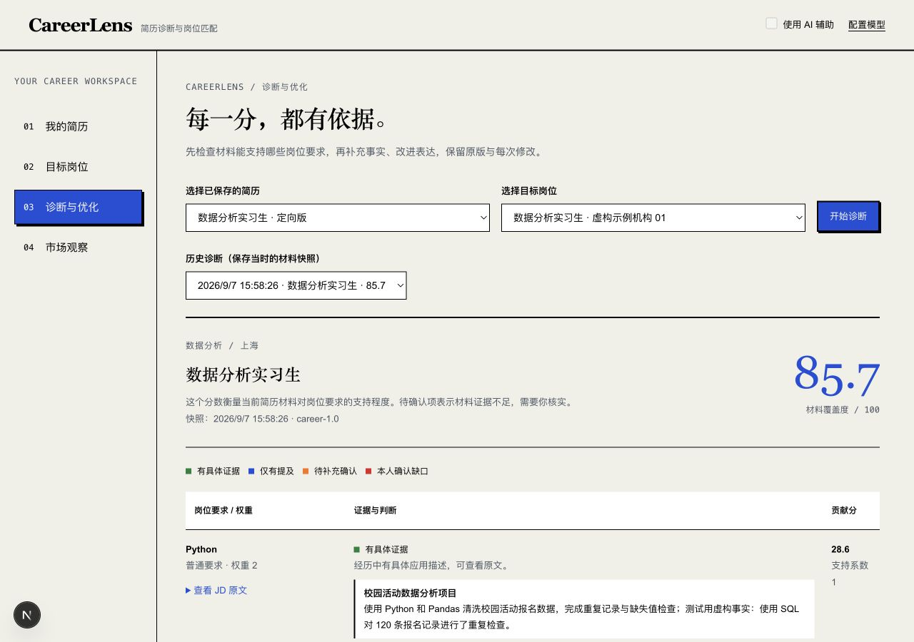
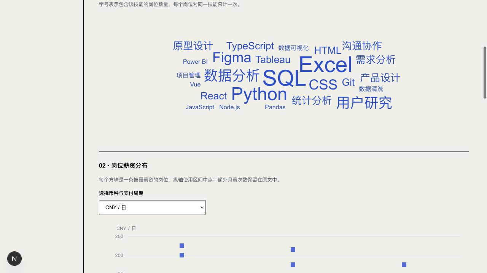

# CareerLens 系统运行说明

更新日期：2026-09-09。本文对应指导书第 21—22 页运行说明要求，提供环境、安装、启动、主要功能验证、停止重启与故障处理。初次体验使用本地模式；网站模式按[网站部署指南](网站部署指南.md)运行。

## 1. 环境要求

| 项目 | 要求或说明 |
| --- | --- |
| 操作系统 | 已有实测为 macOS Apple Silicon；Linux 可按源码或容器部署；Windows 使用 WSL2 或 Docker，原生 PowerShell 未验证 |
| Python | 采用 3.13；项目声明 `>=3.13`，本轮实测 3.13.15 |
| Node.js | 22 或 24；Docker 基础为 22，本轮实测 24.19.0 |
| 工具 | Git、npm、uv；参考历史 npm 11.6.2、uv 0.12.10，版本固定情况见配置说明 |
| 数据库 | SQLite 文件库，无需安装独立数据库服务 |
| 硬件 | 建议至少 4 GB 可用内存、10 GB 可用磁盘用于依赖、Chromium 和构建；这是准备建议，未做最低规格压力验证 |
| 网络 | 首次安装下载依赖与 Chromium；语义模型约 135 MB；AI 和实时岗位请求需访问配置的外部服务；生产构建涉及 Google Fonts 下载 |
| 浏览器与字体 | 使用现代浏览器；Linux 中文 PDF 需 Noto CJK 字体及 Playwright 系统依赖 |

软件依赖的精确锁定版本与配置含义见[配置与依赖说明](配置与依赖说明.md)。

## 2. 本地源码安装

打开终端，将 `/path/to/careerlens` 换成实际解压目录。依赖安装前停止本项目开发服务。

```bash
cd /path/to/careerlens
python3 --version
node --version
npm --version
uv --version
git --version
bash scripts/setup.sh
```

`setup.sh` 依次执行后端冻结安装、Chromium 安装、空数据库初始化、语义模型准备和前端 `npm ci`。成功结尾显示“依赖与数据库已准备好”。语义模型下载失败时脚本会提示，基础编辑、规则诊断仍可运行。

初始化采用应用当前 ORM；无需手动执行 `data/schema.sql`。该 SQL 是历史业务表快照，未包含当前全部字段及独立认证表。新环境不能仅凭该文件认定初始化完整。

需要逐步排查安装时，可从项目根目录进入后端：

```bash
cd app/apps/backend
uv sync --frozen --extra dev
uv run --frozen python -m playwright install chromium
uv run --frozen python -m app.scripts.career_data init
uv run --frozen python -m app.scripts.prepare_embeddings
```

再从项目根目录进入前端：

```bash
cd app/apps/frontend
npm ci --no-audit --no-fund
```

Linux 缺少浏览器运行库时，在后端目录使用 `uv run --frozen python -m playwright install --with-deps chromium`，并由系统包管理器安装 Noto CJK 字体。此步骤可能需要系统安装权限。

## 3. 启动、停止与重启

```bash
cd /path/to/careerlens
bash scripts/dev.sh
```

保持终端运行，待后端日志出现 `Application startup complete`、前端出现 `Ready` 后访问：

| 入口 | 地址 | 登录信息 |
| --- | --- | --- |
| 本地系统 | `http://127.0.0.1:3000` | 无需账号，无默认密码 |
| API 文档 | `http://127.0.0.1:8000/docs` | 本地模式可直接查看 |
| 健康检查 | `http://127.0.0.1:8000/api/v1/health` | 返回健康状态 |

```bash
curl -f http://127.0.0.1:8000/api/v1/health
tail -f .local/logs/backend.log .local/logs/frontend.log
```

在启动终端按 Ctrl+C 停止前后端进程组；再次执行启动命令即为重启。停止程序不会删除数据库。不确定是否仍在运行时，macOS/Linux 可用 `lsof -nP -iTCP:3000 -sTCP:LISTEN` 和对应的 8000 端口检查，先确认进程归属再处理。

## 4. 首次功能验证

建议在专门的演示目录或测试工作区使用[完整合成简历对照](原始与优化简历对照.md)。以下操作不要求真实个人资料。

| 步骤 | 操作 | 预期结果 / 对应用例 |
| --- | --- | --- |
| 1 | 关闭侧栏 AI；新建简历或粘贴示例原文，校对并保存 | 左侧出现简历；刷新后可读到相同正文；TC-01—03 |
| 2 | 在目标岗位粘贴示例 JD，校对要求并记住 | 岗位进入可选列表，要求引用来自正文；TC-04 |
| 3 | 选择简历和 JD，点击开始诊断 | 要求、证据和条件分开展示；规则覆盖度有依据；TC-05—06 |
| 4 | 核对一条证据或到岗条件并保存 | 新诊断保留核对结果，旧记录仍可读取；TC-09 |
| 5 | 选择一段经历生成建议，阅读原文、草稿和来源；确认后采纳 | 创建独立定向版，原稿保留；TC-11—14 |
| 6 | 选择新版本对同一 JD 复评；排版后导出 PDF/Word | 内容完整；Word 可编辑；TC-19—20 |
| 7 | 查询实时岗位，展开完整 JD 与本页统计 | 可见来源、时间和统计范围；浏览不自动记住；TC-16—18 |
| 8 | 配置可用模型后开启 AI，再做诊断和改写 | AI 判断与规则分开；失败时有明确提示；TC-07、12 |

未配置模型时，先完成规则链路。AI 草稿的审阅、改写差异和历史真实调用示例见对照文档。

下列截图来自 2026-09-07 首版合成材料验证，供核对功能主题；当前界面已有迭代，不把截图作为 9/9 新截图。





自动化、实际浏览器与真实模型各自的证据见[测试报告](测试报告.md)。

## 5. 数据、备份与恢复

本地默认数据库为 `app/apps/backend/data/resume_matcher.db`，相邻目录还保存配置、密钥和模型等数据。只备份一个数据库文件不足以保留加密凭据的可用性。停止服务后，备份整个后端 `data/`，将备份保存在私人位置。

以下将停止后的数据复制到一个新建备份目录，不覆盖既有备份：

```bash
cd /path/to/careerlens
career_backup_dir="$(mktemp -d "$HOME/careerlens-backup.XXXXXX")"
cp -R app/apps/backend/data "$career_backup_dir/data"
```

恢复时先在独立源码副本或新的测试 `DATA_DIR` 中还原，启动后检查简历、JD、版本与密钥读取，再决定正式切换。不要把恢复目录直接覆盖正在使用的数据库；本轮尚未执行独立恢复验收。

展示合成数据可在测试工作区后端目录运行 `uv run --frozen python -m app.scripts.career_data init --demo`；它会写入明确标注的示例。普通初始化不加 `--demo`。默认工作台可能隐藏合成岗位，不应为演示改变私人记录的真实性标记。

## 6. 常见问题

| 现象或错误 | 排查与处理 |
| --- | --- |
| “缺少 uv/node/npm”或 command not found | 安装对应工具并重新打开终端；运行版本命令确认 PATH。项目内 `.local/runtime.env` 只是当前机器的可选路径配置，新机器不需要复制它 |
| Python 版本不满足或本机 `python3` 不是 3.13 | 安装 Python 3.13 后使用 `uv sync --frozen --extra dev` 创建环境；不要用系统旧 Python 手工安装到同一环境 |
| `Address already in use` / 端口 3000、8000 被占用 | 查看监听进程和两份日志；停止自己已启动的重复服务，再重启脚本 |
| 前端可打开但 API 报错 | 先访问健康检查；确认后端就绪及 `BACKEND_ORIGIN`，开发默认 `http://127.0.0.1:8000` |
| AI 提示未配置、连接失败或超时 | 在本地模型设置检查提供商、模型、Key 与 Base URL，测试连接；网站由运营者检查环境变量。保留材料后重试，或主动关闭 AI 运行规则链路 |
| 语义模型未就绪 | 在后端重新执行 `prepare_embeddings`，查看下载与校验错误；期间使用关键词结果 |
| PDF 找不到 Chromium、缺运行库或中文方框 | 重新安装 Playwright Chromium；Linux 补系统依赖与 Noto CJK。检查前端 3000 和 `FRONTEND_BASE_URL`，保持服务运行后重试 |
| 保存或采纳返回 409 | 源材料或版式已被其他窗口更改；先保留当前未保存文本，刷新最新版本并重新诊断，避免覆盖新内容 |
| 实时岗位为空或上游失败 | 查看来源、关键词与完整 JD 状态，换词重试；也可手动粘贴已取得的完整 JD；空页不等于市场没有岗位 |
| npm 构建无法下载字体 | 检查构建环境到 Google Fonts 的连接；已有依赖缓存不保证首次生产构建离线成功 |
| 网站验证码无法送达 | 检查 SMTP 主机、端口、安全模式、账号成对配置、发件身份及服务器日志；真实送达必须在目标服务验收 |
| 按 `requirements.txt` 安装后报缺模块 | 推荐执行 uv sync --frozen；兼容清单已同步 pyproject.toml，安装后按说明准备 Chromium 与语义模型 |

## 7. 容器与网站运行

本地容器入口为 `docker compose up --build -d`，网站使用 `compose.hosted.yaml` 和 `.env.hosted.example`。网站必须提供随机认证密钥与可发送验证码的 SMTP 服务；访问通过域名 HTTPS，普通用户用自己的邮箱验证登录。

容器配置、公开端口、更新和卷备份见[网站部署指南](网站部署指南.md)。2026-09-10 已完成 Linux amd64 镜像构建、Caddy HTTPS 与公网检查，当前网站为 https://careerlens.cc。Level 2 / Level 3 功能、入口及验收记录见[本轮交付说明](Level23交付与验收.md)。

## 8. STAR 与已保存岗位分析

在“诊断与优化”选择已保存简历和目标 JD，完成匹配后选择要优化的经历，点击“生成 STAR 定向建议”。可查看情境、任务、行动、结果的材料依据，以及岗位关键词和量化补充建议；“补充这些信息”返回输入区，采纳后生成独立版本，保留原文。

在“实时岗位”切换“已保存岗位分析”，选择类别、城市、近 30 天、近 90 天、全部时间或起始日期，点击“更新岗位统计”。词云、薪资散点图和技能热力图使用同一份去重样本。缺少发布日期的岗位仅在全部时间纳入；薪资按原始币种及周期分别展示。点击“AI 解读当前样本”取得准备建议，结果与样本会保存到页面下方历史。改变筛选后需更新统计再解读。
