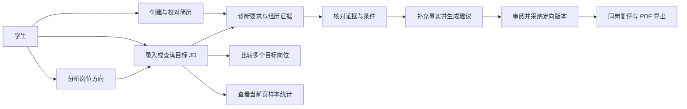

# CareerLens 需求分析

> 版本：v1.1　｜　修订日期：2026-09-09　｜　适用范围：CareerLens 本地模式、网站模式与 T5 实训交付。
>
> 关联文档：[求职市场痛点分析报告](求职市场痛点分析报告.md) · [竞品体验与样本差距分析](竞品体验与样本差距分析.md) · [系统设计方案](系统设计方案.md) · [前端设计文档](前端设计文档.md) · [UI/UX 设计文档](UIUX设计文档.md)。

## 1. 项目定位与分析结论

CareerLens 面向正在准备实习、校招及初次求职的学生，以一份简历和一份目标岗位描述（JD）为基本分析单元，帮助用户核对岗位要求、查找经历证据、确认材料缺口，并形成有事实依据的定向简历。尚未确定目标的用户，可以先了解与现有经历相关的岗位方向，再查找真实岗位。

本项目的核心价值是**让用户看清判断依据，并控制简历修改过程**。招聘平台已经提供岗位推荐和 AI 简历服务，因此“接入大模型”本身不足以构成产品差异。CareerLens 应把逐项证据对应、规则分数复算、事实来源审阅、独立版本保存及岗位样本范围说明落实为可验收能力。

本次分析采用公开资料调研与当前源码核查。竞品部分依据官方产品页面、开发者发布的应用介绍和官方教程；用户痛点属于据此提出的需求假设。本文未将桌面调研写成实际 APP 操作、学生访谈或问卷结果。软件现状按当前工作区记录，真实用户与模型质量评价按第 10 节另行验收。

## 2. 调研依据与竞品分析

教育部网站刊载的报道指出，2026 届全国普通高校毕业生规模预计达 1,270 万人。毕业生就业服务具有广泛的覆盖需求；CareerLens 聚焦其中的岗位理解与材料准备环节，产品用户规模仍需通过实际使用验证。[教育部网站，2026 年 6 月报道](https://www.moe.gov.cn/jyb_xwfb/s5147/202606/t20260615_1440719.html)

教育部 2026 年“春季促就业攻坚行动”提出推广国家大学生就业服务平台，并鼓励利用 AI 辅助就业训练。本项目以学生为主要对象、接入该平台岗位并提供材料训练工具，与这一服务方向相衔接。[教育部行动通知](https://www.moe.gov.cn/jyb_xwfb/gzdt_gzdt/s5987/202603/t20260319_1431535.html)

### 2.1 调研范围

表 1 调研范围

| 证据类型 | 本次采用的材料 | 用途 |
| --- | --- | --- |
| 课程要求 | [T5 实训要求整理](../T5_AI简历诊断与岗位匹配系统_实训要求整理.md) | 确定 Level 1—3、真实样本和交付要求 |
| 当前实现 | 前端工作区、后端路由、数据契约、匹配与 AI 服务 | 确定已有能力和工程边界 |
| 国内招聘产品 | BOSS 直聘、智联招聘的官方公开资料 | 比较岗位发现、简历准备和求职反馈流程 |
| 简历垂类产品 | Jobscan 官方教程 | 比较 JD 对照、匹配反馈和修改流程 |
| 规范依据 | 个人信息保护法、W3C WCAG 2.2 | 提出数据告知、可控处理与可访问性要求 |
| 既有验证材料 | [验证记录](验证记录.md)、[后续修复记录](增强功能与缺陷修复_2026-09-07.md) | 识别已有工程证据；不替代本次验收 |

外部资料沿用 2026-09-08 的既有调研记录，本轮仅核对本地源码和课程原文，未重新联网核验。未标示发布日期的产品页面以访问时内容为准；未披露的实现细节记为“公开资料未明确”。

### 2.2 竞品比较

表 2 竞品比较

| 产品与资料范围 | 官方资料可确认的能力 | 对 CareerLens 的启示 | 需求映射 |
| --- | --- | --- | --- |
| BOSS 直聘：招聘 APP 与配套简历网站 | APP 强调招聘者直聊与岗位推荐；配套简历网站提供 AI 简历生成、诊断、目标岗位优化及编辑导出。[BOSS APP](https://app.zhipin.com/)、[BOSS 简历](https://cv.zhipin.com/) | 用户可能从招聘平台发现岗位，再进入材料准备环节。保留粘贴 JD 与来源链接；诊断结果必须能落实到具体修改 | FR-03、FR-04、FR-08、FR-11 |
| 智联招聘：应用商店开发者介绍 | 介绍列出岗位推荐、投递反馈、即时沟通、企业屏蔽，以及 AI 简历与诊断服务。[智联招聘 APP](https://apps.apple.com/cn/app/id488033535) | 用户既需要岗位信息，也需要知道材料和操作处于什么状态。应明确保存、分析、采纳、导出状态，并提供数据控制 | FR-02、FR-05、FR-13、FR-14 |
| Jobscan：官方使用教程 | 以简历和目标 JD 为输入，提供匹配反馈与优化提示。[Jobscan 教程](https://www.jobscan.co/jobscan-tutorial) | 针对单一 JD 的对照具有清晰任务边界。CareerLens 需进一步明确自身分数的计算对象、证据明细与人工修正方式 | FR-04、FR-07、FR-09 |

BOSS 的配套简历网站与招聘 APP 分别记录，不推定所有网页能力都可在 APP 内完成。智联求职 AI 版页面呈现预约内测入口，其相关能力不计入上表的普遍可用功能。[智联求职 AI 版](https://ai.zhaopin.com/)

公开资料不足以证明这些产品是否采用与 CareerLens 相同的证据状态、权重、快照和事实核验机制。因此，本项目将这些机制作为自身的设计重点，不据此宣称竞品缺失对应能力。

### 2.3 从调研到产品判断

表 3 从调研到产品判断

| 编号 | 调研发现或项目事实 | 产品判断 | 需要进一步验证的问题 |
| --- | --- | --- | --- |
| H-01 | 招聘产品同时提供岗位发现与简历服务 | 准备材料需要连接到具体 JD，不能停留在通用润色 | 学生实际如何保存 JD，重复录入是否妨碍准备 |
| H-02 | 匹配工具以简历和 JD 对照形成反馈 | 分数应附带要求、证据和下一步动作，降低理解成本 | 用户能否根据结果定位原文并解释判断 |
| H-03 | 当前项目已把“未提供证据”与“确认未掌握”分开 | 缺少描述首先触发事实核实；表达调整与能力提升分别处理 | 用户能否正确理解两类缺口 |
| H-04 | AI 简历优化已是同类产品的公开能力 | 优化质量应由事实忠实性、岗位针对性和修改可控性衡量 | 用户能否发现无依据的角色、数字和成果扩写 |
| H-05 | 当前岗位来源的地域、雇主和薪资口径不同 | 市场图表必须展示样本来源、分母和时间范围 | 用户能否区分本页样本与整个招聘市场 |

以上假设用于组织后续访谈与任务测试，不附加未经采集的发生比例、用户满意度或录用提升数据。

## 3. 用户、场景与目标

### 3.1 用户与利益相关方

表 4 用户与利益相关方

| 角色 | 使用背景 | 主要任务 | 成功结果 |
| --- | --- | --- | --- |
| 已有目标的学生 | 有简历和具体 JD，需要准备投递材料 | 核对要求、确认相关经历、改写、导出 | 得到本人确认的定向版本，能够说明修改依据 |
| 尚未确定方向的学生 | 有课程、项目或实习经历，岗位认知不足 | 查看方向建议，检索并保存相关岗位 | 形成若干真实候选 JD，进入具体对照 |
| 就业指导教师或评审者 | 需要了解学生修改过程或评价课程成果 | 在学生授权下查看脱敏材料、证据和前后变化 | 能复核判断与改写逻辑 |
| 项目维护者 | 配置本地环境与模型，处理运行问题 | 初始化、测试连接、备份、复现问题 | 在不暴露凭据和个人材料的前提下恢复使用 |

当前系统支持两种运行方式：本地模式直接使用个人工作区；网站模式通过邮箱验证码登录，按用户隔离工作区数据。教师是业务利益相关方，尚无专用教师角色、班级管理或协作审阅功能；网站模型配置由部署维护者统一管理。

### 3.2 主要使用场景

1. **针对岗位准备简历。** 学生导入现有简历并校对，粘贴目标 JD，查看要求和经历证据，补充本人确认的事实，审阅并采纳一段建议，保存定向版本后导出。
2. **从经历寻找方向。** 学生先保存简历，通过 AI 了解相关岗位方向，点击方向搜索真实岗位，阅读完整 JD 后主动记住，再进入目标诊断。
3. **比较多个岗位。** 学生选择 2—5 份已保存 JD，以同一简历快照比较材料覆盖、条件与证据，选择需要优先准备的目标。
4. **了解岗位样本。** 学生在实时岗位中查看当前页完整 JD 的技能和薪资统计，结合来源、时间与样本数解释结果。

### 3.3 产品目标

表 5 产品目标

| 编号 | 目标 | 可观察结果 |
| --- | --- | --- |
| G-01 | 缩短从材料到可操作判断的路径 | 导入、校对、选择 JD 后可进入诊断，每个待处理项有对应动作 |
| G-02 | 提高判断的可解释性 | 规则分数可复算；AI 结论可查看简历与 JD 引文 |
| G-03 | 保持经历表述真实 | 无来源扩写被拦截或提示核实，采纳由用户确认，原版本可读取 |
| G-04 | 支持有依据的岗位比较 | 不同 JD 使用相同简历快照，条件要求与分数分开展示 |
| G-05 | 形成可复现的课程成果 | 主流程、数据来源、测试记录、运行说明与需求、前后端设计、数据库和接口文档能够对应 |

## 4. 产品范围与优先级

P0 为核心交付与阻断性质量要求；P1 为已纳入当前产品的增强能力；P2 为后续规划。优先级表示验收顺序，不表示功能是否已经开发。

表 6 产品范围与优先级

| 范围 | 内容 | 当前安排 |
| --- | --- | --- |
| P0：核心业务 | 简历导入编辑、JD 校对、证据匹配、AI 诊断、事实确认、单段改写、独立版本与 PDF/Word 导出 | 当前有实现，按完整用户链路验收 |
| P0：交付质量 | 网站认证和用户隔离、数据一致性、失败恢复、隐私告知、真实样本评估与可复现运行 | 逐项验证，未完成部分列为交付待办 |
| P1：增强业务 | 方向建议、已保存岗位推荐、2—5 岗比较、本地语义候选、实时岗位、本页市场解读、照片与排版 | 当前已有代码，补齐来源与结果质量验收 |
| P2：后续扩展 | 教师管理、多人协作编辑、投递平台整合、自动投递、完整招聘市场监测 | 不进入本轮需求基线 |

课程 Level 1—3 与上述优先级分别管理：Level 1 对应基础录入与匹配，Level 2 对应 AI 诊断和定向优化，Level 3 对应岗位聚合、三类图表及市场分析。课程中 PostgreSQL、pgvector 属于推荐技术；本项目沿用已实现的 SQLite 与本地语义检索，具体技术决策见系统设计方案。

## 5. 功能需求规格

以下验收条件描述交付应达到的行为；“已有”表示当前源码具备对应实现，不代表本次已执行测试。

表 7 功能需求规格

| 编号 | 功能与用户需求 | 优先级 | 验收条件 | 当前实现与待办 |
| --- | --- | --- | --- | --- |
| FR-01 | 创建和导入简历：使用空白表单、粘贴文本或现有文件开始准备 | P0 | 支持 PDF、DOCX、TXT、Markdown；文件上限 5 MB；展示可编辑结果和原文；解析不完整时可人工补齐 | 已有；中文实际样本解析质量待评估 |
| FR-02 | 编辑、保存、预览和导出：持续整理同一份简历 | P0 | 原文、结构化字段和版本名正确保存；重载一致；预览展示当前编辑；PDF/Word 导出先保存当前内容与排版，再读取保存版本；中文长简历分页完整 | 已有；持续验收保存冲突与导出一致性 |
| FR-03 | 输入、校对和记住 JD：复用来自不同平台的岗位 | P0 | 可粘贴 JD 并填写名称；校对普通要求与加分项；每条引用来自原文，标准要求不重复；已保存 JD 可再次选择 | 已有；来源信息缺失保持未知 |
| FR-04 | 规则证据匹配：理解材料覆盖了哪些要求 | P0 | 显示要求、重要度、证据状态、原文和贡献；同一输入同一规则结果一致；无有效要求显示信息不足 | 已有；冻结样本上核查误匹配与漏匹配 |
| FR-05 | AI 目标诊断：理解经历与目标岗位的关联 | P0 | 独立展示 AI 适合度、判断理由、优点、缺口与动作；引用可核对；记录模型与时间；AI 失败不保存替代结论 | 已有；真实材料质量与引用准确性待评估 |
| FR-06 | 岗位方向与已保存岗位推荐：从现有经历确定下一步 | P1 | 不选择 JD 也可分析方向；具体岗位只来自服务端允许的已保存候选；方向可触发实时搜索；AI 关闭时明确不可用 | 已有；方向结果为即时响应，不等同于历史诊断记录 |
| FR-07 | 核对证据和条件：纠正自动结果 | P0 | 可确认有证据、仅提及、待确认或尚未掌握；学历、经验、到岗单独核对；提交后生成新诊断，旧记录保持原状 | 已有；人工核对后沿用的 AI 分析应标明未重新生成，界面说明待完善 |
| FR-08 | 事实约束改写：改善一段经历的表达 | P0 | 结合目标 JD 与原文生成草稿；可补充至多 8 条本人事实；展示原文、草稿、修改说明和逐句来源；无依据的数字、技能、角色或成果扩写不得通过检查 | 已有规则与 AI 核验；含蓄夸大与真实样本忠实性仍需人工评价 |
| FR-09 | 独立定向版本与同岗复评：保留原稿并评估改动 | P0 | 用户确认后新建定向版；重复采纳返回同一结果；源材料变化时拒绝陈旧草稿；对同一 JD 比较修改和规则覆盖变化 | 已有；分数提升不作为改写有效的唯一条件 |
| FR-10 | 多岗位横向比较：选择准备重点 | P1 | 一次选择 2—5 个不同岗位；共享同一简历快照；展示各岗分数、条件和待确认项；可打开单岗证据和导出比较 JSON | 已有；模型分数只作为辅助判断 |
| FR-11 | 查询和记住实时岗位：获取带来源的真实 JD | P1 | 支持 NCSS、Jobicy、腾讯三个来源；按需搜索并显示来源、地域与获取时间；详情不完整时不计入统计、不允许直接记住；浏览不自动写入岗位表 | 已有；本次未重测来源可用性；保存原始获取时间待完善，当前另记入库时间 |
| FR-12 | 本页岗位统计和解读：了解当前样本的共同要求 | P1 | 提供技能词云、薪资分布和岗位技能分布；展示完整 JD 样本数、薪资有效数及缺失数；AI 解读限于传入样本，数字由程序统计 | 统计与解读已有；Jobicy 薪资仅展示；薪资有效数和缺失数尚待界面补充 |
| FR-13 | 模型配置与模式控制：选择是否使用 AI | P0 | 本地模式可保存设置、测试连接；网站模式由平台管理配置，用户查看账户与服务；可切换 AI；规则与 AI 结果有明确标识；远程模型调用前说明发送范围；模型失败后保留材料并给出下一步 | 配置、开关与错误处理已有；首次传输告知与同意记录待完善 |
| FR-14 | 删除与数据控制：管理个人材料和历史 | P0 | 删除前说明影响；清理关联记录并保留其他独立简历；可备份本地数据；凭据不进入日志或交付包 | 删除、重置及备份说明已有；删除 JD 后的上游无外键日志清理需补齐；简历数据并非全库加密 |
| FR-15 | 网站认证与用户隔离 | P0 | 邮箱验证码验证后进入工作区；会话过期清除受保护视图；用户切换后旧请求和缓存不能回填，普通用户不能更改平台密钥 | 已有；具体邮件服务可用性取决于部署配置 |
| FR-16 | 照片、排版和可编辑导出 | P1 | 照片可选，可更换移除；每份简历保存独立排版；自动排版保留全部内容；PDF/Word 含当前已保存的内容与照片 | 已有；使用合成含照片和长中文样本核对导出 |

## 6. 业务规则与结果解释

表 8 业务规则与结果解释

| 编号 | 规则 | 对用户行为和结果的影响 |
| --- | --- | --- |
| BR-01 | 规则材料覆盖度衡量当前简历对当前 JD 的证据覆盖 | 显示可复算依据；不解释为个人真实能力或录用概率 |
| BR-02 | AI 适合度是模型根据材料作出的独立判断 | 与规则分数分别命名，记录模型与生成时间；不混为一个总分 |
| BR-03 | 普通要求权重为 2，加分项为 1；具体证据值为 1，仅提及为 0.5，其余为 0 | 要求去重后只计算一次；总权重为零时不出分，公式与算例见系统设计方案 |
| BR-04 | 没找到证据首先表示待确认 | 只有本人确认未掌握时才标记能力缺口；学习建议不直接写入已完成经历 |
| BR-05 | 语义相似度只提供相关经历候选 | 用户核对后才按证据状态计入规则覆盖；相似度不直接加分 |
| BR-06 | 学历、经验、到岗等条件独立呈现 | 其他技能高分不能抵消条件不符；不能可靠判断的条件保留未知 |
| BR-07 | 分析、核对和采纳具有明确版本边界 | 核对生成新记录；同一基础版的不同草稿各自产生独立定向版；连续优化应选择新版本再诊断 |
| BR-08 | 事实补充由用户明确提供，草稿由用户审阅采纳 | 按 STAR 整理已知内容；缺少成果数据时先提问，不生成虚构指标 |
| BR-09 | 来源提供的发布日期、更新日期与系统时间分别解释 | 实时结果显示获取时间；保存 JD 时另记本次入库时间，当前不保留原查询的获取时间；未知薪资和日期不补造 |
| BR-10 | 本页完整且去重的 JD 构成实时统计样本 | 样本数与平台命中数分别说明；翻页改变统计范围；不把缺失薪资记为零 |
| BR-11 | 外部 JD 与模型输出属于待验证内容 | 校验字段、原文引用与允许的岗位标识；模型不得编造企业、链接或未采集的市场数字 |
| BR-12 | 不同失败场景采用明确恢复路径 | 文件 AI 解析失败可返回保留原文的规则草稿；语义失败保留关键词结果；请求 AI 诊断失败则报错，由用户主动切换规则模式 |

## 7. 关键用例与流程

### 7.1 用例关系

图 1 用例关系

### 7.2 UC-01：完成一次有依据的定向优化

**参与者：** 已有目标 JD 的学生。**前置条件：** 简历和 JD 已校对保存；使用 AI 时模型配置有效。**关联需求：** FR-01—05、FR-07—09。

1. 用户选择已保存简历与 JD，发起诊断。
2. 系统固定输入快照，返回规则覆盖明细；启用 AI 时另行返回 AI 判断与引用。
3. 用户检查一项待确认要求，选择相关证据或说明尚未掌握；系统保留核对记录。
4. 用户选择一段经历，补充能确认的事实并生成草稿。
5. 用户查看原文、草稿、变化说明和事实来源，确认后采纳。
6. 系统创建独立定向版。用户对同一 JD 复评，保存并导出该版本。

**成功后置条件：** 原简历不被覆盖；新版本与原简历、JD、诊断和修改记录有关联；重复采纳不重复创建。

**异常分支：** 引用或事实核验失败时不保存草稿；输入已改变时要求重新诊断；PDF 失败可重试且不影响已保存版本。草稿没有实质改善时应明确说明，不以轻微措辞替换冒充有效优化。

### 7.3 UC-02：从方向建议进入真实岗位诊断

**前置条件：** 已保存简历并启用可用模型。用户请求方向分析，查看引用及准备事项，选择某一方向发起实时搜索。系统返回带来源的岗位，用户展开完整 JD，主动记住并校对后进入诊断。方向名称只用于搜索，不作为某家企业正在招聘的证据。关联 FR-03、FR-06、FR-11。

### 7.4 UC-03：比较多个岗位

**前置条件：** 已保存一份简历和至少两份 JD。用户选择 2—5 个不同岗位，系统基于同一份简历快照计算各岗结果，展示覆盖度、条件、待确认项和可用的 AI 判断。用户打开其中一岗继续核对或导出比较结果。比较期间输入变化应触发冲突提示，不能混合不同简历状态。关联 FR-07、FR-10。

### 7.5 UC-04：阅读岗位样本统计

用户指定来源和关键词后查询岗位，展开本页统计，检查样本数、技能分布和同口径薪资，再请求样本解读。无完整 JD 时显示无可分析样本；无有效薪资时保留其他图表并说明缺失。翻页或改筛选后，图表与解读应绑定新的样本范围。关联 FR-11、FR-12。

## 8. 数据需求与使用边界

### 8.1 核心数据

表 9 核心数据

| 数据对象 | 必要内容 | 质量约束 |
| --- | --- | --- |
| 简历 | 名称、原文、结构化教育和经历等、更新时间、版本关联 | 原文与编辑字段能够重载；分析读取已保存内容 |
| JD | 标题、完整正文、去重要求、来源及可得的公司、地区、薪资、时间 | 要求引用在原文中；未知元数据留空；API 来源保留外部编号 |
| 证据 | 稳定标识、原文片段、章节路径、类型和内容摘要哈希 | 可以定位对应快照；语义候选不能冒充已确认事实 |
| 诊断 | 简历快照、JD 快照、规则版本、明细、条件、可选 AI 结果 | 输入及历史判断可追溯；核对产生新记录 |
| 改写 | 选中经历、本人补充事实、草稿、逐句引用、核验和采纳状态 | 采纳前检查当前材料；定向版单独保存 |
| 实时样本 | 来源标识、外部编号、完整度、获取时间、当前页记录 | 浏览只作查询与缓存；主动记住才转为本地 JD |

方向建议是即时分析响应，不列作已持久化的独立实体。真实表结构、JSON 字段和删除关系以系统设计方案为准。

### 8.2 当前输入边界

当前数据契约限制：简历/JD 文本最多 30,000 字符，标题最多 120 字符，JD 要求最多 60 条；比较包含 2—5 个不同岗位；每次改写最多 8 条补充事实，每条最多 1,000 字符；实时分析最多接收 10 条完整 JD。文件大小和字段长度的提示应同时在界面和接口边界生效。依据：[CareerLens 数据契约](../app/apps/backend/app/schemas/career.py)、[业务路由](../app/apps/backend/app/routers/career.py)。

### 8.3 隐私与模型使用

产品应遵循目的明确、最小必要、清晰告知和可控删除的要求。首次使用远程模型前，界面应说明接收方、发送的材料范围和使用目的，并提供明确的模式选择；当前默认开启 AI，完整的首次告知与同意记录仍需补齐。这些是产品验收要求，不代表现有系统已经完成合规认证。[个人信息保护法，第 6、17、47 条](https://www.miit.gov.cn/zwgk/zcwj/flfg/art/2022/art_04a0f1fb5df244e39688fd5372623a8d.html)

当前目标诊断和方向分析从结构化经历等字段组织证据，不主动加入联系方式；全文解析可能发送用户提供的完整原文。因此，不能笼统承诺“所有 AI 请求均已脱敏”。课程评估使用经本人同意的脱敏副本，私人原件和密钥不进入 Git、截图、公开报告及交付压缩包。

SQLite 中的简历内容并非全库加密。本地模式使用本地数据目录；网站模式按已验证的用户身份选择独立工作区。身份、会话与业务数据隔离机制见[后端与数据库设计](后端与数据库设计文档.md)。访谈和课堂演示仍使用授权脱敏副本，账号隔离不能替代采集授权。

## 9. 非功能需求

下列数值是项目验收目标，未经本次实测。测试应记录机器、样本长度、运行模式和失败次数；AI 与岗位源的外部延迟单独统计。

表 10 非功能需求

| 编号 | 维度 | 目标与验证方式 |
| --- | --- | --- |
| NFR-01 | 基础性能 | 本地非 AI 单岗规则匹配目标 1 秒内；固定材料预热后执行至少 20 次，报告中位数、P95 和最大值 |
| NFR-02 | 操作反馈 | 点击保存、分析、导入后及时显示处理中并阻止重复提交；慢请求不使用虚假的百分比；结束后显示成功或可执行的错误提示 |
| NFR-03 | 外部依赖 | 请求必须有超时；当前单岗 AI 与改写上限 150 秒、多岗 AI 180 秒，语义检索 30 秒，实时查询/解读 60 秒；这些是操作阶段上限，不是响应速度承诺 |
| NFR-04 | 数据一致性 | 重复采纳只生成一个版本；冲突返回明确提示；分析、核对和删除不留下无效关联；失败不覆盖用户已保存材料 |
| NFR-05 | 可用性 | 首次用户能在无需查看接口文档的情况下完成核心流程；通过任务测试记录完成率、用时、错误点和评分含义理解情况 |
| NFR-06 | 可访问性 | 以 WCAG 2.2 AA 相关条款作为验收目标，覆盖键盘、焦点、表单提示、对比度和状态播报；详细尺寸与检查项见 UI/UX 文档，当前未完成一致性评估。[W3C](https://www.w3.org/TR/WCAG22/) |
| NFR-07 | 响应式 | 至少检查 390 px 手机、768 px 平板、1280 px 桌面；正文不发生页面级横向溢出，长 JD 与图表有可操作的阅读方式 |
| NFR-08 | 安全与凭据 | 模型密钥由后端加密存储，不返回完整密钥、不写入日志；验证文件类型、大小、字段及引用；外部材料展示前处理不可信内容 |
| NFR-09 | 可恢复性 | 备份包含数据库和相应密钥文件；在隔离环境恢复后可读取简历、JD 和已采纳版本；设置重置操作说明删除范围 |
| NFR-10 | 可维护与复现 | 保留前后端锁文件、初始化命令与建表 SQL；从干净源码复现主流程；Docker 构建及重建持久化作为独立验收项 |

## 10. 真实样本与需求验证计划

### 10.1 课程数据准备

课程要求至少 5 份真实 JD、3 份学生简历，并完成两款招聘 APP 的分析。既有文档已形成两款产品的公开资料对比；实际操作体验、学生授权材料和人工标注结果仍需归档。详细采集表、访谈提纲、15 组对照登记及合成算例见[竞品体验与样本差距分析](竞品体验与样本差距分析.md)。版本库中的[合成示例](../data/README.md)用于软件测试，不计入真实样本数量。

表 11 课程数据准备

| 材料 | 采集与记录方式 | 完成标准 |
| --- | --- | --- |
| 5 份真实 JD | 保存完整职责与资格要求、来源 URL、采集时间；岗位更新日期不明则留空 | 每份可以复核来源和要求引用 |
| 3 位学生的简历 | 获得本人同意，替换姓名与联系方式，保留匿名样本编号 | 三位不同学生，不以同一人的三个版本替代 |
| 15 组简历—JD 对照 | 3 份简历分别对应 5 份 JD；两名成员核对要求、重要度、证据和条件 | 分歧经讨论定稿，保留修改原因 |
| 两款 APP 操作记录 | 对同类任务记录客户端版本、设备、路径、反馈及截图 | 将实测结果补充到桌面调研之后，避免由页面宣传推断交互质量 |
| 优化前后案例 | 每份简历至少 2 段经历，保留原文、补充事实、草稿、人工结论 | 能逐句核查事实，至少展示同一经历对不同 JD 的定向差异 |

沿用[构建计划](../CareerLens_构建计划.md)的划分：前两位学生对应的 10 组用于调整规则，第三位学生对应的 5 组在规则冻结后验证。该设计可以避免同一人的不同简历版本混入两组，但 JD 仍有重用，结果只反映这批材料上的表现。

### 10.2 评价方法

表 12 评价方法

| 评价对象 | 指标或判断方法 | 验收目标 |
| --- | --- | --- |
| 关键技能抽取 | 以人工标注为参考，记正确抽取、错误抽取和遗漏数量 | 精确率与召回率目标均不低于 0.85，报告实际分母与案例 |
| 规则评分 | 手算要求权重和证据贡献，与接口值比较 | 同一规则版本、输入和人工确认状态下结果一致 |
| 引用质量 | 检查引文是否逐字存在且能支持该项判断 | 无不存在的引文；语义不支持的引用记录为错误 |
| 改写忠实性 | 将每句草稿对应到原文或本人补充事实 | 被评估的已采纳样本不得出现未经确认的新数字、角色、技能或成果 |
| 定向价值 | 比较两份 JD 下的同一经历改写，检查强调内容与要求的关联 | 差异能够由 JD 和真实经历解释，不以强塞关键词判定成功 |
| 用户理解 | 请参与者解释规则分数、AI 判断和待确认项 | 记录解释正确与错误的人数，不预填满意率 |
| 岗位统计 | 按相同去重、完整度、币种与周期手工核算 | 图表分母、缺失项与统计数一致 |

令正确抽取数为 \(a\)，错误抽取数为 \(b\)，遗漏数为 \(c\)，精确率和召回率分别为

\[
P=\frac{a}{a+b},\qquad R=\frac{a}{a+c}.
\]

分母为零时记录“不适用”。样本少时同时报告计数，避免只给百分比。

### 10.3 核心验收场景

表 13 核心验收场景

| 用例编号 | 输入或操作 | 必须观察到的结果 |
| --- | --- | --- |
| AT-01 | 中文简历导入、校对、保存、重载 | 原文与结构化字段一致，未解析内容可继续编辑 |
| AT-02 | JD 重复技能、别名、否定句、仅计划学习 | 去重与否定处理正确，不把学习计划记作已有实践 |
| AT-03 | 空要求、无证据、仅技能自述、有具体经历 | 无要求不出分；其余状态与证据贡献对应 |
| AT-04 | 人工核对证据和学历、经验、到岗 | 新增诊断；旧快照不变；条件不与覆盖分抵消 |
| AT-05 | 模型生成不存在的引文或夸大成果 | 检查拒绝；原材料不变；错误提供下一步 |
| AT-06 | AI 不可用、语义模型不可用、岗位源超时 | 分别走 BR-12 的恢复路径，不混淆规则与 AI 来源 |
| AT-07 | 采纳、重复采纳、修改源材料后采纳 | 独立版本、幂等响应、陈旧草稿冲突均符合预期 |
| AT-08 | 同一简历对 2—5 岗分析 | 输入快照一致，可进入单岗详情并导出比较 |
| AT-09 | 不完整 JD、薪资缺失、多币种、翻页 | 不完整记录不计入统计；不同薪资口径分开；页面范围同步变化 |
| AT-10 | 短简历、长简历及含照片简历导出 PDF/Word | 导出先保存当前内容与排版；中文、照片、段落完整，Word 内容可编辑 |
| AT-11 | 键盘操作、手机阅读、错误恢复 | 关键任务可完成，焦点可见，状态可感知，输入可继续使用 |
| AT-12 | 在隔离环境删除与恢复备份 | 关联清理符合说明，其他独立版本保留，备份可恢复 |
| AT-13 | 本地入口、网站匿名入口、登录、退出与跨账号切换 | 本地直接进入；网站先验证邮箱；旧业务请求不回填新账号，其他账号记录不可访问 |
| AT-14 | 仅修改排版后并发保存 | 包含排版的 revision 拦截过期保存；照片不进入 AI 提示词 |

## 11. 交付顺序与需求追踪

表 14 交付顺序与需求追踪

| 阶段 | 工作重点 | 完成依据 |
| --- | --- | --- |
| 需求定稿 | 确认竞品发现、用户任务、产品边界和需求编号 | 本文与课程要求、当前代码对应 |
| 设计评审 | 统一数据关系、评分含义、状态与页面文案 | 系统设计方案、UI/UX 设计文档评审通过 |
| 质量补齐 | 首次 AI 告知、真实样本标注、引用与改写评估、响应式和可访问性核验 | AT 场景结果、误差记录与修复证据 |
| 交付复现 | 冻结版本、干净环境启动、整理运行与演示材料 | 可复现源码包、运行说明、课程视频和个人报告 |

课程提交截止时间以实训文件的 **2026-09-12 12:00** 为准。本次 Markdown 文档构成需求、设计与交付材料基线；实际视频、签名报告和真实样本证据按课程要求另行提交。

表 15 交付顺序与需求追踪

| 需求组 | 系统设计对应内容 | UI/UX 对应页面 | 主要验收 |
| --- | --- | --- | --- |
| FR-01—02 | 简历服务、解析与 PDF 复用链路 | 我的简历、预览与排版编辑器 | AT-01、AT-10 |
| FR-03—07 | 岗位、匹配、AI 诊断和确认记录 | 目标岗位、诊断与优化 | AT-02—06 |
| FR-08—10 | 事实核验、事务采纳、版本与批量比较 | 建议审阅、版本对照、多岗位比较 | AT-05、AT-07—08 |
| FR-11—12 | 来源适配、查询缓存与样本聚合 | 实时岗位与本页统计 | AT-06、AT-09 |
| FR-13—14 | 模型配置、密钥、删除与恢复 | 模型设置、操作反馈和数据管理 | AT-06、AT-11—12 |
| FR-15—16 | 会话隔离、照片校验、排版修订与导出 | 网站入口、账户与服务、个人信息、排版 | AT-10、AT-13—14 |

本轮按指导书第 17—18 页建立日期对应：9 月 8 日形成问题定义与需求基线，9 月 9 日补齐系统、前后端、数据库、接口和原型文档；9 月 10—12 日的持续测试、集成、报告定稿与展示属于后续执行安排。文档修订日期不作为此前晨会或采集活动已经发生的证明。

## 12. 资料索引

外部链接已在相关论述旁标明，以下索引说明各资料的使用范围。

表 16 资料索引

| 资料 | 发布或状态信息 | 用途 |
| --- | --- | --- |
| [高校毕业生就业工作报道](https://www.moe.gov.cn/jyb_xwfb/s5147/202606/t20260615_1440719.html) | 教育部网站刊载新华社 2026-06-11 报道 | 2026 届毕业生预计规模与就业服务背景 |
| [春季促就业攻坚行动](https://www.moe.gov.cn/jyb_xwfb/gzdt_gzdt/s5987/202603/t20260319_1431535.html) | 教育部 2026 年 3 月发布 | 国家就业平台与 AI 辅助训练方向 |
| [BOSS 直聘 APP](https://app.zhipin.com/) | 官方下载与产品介绍，未标示页面发布日期 | 招聘沟通和岗位发现能力 |
| [BOSS 简历](https://cv.zhipin.com/) | 官方配套简历网站，未标示页面发布日期 | AI 简历服务与定向优化能力 |
| [智联招聘 APP](https://apps.apple.com/cn/app/id488033535) | 开发者发布的应用介绍，页面会随版本更新 | 推荐、反馈、隐私功能和简历服务 |
| [智联求职 AI 版](https://ai.zhaopin.com/) | 访问时有预约内测入口 | 区分公开产品介绍与内测方向 |
| [Jobscan 官方教程](https://www.jobscan.co/jobscan-tutorial) | 官方使用说明，未以本文断言固定版本 | 简历与 JD 对照流程 |
| [个人信息保护法](https://www.miit.gov.cn/zwgk/zcwj/flfg/art/2022/art_04a0f1fb5df244e39688fd5372623a8d.html) | 2021-08-20 通过；工信部页面发布于 2022-01-29 | 最小必要、事前告知和删除要求 |
| [WCAG 2.2](https://www.w3.org/TR/WCAG22/) | W3C 标准 | 可访问性验收依据 |
| [项目数据说明](../data/README.md)、[构建计划](../CareerLens_构建计划.md) | 本地课程与工程材料 | 真实样本、15 组对照及质量目标 |
